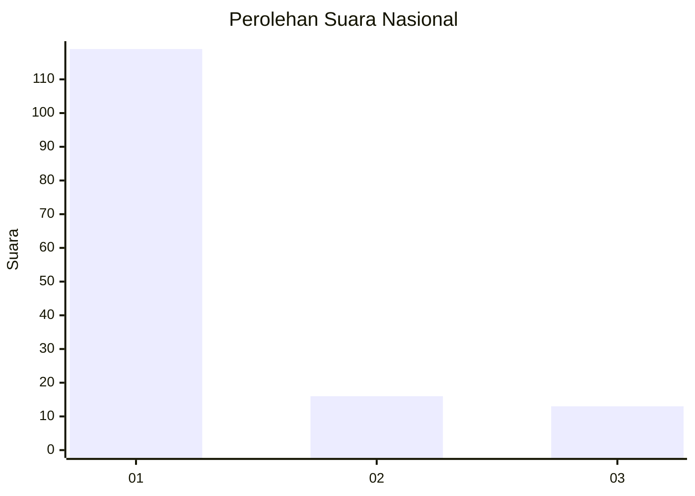
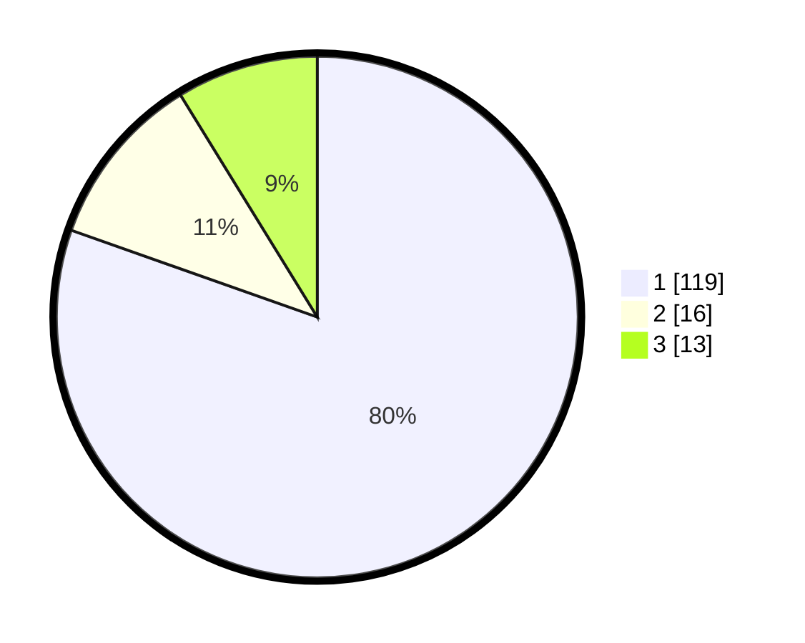

# Hasil

## Grafik

## Tabel

| No. | Nama Paslon    | Suara | Suara (raw) | Persentase |
|:--- |:-------------- | -----:| -----------:| ----------:|
| 1   | ANIES MUHAIMIN | 119   | [119][p-1]  | 80,41      |
| 2   | PRABOWO GIBRAN | 16    | [16][p-2]   | 10,81      |
| 3   | GANJAR MAHFUD  | 13    | [13][p-3]   | 8,78       |

[p-1]: https://github.com/gigit-pemilu/pemilu-2024/blob/main/pilpres/hitung-suara/sub/11-aceh/sub/01-aceh-selatan/sub/11-labuhan-haji-timur/sub/2004-aur-peulumat/sub/001-tps/sub/paslon-1.txt
[p-2]: https://github.com/gigit-pemilu/pemilu-2024/blob/main/pilpres/hitung-suara/sub/11-aceh/sub/01-aceh-selatan/sub/11-labuhan-haji-timur/sub/2004-aur-peulumat/sub/001-tps/sub/paslon-2.txt
[p-3]: https://github.com/gigit-pemilu/pemilu-2024/blob/main/pilpres/hitung-suara/sub/11-aceh/sub/01-aceh-selatan/sub/11-labuhan-haji-timur/sub/2004-aur-peulumat/sub/001-tps/sub/paslon-3.txt

## Foto C Plano

https://sirekap-obj-formc.kpu.go.id/5625/pemilu/ppwp/11/01/11/20/04/1101112004001-20240214-221519--57fed80c-d474-40dd-987e-e66a43480e59.jpg

https://sirekap-obj-formc.kpu.go.id/5625/pemilu/ppwp/11/01/11/20/04/1101112004001-20240214-221659--21da9779-ed1d-4d49-96e1-337ed1fa9b0f.jpg

https://sirekap-obj-formc.kpu.go.id/5625/pemilu/ppwp/11/01/11/20/04/1101112004001-20240214-222142--ff923df5-fb5c-4be9-b7cf-a55173d36d3d.jpg

## Metadata

| Key        | Value               |
| ---------- | ------------------- |
| Time Stamp | 2024-02-15 22:30:27 |

## DATA PEMILIH TETAP

Jumlah pemilih dalam DPT: **174**.
 * L: **86**.
 * P: **88**.

## DATA PENGGUNA HAK PILIH

Jumlah pengguna hak pilih dalam DPT: **147**.
 * L: **63**.
 * P: **84**.

Jumlah pengguna hak pilih dalam DPTb: **2**.
 * L: **2**.
 * P: **0**.

Jumlah pengguna hak pilih dalam DPK: **1**.
 * L: **1**.
 * P: **0**.

Jumlah pengguna hak pilih: **150**.
 * L: **66**.
 * P: **84**.

## JUMLAH SUARA SAH DAN TIDAK SAH

JUMLAH SELURUH SUARA SAH: **148**.

JUMLAH SUARA TIDAK SAH: **2**.

JUMLAH SELURUH SUARA SAH DAN SUARA TIDAK SAH: **150**.

