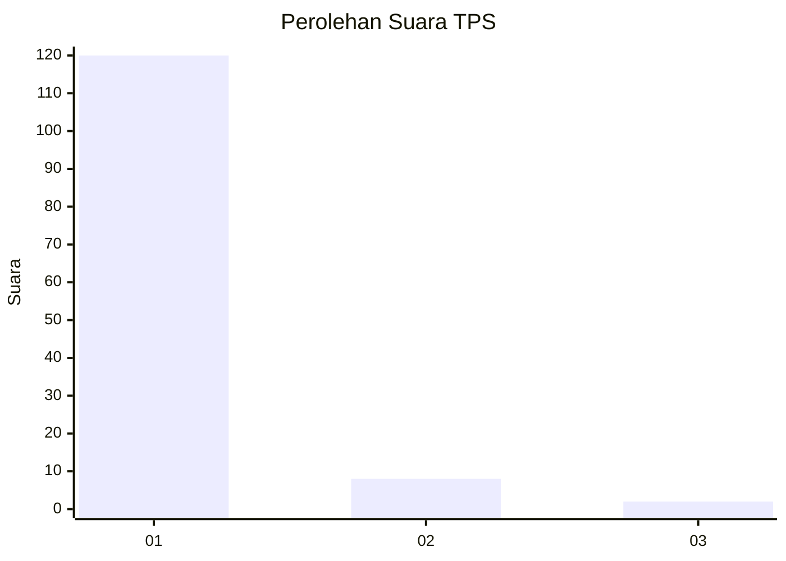
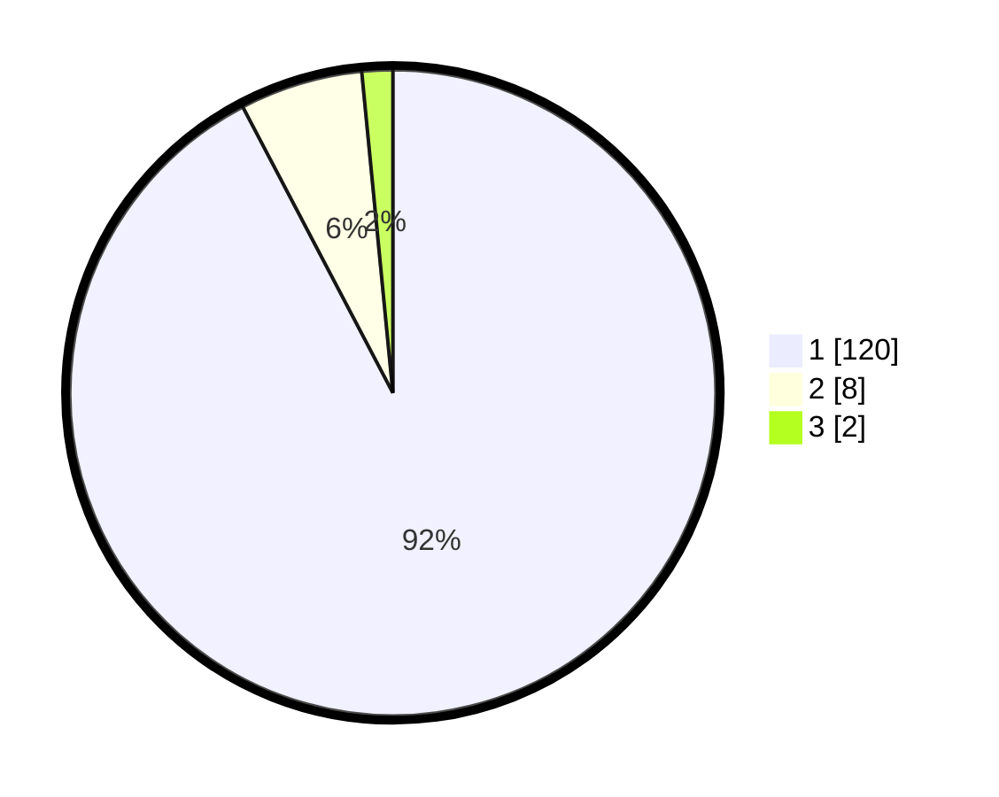

# Hasil

## Grafik

## Tabel

| No. | Nama Paslon    | Suara | Suara (raw) | Persentase |
|:--- |:-------------- | -----:| -----------:| ----------:|
| 1   | ANIES MUHAIMIN | 120   | [120][p-1]  | 92,31      |
| 2   | PRABOWO GIBRAN | 8     | [8][p-2]    | 6,15       |
| 3   | GANJAR MAHFUD  | 2     | [2][p-3]    | 1,54       |

[p-1]: https://github.com/gigit-pemilu/pemilu-2024-11-aceh/blob/main/pilpres/hitung-suara/sub/11-aceh/sub/01-aceh-selatan/sub/11-labuhan-haji-timur/sub/2007-peuneulop/sub/001-tps/sub/paslon-1.txt
[p-2]: https://github.com/gigit-pemilu/pemilu-2024-11-aceh/blob/main/pilpres/hitung-suara/sub/11-aceh/sub/01-aceh-selatan/sub/11-labuhan-haji-timur/sub/2007-peuneulop/sub/001-tps/sub/paslon-2.txt
[p-3]: https://github.com/gigit-pemilu/pemilu-2024-11-aceh/blob/main/pilpres/hitung-suara/sub/11-aceh/sub/01-aceh-selatan/sub/11-labuhan-haji-timur/sub/2007-peuneulop/sub/001-tps/sub/paslon-3.txt

## Foto C Plano

https://sirekap-obj-formc.kpu.go.id/ac75/pemilu/ppwp/11/01/11/20/07/1101112007001-20240223-215004--c19a4a16-7b41-4824-ae67-a7a4c5748ee6.jpg

https://sirekap-obj-formc.kpu.go.id/ac75/pemilu/ppwp/11/01/11/20/07/1101112007001-20240223-215006--39adc1d9-722f-4a03-9174-12c8d9539288.jpg

https://sirekap-obj-formc.kpu.go.id/ac75/pemilu/ppwp/11/01/11/20/07/1101112007001-20240223-215005--71880912-7ebe-4f6f-91eb-a3a02589b780.jpg

## Metadata

| Key        | Value               |
| ---------- | ------------------- |
| Time Stamp | 2024-02-24 22:31:28 |

## DATA PEMILIH TETAP

Jumlah pemilih dalam DPT: **161**.
 * L: **81**.
 * P: **80**.

## DATA PENGGUNA HAK PILIH

Jumlah pengguna hak pilih dalam DPT: **131**.
 * L: **61**.
 * P: **70**.

Jumlah pengguna hak pilih dalam DPTb: **3**.
 * L: **2**.
 * P: **1**.

Jumlah pengguna hak pilih dalam DPK: **134**.
 * L: **63**.
 * P: **71**.

Jumlah pengguna hak pilih: **134**.
 * L: **63**.
 * P: **71**.

## JUMLAH SUARA SAH DAN TIDAK SAH

JUMLAH SELURUH SUARA SAH: **130**.

JUMLAH SUARA TIDAK SAH: **4**.

JUMLAH SELURUH SUARA SAH DAN SUARA TIDAK SAH: **134**.

