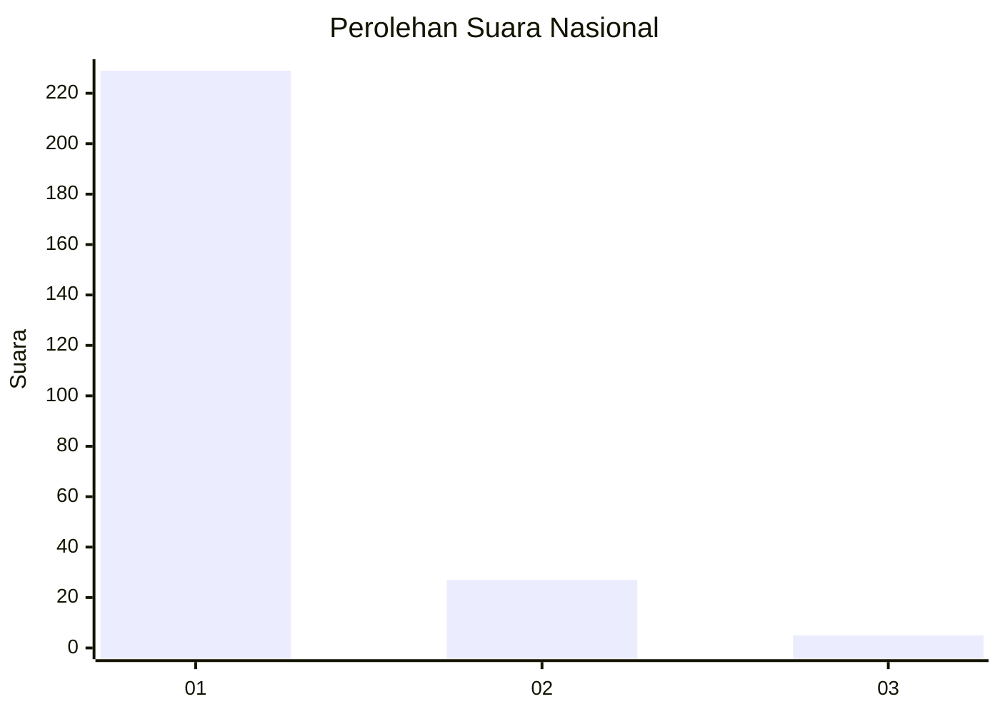
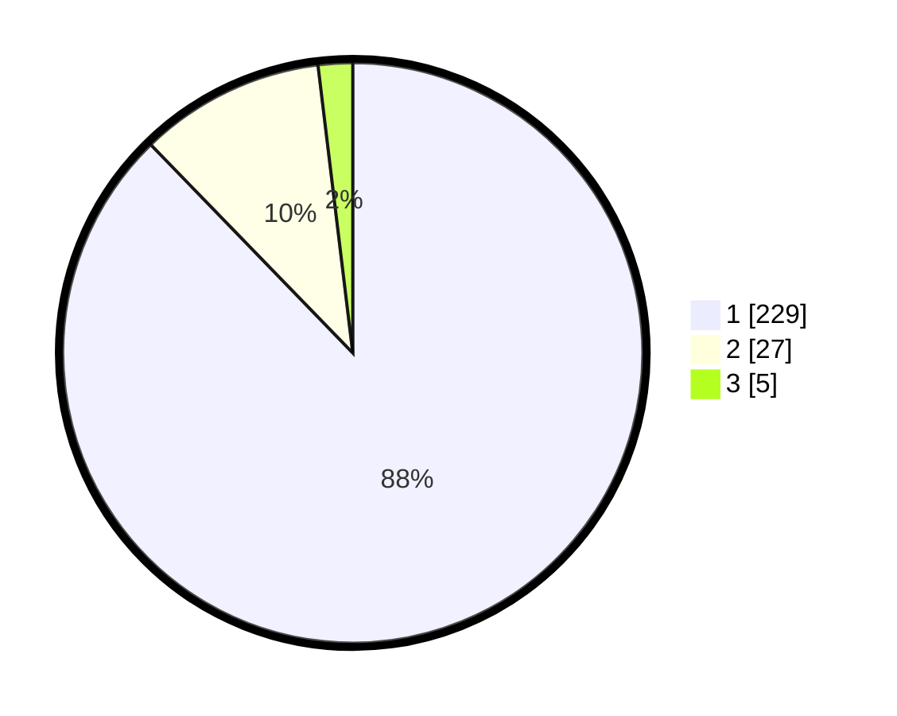

# Hasil

## Grafik

## Tabel

| No. | Nama Paslon    | Suara | Suara (raw) | Persentase |
|:--- |:-------------- | -----:| -----------:| ----------:|
| 1   | ANIES MUHAIMIN | 229   | [229][p-1]  | 87,74      |
| 2   | PRABOWO GIBRAN | 27    | [27][p-2]   | 10,34      |
| 3   | GANJAR MAHFUD  | 5     | [5][p-3]    | 1,92       |

[p-1]: https://github.com/gigit-pemilu/pemilu-2024/blob/main/pilpres/hitung-suara/sub/11-aceh/sub/01-aceh-selatan/sub/12-labuhan-haji-barat/sub/2001-tutong/sub/001-tps/sub/paslon-1.txt
[p-2]: https://github.com/gigit-pemilu/pemilu-2024/blob/main/pilpres/hitung-suara/sub/11-aceh/sub/01-aceh-selatan/sub/12-labuhan-haji-barat/sub/2001-tutong/sub/001-tps/sub/paslon-2.txt
[p-3]: https://github.com/gigit-pemilu/pemilu-2024/blob/main/pilpres/hitung-suara/sub/11-aceh/sub/01-aceh-selatan/sub/12-labuhan-haji-barat/sub/2001-tutong/sub/001-tps/sub/paslon-3.txt

## Foto C Plano

https://sirekap-obj-formc.kpu.go.id/aae7/pemilu/ppwp/11/01/12/20/01/1101122001001-20240215-011157--dd6394e7-02fe-4824-b18e-057cb6326eec.jpg

https://sirekap-obj-formc.kpu.go.id/aae7/pemilu/ppwp/11/01/12/20/01/1101122001001-20240215-013936--66b09548-215b-4737-96a2-659b276d5388.jpg

https://sirekap-obj-formc.kpu.go.id/aae7/pemilu/ppwp/11/01/12/20/01/1101122001001-20240215-014031--4c77a73d-ca13-44b5-b2d1-e11b8ca3ec14.jpg

## Metadata

| Key        | Value               |
| ---------- | ------------------- |
| Time Stamp | 2024-02-16 12:51:22 |

## DATA PEMILIH TETAP

Jumlah pemilih dalam DPT: **290**.
 * L: **145**.
 * P: **145**.

## DATA PENGGUNA HAK PILIH

Jumlah pengguna hak pilih dalam DPT: **253**.
 * L: **118**.
 * P: **135**.

Jumlah pengguna hak pilih dalam DPTb: **8**.
 * L: **5**.
 * P: **3**.

Jumlah pengguna hak pilih dalam DPK: **0**.
 * L: **0**.
 * P: **0**.

Jumlah pengguna hak pilih: **261**.
 * L: **123**.
 * P: **138**.

## JUMLAH SUARA SAH DAN TIDAK SAH

JUMLAH SELURUH SUARA SAH: **261**.

JUMLAH SUARA TIDAK SAH: **0**.

JUMLAH SELURUH SUARA SAH DAN SUARA TIDAK SAH: **261**.

