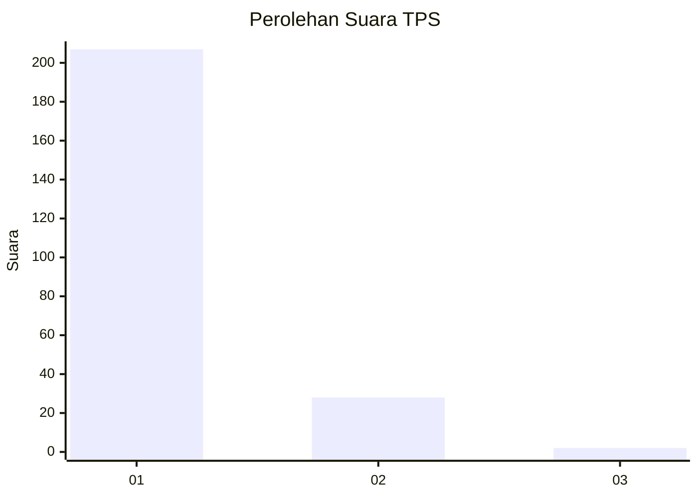
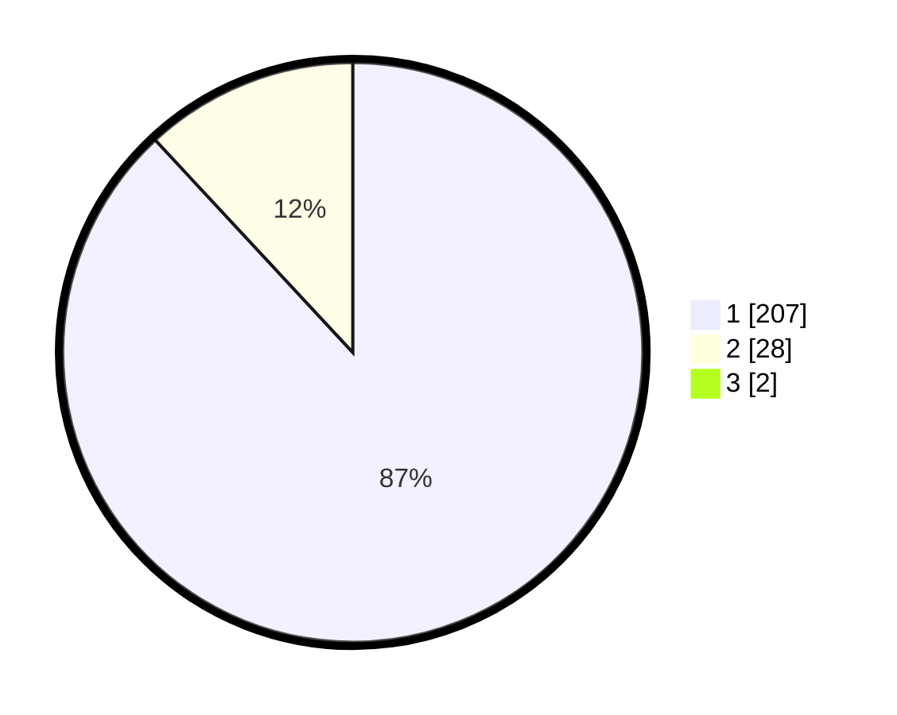

# Hasil

## Grafik

## Tabel

| No. | Nama Paslon    | Suara | Suara (raw) | Persentase |
|:--- |:-------------- | -----:| -----------:| ----------:|
| 1   | ANIES MUHAIMIN | 207   | [207][p-1]  | 87,34      |
| 2   | PRABOWO GIBRAN | 28    | [28][p-2]   | 11,81      |
| 3   | GANJAR MAHFUD  | 2     | [2][p-3]    | 0,84       |

[p-1]: https://github.com/gigit-pemilu/pemilu-2024-11-aceh/blob/main/pilpres/hitung-suara/sub/11-aceh/sub/01-aceh-selatan/sub/12-labuhan-haji-barat/sub/2001-tutong/sub/003-tps/sub/paslon-1.txt
[p-2]: https://github.com/gigit-pemilu/pemilu-2024-11-aceh/blob/main/pilpres/hitung-suara/sub/11-aceh/sub/01-aceh-selatan/sub/12-labuhan-haji-barat/sub/2001-tutong/sub/003-tps/sub/paslon-2.txt
[p-3]: https://github.com/gigit-pemilu/pemilu-2024-11-aceh/blob/main/pilpres/hitung-suara/sub/11-aceh/sub/01-aceh-selatan/sub/12-labuhan-haji-barat/sub/2001-tutong/sub/003-tps/sub/paslon-3.txt

## Foto C Plano

https://sirekap-obj-formc.kpu.go.id/ff74/pemilu/ppwp/11/01/12/20/01/1101122001003-20240214-185739--3cb95212-3723-4448-a483-a0dc2fc0f603.jpg

https://sirekap-obj-formc.kpu.go.id/ff74/pemilu/ppwp/11/01/12/20/01/1101122001003-20240214-190510--d532c676-a898-49bf-a282-e3a5e25dd42b.jpg

https://sirekap-obj-formc.kpu.go.id/ff74/pemilu/ppwp/11/01/12/20/01/1101122001003-20240215-220947--05950447-027e-4ff1-aba7-6b34bd768cc8.jpg

## Metadata

| Key        | Value               |
| ---------- | ------------------- |
| Time Stamp | 2024-02-15 22:30:27 |

## DATA PEMILIH TETAP

Jumlah pemilih dalam DPT: **281**.
 * L: **145**.
 * P: **136**.

## DATA PENGGUNA HAK PILIH

Jumlah pengguna hak pilih dalam DPT: **242**.
 * L: **113**.
 * P: **129**.

Jumlah pengguna hak pilih dalam DPTb: **0**.
 * L: **0**.
 * P: **0**.

Jumlah pengguna hak pilih dalam DPK: **3**.
 * L: **2**.
 * P: **1**.

Jumlah pengguna hak pilih: **245**.
 * L: **115**.
 * P: **130**.

## JUMLAH SUARA SAH DAN TIDAK SAH

JUMLAH SELURUH SUARA SAH: **237**.

JUMLAH SUARA TIDAK SAH: **8**.

JUMLAH SELURUH SUARA SAH DAN SUARA TIDAK SAH: **245**.

