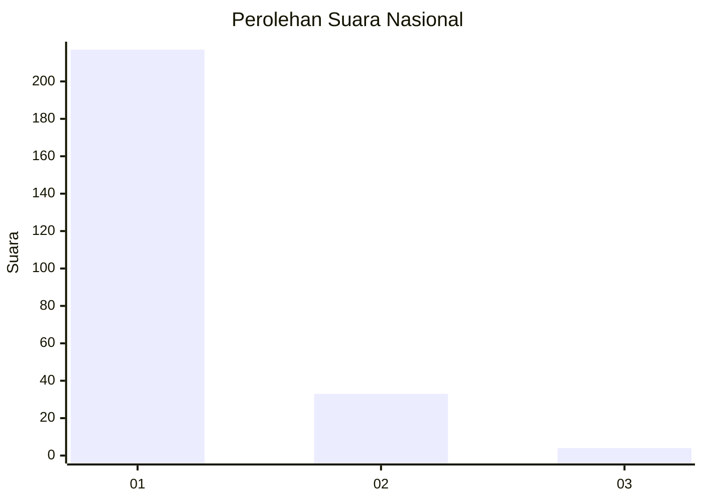
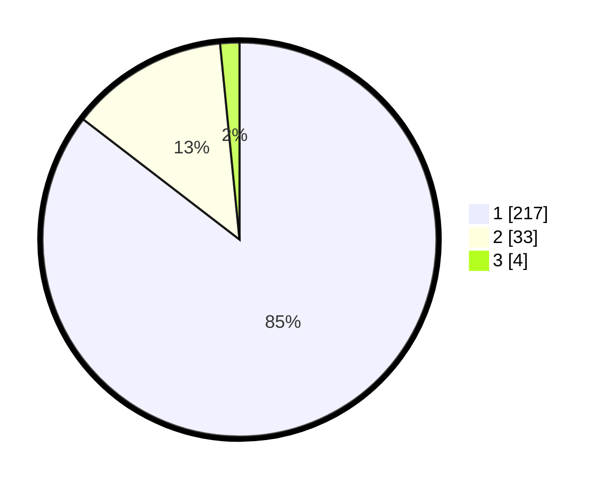

# Hasil

## Grafik

## Tabel

| No. | Nama Paslon    | Suara | Suara (raw) | Persentase |
|:--- |:-------------- | -----:| -----------:| ----------:|
| 1   | ANIES MUHAIMIN | 217   | [217][p-1]  | 85,43      |
| 2   | PRABOWO GIBRAN | 33    | [33][p-2]   | 12,99      |
| 3   | GANJAR MAHFUD  | 4     | [4][p-3]    | 1,57       |

[p-1]: https://github.com/gigit-pemilu/pemilu-2024/blob/main/pilpres/hitung-suara/sub/11-aceh/sub/01-aceh-selatan/sub/12-labuhan-haji-barat/sub/2001-tutong/sub/004-tps/sub/paslon-1.txt
[p-2]: https://github.com/gigit-pemilu/pemilu-2024/blob/main/pilpres/hitung-suara/sub/11-aceh/sub/01-aceh-selatan/sub/12-labuhan-haji-barat/sub/2001-tutong/sub/004-tps/sub/paslon-2.txt
[p-3]: https://github.com/gigit-pemilu/pemilu-2024/blob/main/pilpres/hitung-suara/sub/11-aceh/sub/01-aceh-selatan/sub/12-labuhan-haji-barat/sub/2001-tutong/sub/004-tps/sub/paslon-3.txt

## Foto C Plano

https://sirekap-obj-formc.kpu.go.id/dd5e/pemilu/ppwp/11/01/12/20/01/1101122001004-20240215-051449--52e8bf67-a5e2-4e1b-9546-62e170e51c75.jpg

https://sirekap-obj-formc.kpu.go.id/dd5e/pemilu/ppwp/11/01/12/20/01/1101122001004-20240214-215619--41095fe8-bd9f-4073-b54b-efdc5e1a2988.jpg

https://sirekap-obj-formc.kpu.go.id/dd5e/pemilu/ppwp/11/01/12/20/01/1101122001004-20240214-220121--bac6d341-8f19-4950-8afd-3f68e8c1a4b6.jpg

## Metadata

| Key        | Value               |
| ---------- | ------------------- |
| Time Stamp | 2024-02-17 10:30:03 |

## DATA PEMILIH TETAP

Jumlah pemilih dalam DPT: **290**.
 * L: **135**.
 * P: **155**.

## DATA PENGGUNA HAK PILIH

Jumlah pengguna hak pilih dalam DPT: **252**.
 * L: **114**.
 * P: **138**.

Jumlah pengguna hak pilih dalam DPTb: **0**.
 * L: **0**.
 * P: **0**.

Jumlah pengguna hak pilih dalam DPK: **5**.
 * L: **3**.
 * P: **2**.

Jumlah pengguna hak pilih: **257**.
 * L: **117**.
 * P: **140**.

## JUMLAH SUARA SAH DAN TIDAK SAH

JUMLAH SELURUH SUARA SAH: **254**.

JUMLAH SUARA TIDAK SAH: **3**.

JUMLAH SELURUH SUARA SAH DAN SUARA TIDAK SAH: **257**.

