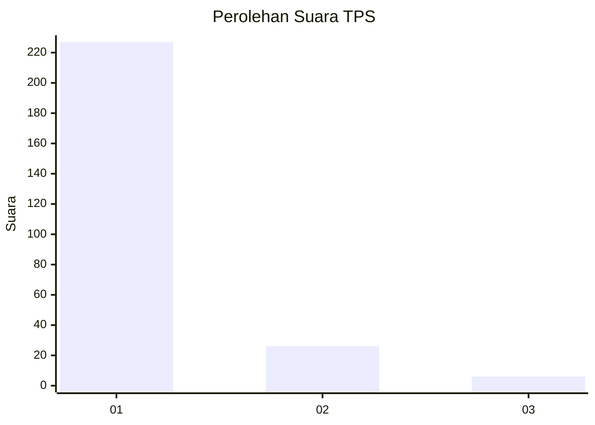
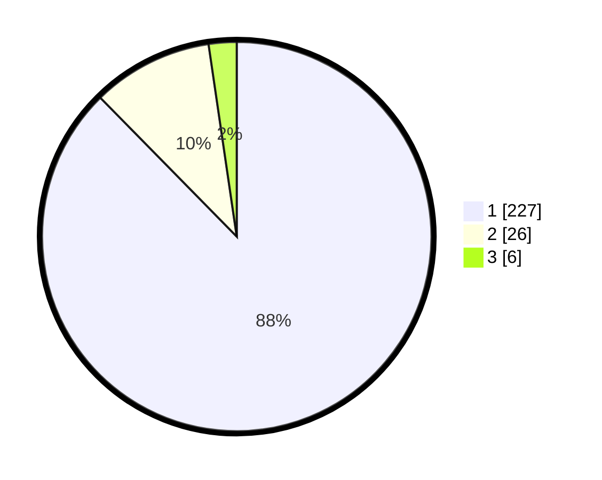

# Hasil

## Grafik

## Tabel

| No. | Nama Paslon    | Suara | Suara (raw) | Persentase |
|:--- |:-------------- | -----:| -----------:| ----------:|
| 1   | ANIES MUHAIMIN | 227   | [227][p-1]  | 87,64      |
| 2   | PRABOWO GIBRAN | 26    | [26][p-2]   | 10,04      |
| 3   | GANJAR MAHFUD  | 6     | [6][p-3]    | 2,32       |

[p-1]: https://github.com/gigit-pemilu/pemilu-2024-11-aceh/blob/main/pilpres/hitung-suara/sub/11-aceh/sub/01-aceh-selatan/sub/12-labuhan-haji-barat/sub/2002-teungoh-iboh/sub/001-tps/sub/paslon-1.txt
[p-2]: https://github.com/gigit-pemilu/pemilu-2024-11-aceh/blob/main/pilpres/hitung-suara/sub/11-aceh/sub/01-aceh-selatan/sub/12-labuhan-haji-barat/sub/2002-teungoh-iboh/sub/001-tps/sub/paslon-2.txt
[p-3]: https://github.com/gigit-pemilu/pemilu-2024-11-aceh/blob/main/pilpres/hitung-suara/sub/11-aceh/sub/01-aceh-selatan/sub/12-labuhan-haji-barat/sub/2002-teungoh-iboh/sub/001-tps/sub/paslon-3.txt

## Foto C Plano

https://sirekap-obj-formc.kpu.go.id/120f/pemilu/ppwp/11/01/12/20/02/1101122002001-20240216-142642--bda9ebcb-3f89-4079-8530-0fbdcb8c7dfb.jpg

https://sirekap-obj-formc.kpu.go.id/120f/pemilu/ppwp/11/01/12/20/02/1101122002001-20240216-142643--1da1a5ce-65f5-4b2a-91f8-3892e539fc7d.jpg

https://sirekap-obj-formc.kpu.go.id/120f/pemilu/ppwp/11/01/12/20/02/1101122002001-20240216-092133--29574bca-6169-45de-937a-4b361adca12a.jpg

## Metadata

| Key        | Value               |
| ---------- | ------------------- |
| Time Stamp | 2024-02-16 21:01:00 |

## DATA PEMILIH TETAP

Jumlah pemilih dalam DPT: **299**.
 * L: **142**.
 * P: **157**.

## DATA PENGGUNA HAK PILIH

Jumlah pengguna hak pilih dalam DPT: **253**.
 * L: **109**.
 * P: **144**.

Jumlah pengguna hak pilih dalam DPTb: **1**.
 * L: **1**.
 * P: **0**.

Jumlah pengguna hak pilih dalam DPK: **5**.
 * L: **3**.
 * P: **2**.

Jumlah pengguna hak pilih: **259**.
 * L: **113**.
 * P: **146**.

## JUMLAH SUARA SAH DAN TIDAK SAH

JUMLAH SELURUH SUARA SAH: **259**.

JUMLAH SUARA TIDAK SAH: **0**.

JUMLAH SELURUH SUARA SAH DAN SUARA TIDAK SAH: **259**.

