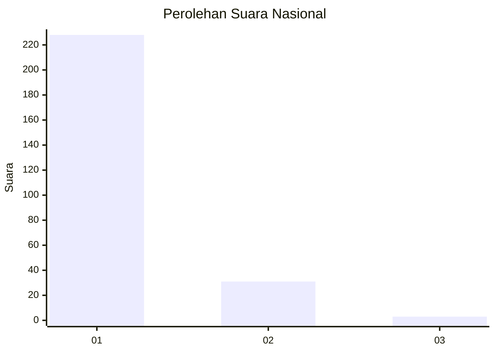
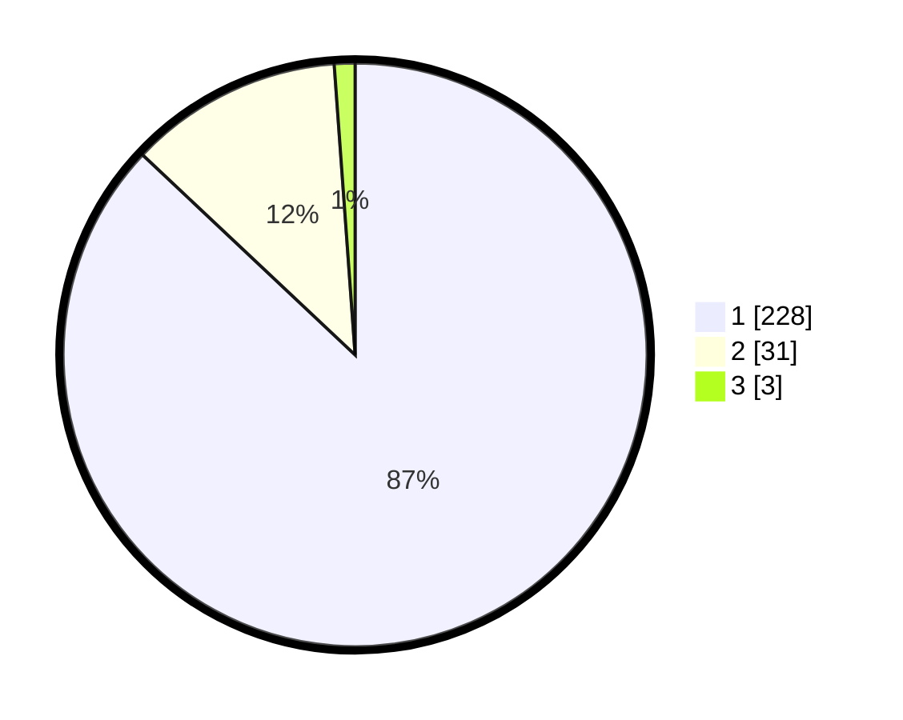

# Hasil

## Grafik

## Tabel

| No. | Nama Paslon    | Suara | Suara (raw) | Persentase |
|:--- |:-------------- | -----:| -----------:| ----------:|
| 1   | ANIES MUHAIMIN | 228   | [228][p-1]  | 87,02      |
| 2   | PRABOWO GIBRAN | 31    | [31][p-2]   | 11,83      |
| 3   | GANJAR MAHFUD  | 3     | [3][p-3]    | 1,15       |

[p-1]: https://github.com/gigit-pemilu/pemilu-2024/blob/main/pilpres/hitung-suara/sub/11-aceh/sub/01-aceh-selatan/sub/12-labuhan-haji-barat/sub/2002-teungoh-iboh/sub/003-tps/sub/paslon-1.txt
[p-2]: https://github.com/gigit-pemilu/pemilu-2024/blob/main/pilpres/hitung-suara/sub/11-aceh/sub/01-aceh-selatan/sub/12-labuhan-haji-barat/sub/2002-teungoh-iboh/sub/003-tps/sub/paslon-2.txt
[p-3]: https://github.com/gigit-pemilu/pemilu-2024/blob/main/pilpres/hitung-suara/sub/11-aceh/sub/01-aceh-selatan/sub/12-labuhan-haji-barat/sub/2002-teungoh-iboh/sub/003-tps/sub/paslon-3.txt

## Foto C Plano

https://sirekap-obj-formc.kpu.go.id/2ae5/pemilu/ppwp/11/01/12/20/02/1101122002003-20240214-233824--ed6a6c21-afa6-482d-91b9-0d6527e9a7b8.jpg

https://sirekap-obj-formc.kpu.go.id/2ae5/pemilu/ppwp/11/01/12/20/02/1101122002003-20240214-221643--582e9f17-1dab-4fd5-8a9a-23d0c34a1017.jpg

https://sirekap-obj-formc.kpu.go.id/2ae5/pemilu/ppwp/11/01/12/20/02/1101122002003-20240214-223109--faae10e2-d96f-4106-8431-8983dec2fbae.jpg

## Metadata

| Key        | Value               |
| ---------- | ------------------- |
| Time Stamp | 2024-02-17 10:30:03 |

## DATA PEMILIH TETAP

Jumlah pemilih dalam DPT: **299**.
 * L: **146**.
 * P: **153**.

## DATA PENGGUNA HAK PILIH

Jumlah pengguna hak pilih dalam DPT: **265**.
 * L: **121**.
 * P: **144**.

Jumlah pengguna hak pilih dalam DPTb: **0**.
 * L: **0**.
 * P: **0**.

Jumlah pengguna hak pilih dalam DPK: **1**.
 * L: **0**.
 * P: **1**.

Jumlah pengguna hak pilih: **266**.
 * L: **121**.
 * P: **145**.

## JUMLAH SUARA SAH DAN TIDAK SAH

JUMLAH SELURUH SUARA SAH: **262**.

JUMLAH SUARA TIDAK SAH: **4**.

JUMLAH SELURUH SUARA SAH DAN SUARA TIDAK SAH: **266**.

