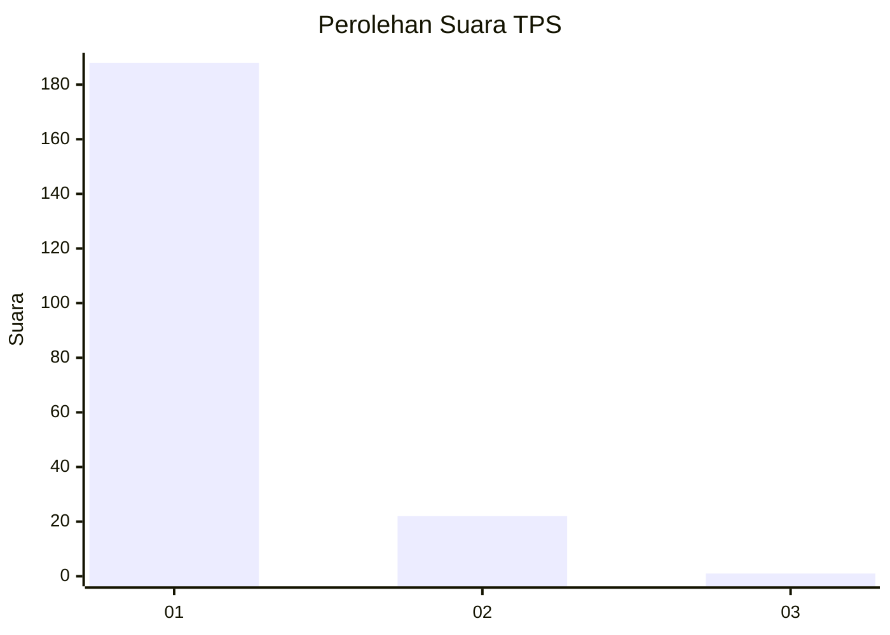
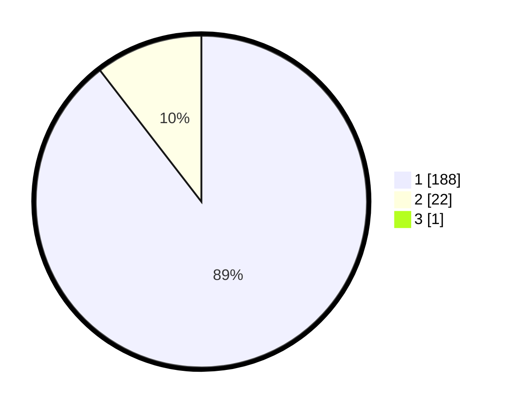

# Hasil

## Grafik

## Tabel

| No. | Nama Paslon    | Suara | Suara (raw) | Persentase |
|:--- |:-------------- | -----:| -----------:| ----------:|
| 1   | ANIES MUHAIMIN | 188   | [188][p-1]  | 89,10      |
| 2   | PRABOWO GIBRAN | 22    | [22][p-2]   | 10,43      |
| 3   | GANJAR MAHFUD  | 1     | [1][p-3]    | 0,47       |

[p-1]: https://github.com/gigit-pemilu/pemilu-2024-11-aceh/blob/main/pilpres/hitung-suara/sub/11-aceh/sub/01-aceh-selatan/sub/12-labuhan-haji-barat/sub/2005-ujung-padang/sub/003-tps/sub/paslon-1.txt
[p-2]: https://github.com/gigit-pemilu/pemilu-2024-11-aceh/blob/main/pilpres/hitung-suara/sub/11-aceh/sub/01-aceh-selatan/sub/12-labuhan-haji-barat/sub/2005-ujung-padang/sub/003-tps/sub/paslon-2.txt
[p-3]: https://github.com/gigit-pemilu/pemilu-2024-11-aceh/blob/main/pilpres/hitung-suara/sub/11-aceh/sub/01-aceh-selatan/sub/12-labuhan-haji-barat/sub/2005-ujung-padang/sub/003-tps/sub/paslon-3.txt

## Foto C Plano

https://sirekap-obj-formc.kpu.go.id/4bea/pemilu/ppwp/11/01/12/20/05/1101122005003-20240215-171503--90352da1-bd0b-4c36-ba37-0e688ba37174.jpg

https://sirekap-obj-formc.kpu.go.id/4bea/pemilu/ppwp/11/01/12/20/05/1101122005003-20240215-171623--e95a7f33-760a-4b03-8643-d4fc74e9625f.jpg

https://sirekap-obj-formc.kpu.go.id/4bea/pemilu/ppwp/11/01/12/20/05/1101122005003-20240215-171816--6da0074f-86b1-4bcf-806c-20ca84fc9727.jpg

## Metadata

| Key        | Value               |
| ---------- | ------------------- |
| Time Stamp | 2024-02-16 12:51:22 |

