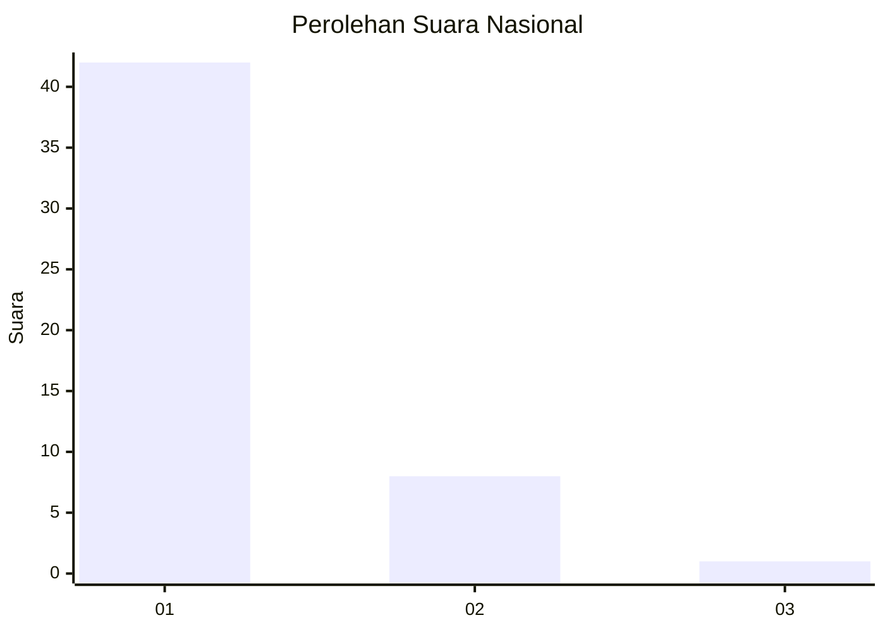
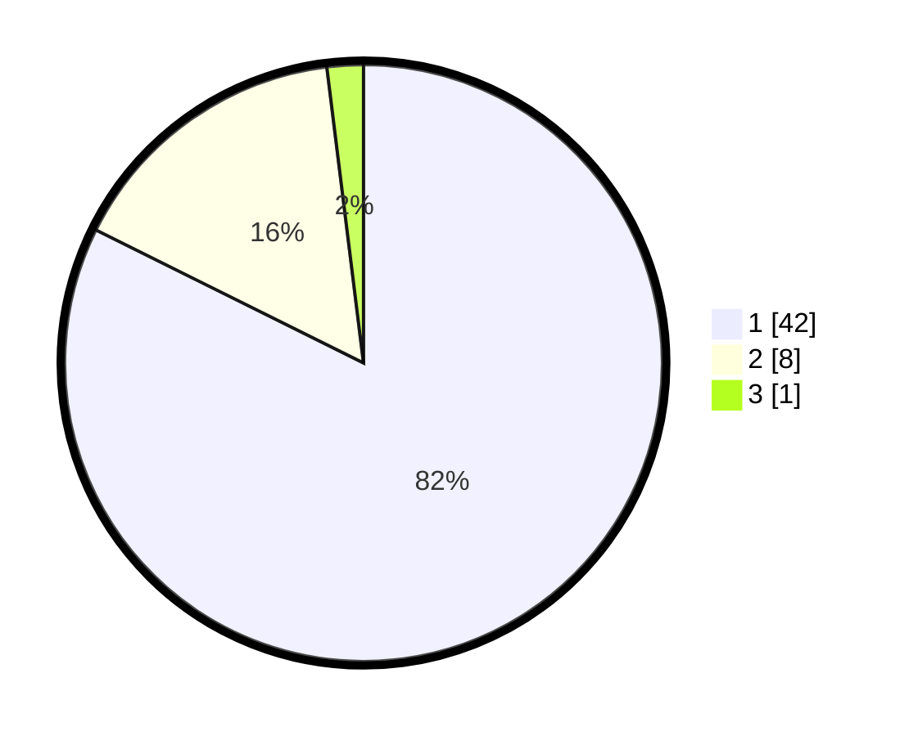

# Hasil

## Grafik

## Tabel

| No. | Nama Paslon    | Suara | Suara (raw) | Persentase |
|:--- |:-------------- | -----:| -----------:| ----------:|
| 1   | ANIES MUHAIMIN | 42    | [42][p-1]   | 82,35      |
| 2   | PRABOWO GIBRAN | 8     | [8][p-2]    | 15,69      |
| 3   | GANJAR MAHFUD  | 1     | [1][p-3]    | 1,96       |

[p-1]: https://github.com/gigit-pemilu/pemilu-2024/blob/main/pilpres/hitung-suara/sub/11-aceh/sub/01-aceh-selatan/sub/12-labuhan-haji-barat/sub/2005-ujung-padang/sub/901-tps/sub/paslon-1.txt
[p-2]: https://github.com/gigit-pemilu/pemilu-2024/blob/main/pilpres/hitung-suara/sub/11-aceh/sub/01-aceh-selatan/sub/12-labuhan-haji-barat/sub/2005-ujung-padang/sub/901-tps/sub/paslon-2.txt
[p-3]: https://github.com/gigit-pemilu/pemilu-2024/blob/main/pilpres/hitung-suara/sub/11-aceh/sub/01-aceh-selatan/sub/12-labuhan-haji-barat/sub/2005-ujung-padang/sub/901-tps/sub/paslon-3.txt

## Foto C Plano

https://sirekap-obj-formc.kpu.go.id/2c9b/pemilu/ppwp/11/01/12/20/05/1101122005901-20240215-130316--e2b2af08-5bfa-4b13-a32f-67ebaa1d994a.jpg

https://sirekap-obj-formc.kpu.go.id/2c9b/pemilu/ppwp/11/01/12/20/05/1101122005901-20240215-091441--14d4efb7-b11b-4dcb-9433-cd3ec91d7070.jpg

https://sirekap-obj-formc.kpu.go.id/2c9b/pemilu/ppwp/11/01/12/20/05/1101122005901-20240215-014432--6c6f9ca4-bc49-4fb0-9eb5-98aac44dd050.jpg

## Metadata

| Key        | Value               |
| ---------- | ------------------- |
| Time Stamp | 2024-02-16 12:51:22 |

## DATA PEMILIH TETAP

Jumlah pemilih dalam DPT: **218**.
 * L: **99**.
 * P: **119**.

## DATA PENGGUNA HAK PILIH

Jumlah pengguna hak pilih dalam DPT: **53**.
 * L: **33**.
 * P: **20**.

Jumlah pengguna hak pilih dalam DPTb: **0**.
 * L: **0**.
 * P: **0**.

Jumlah pengguna hak pilih dalam DPK: **0**.
 * L: **0**.
 * P: **0**.

Jumlah pengguna hak pilih: **53**.
 * L: **33**.
 * P: **20**.

## JUMLAH SUARA SAH DAN TIDAK SAH

JUMLAH SELURUH SUARA SAH: **51**.

JUMLAH SUARA TIDAK SAH: **2**.

JUMLAH SELURUH SUARA SAH DAN SUARA TIDAK SAH: **53**.

