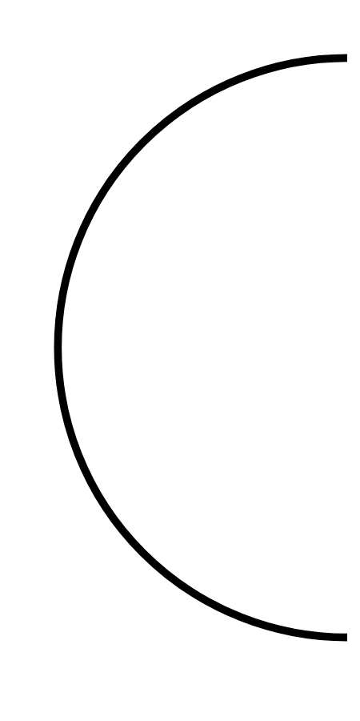

# Hasil

## Grafik

```mermaid
xychart-beta
    title "Perolehan Suara Nasional"
    x-axis []
    y-axis "Suara" 0 --> 0
    bar []
```



## Tabel

| No. | Nama Paslon | Suara | Suara (raw) | Persentase |
|:--- |:----------- | -----:| -----------:| ----------:|


[p-1]: https://github.com/gigit-pemilu/pemilu-2024/blob/main/pilpres/hitung-suara/sub/11-aceh/sub/01-aceh-selatan/sub/12-labuhan-haji-barat/sub/2008-pulo-ie/sub/001-tps/sub/paslon-1.txt
[p-2]: https://github.com/gigit-pemilu/pemilu-2024/blob/main/pilpres/hitung-suara/sub/11-aceh/sub/01-aceh-selatan/sub/12-labuhan-haji-barat/sub/2008-pulo-ie/sub/001-tps/sub/paslon-2.txt
[p-3]: https://github.com/gigit-pemilu/pemilu-2024/blob/main/pilpres/hitung-suara/sub/11-aceh/sub/01-aceh-selatan/sub/12-labuhan-haji-barat/sub/2008-pulo-ie/sub/001-tps/sub/paslon-3.txt

## Foto C Plano

https://sirekap-obj-formc.kpu.go.id/8549/pemilu/ppwp/11/01/12/20/08/1101122008001-20240216-111303--38f327ce-e87f-44f4-8a39-cdcec3aa3673.jpg

https://sirekap-obj-formc.kpu.go.id/8549/pemilu/ppwp/11/01/12/20/08/1101122008001-20240216-120819--8f8359e6-f5c5-46e7-be8d-042c40ffd8cf.jpg

https://sirekap-obj-formc.kpu.go.id/8549/pemilu/ppwp/11/01/12/20/08/1101122008001-20240216-120458--071be95b-2d42-466a-ad12-8d6b98adf6ce.jpg


## Metadata

| Key        | Value               |
| ---------- | ------------------- |
| Time Stamp | 2024-02-16 13:00:29 |


