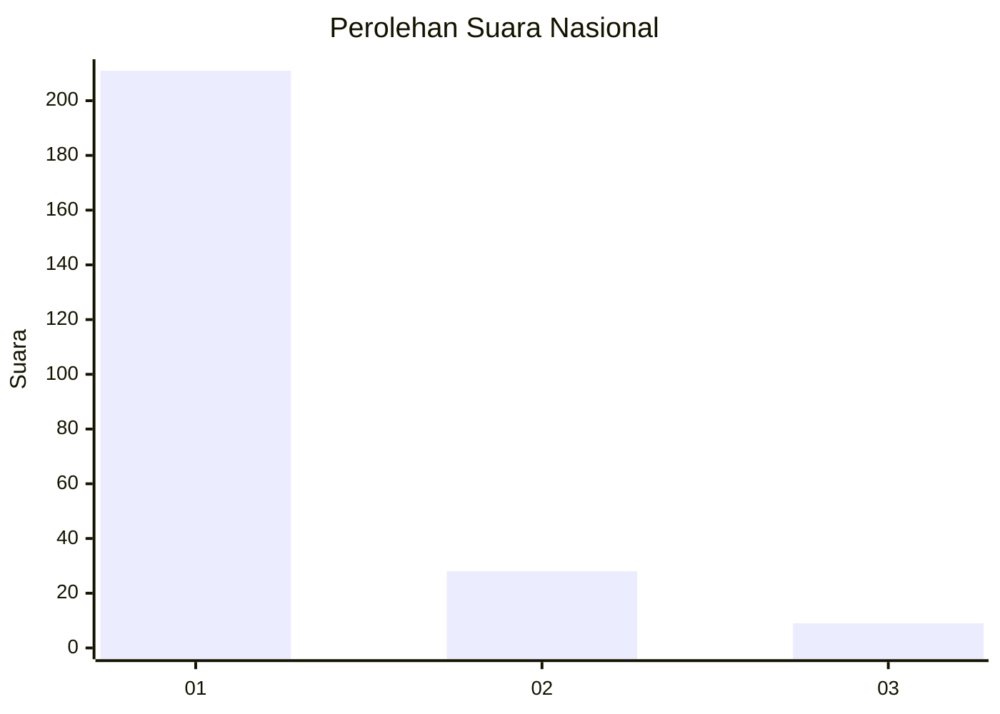
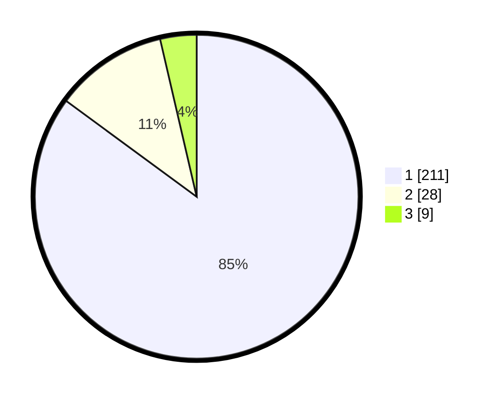

# Hasil

## Grafik

## Tabel

| No. | Nama Paslon    | Suara | Suara (raw) | Persentase |
|:--- |:-------------- | -----:| -----------:| ----------:|
| 1   | ANIES MUHAIMIN | 211   | [211][p-1]  | 85,08      |
| 2   | PRABOWO GIBRAN | 28    | [28][p-2]   | 11,29      |
| 3   | GANJAR MAHFUD  | 9     | [9][p-3]    | 3,63       |

[p-1]: https://github.com/gigit-pemilu/pemilu-2024/blob/main/pilpres/hitung-suara/sub/11-aceh/sub/01-aceh-selatan/sub/12-labuhan-haji-barat/sub/2011-kuta-trieng/sub/001-tps/sub/paslon-1.txt
[p-2]: https://github.com/gigit-pemilu/pemilu-2024/blob/main/pilpres/hitung-suara/sub/11-aceh/sub/01-aceh-selatan/sub/12-labuhan-haji-barat/sub/2011-kuta-trieng/sub/001-tps/sub/paslon-2.txt
[p-3]: https://github.com/gigit-pemilu/pemilu-2024/blob/main/pilpres/hitung-suara/sub/11-aceh/sub/01-aceh-selatan/sub/12-labuhan-haji-barat/sub/2011-kuta-trieng/sub/001-tps/sub/paslon-3.txt

## Foto C Plano

https://sirekap-obj-formc.kpu.go.id/ba57/pemilu/ppwp/11/01/12/20/11/1101122011001-20240215-180247--606a0d55-7123-445a-8403-0ec84fb18fb1.jpg

https://sirekap-obj-formc.kpu.go.id/ba57/pemilu/ppwp/11/01/12/20/11/1101122011001-20240215-180457--afa9d356-e108-47e6-b910-4957a5494ed9.jpg

## Metadata

| Key        | Value               |
| ---------- | ------------------- |
| Time Stamp | 2024-02-24 22:31:28 |

