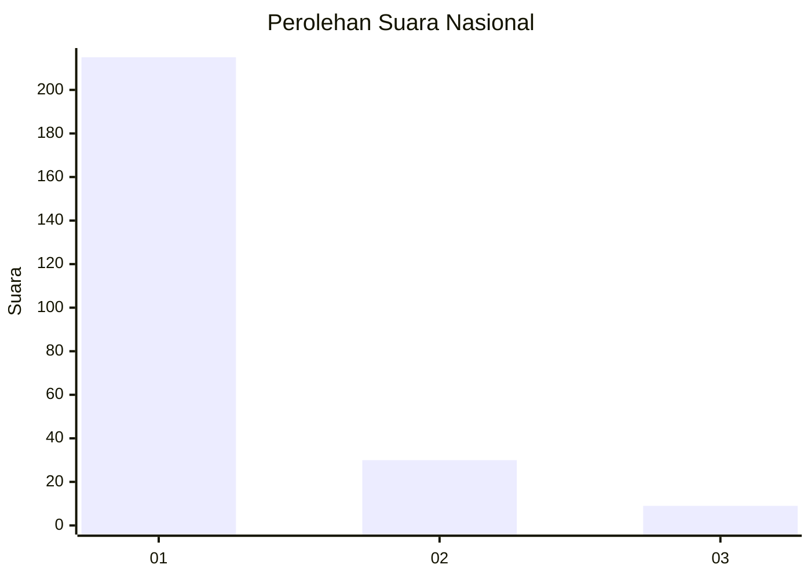
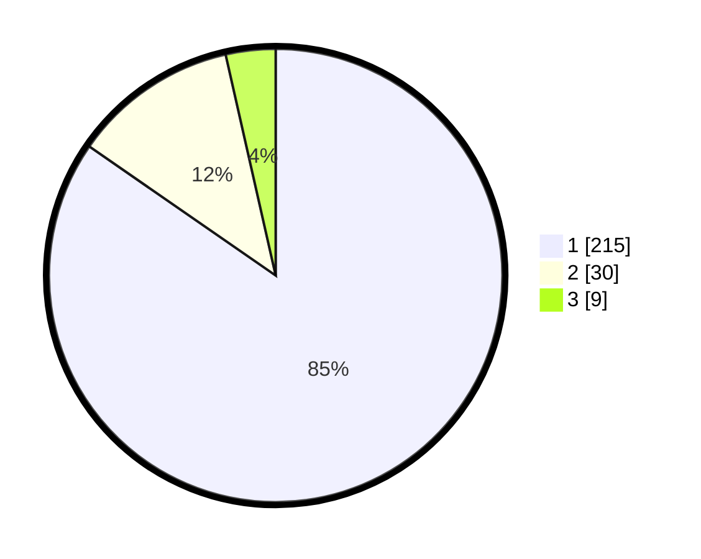

# Hasil

## Grafik

## Tabel

| No. | Nama Paslon    | Suara | Suara (raw) | Persentase |
|:--- |:-------------- | -----:| -----------:| ----------:|
| 1   | ANIES MUHAIMIN | 215   | [215][p-1]  | 84,65      |
| 2   | PRABOWO GIBRAN | 30    | [30][p-2]   | 11,81      |
| 3   | GANJAR MAHFUD  | 9     | [9][p-3]    | 3,54       |

[p-1]: https://github.com/gigit-pemilu/pemilu-2024/blob/main/pilpres/hitung-suara/sub/11-aceh/sub/01-aceh-selatan/sub/12-labuhan-haji-barat/sub/2011-kuta-trieng/sub/004-tps/sub/paslon-1.txt
[p-2]: https://github.com/gigit-pemilu/pemilu-2024/blob/main/pilpres/hitung-suara/sub/11-aceh/sub/01-aceh-selatan/sub/12-labuhan-haji-barat/sub/2011-kuta-trieng/sub/004-tps/sub/paslon-2.txt
[p-3]: https://github.com/gigit-pemilu/pemilu-2024/blob/main/pilpres/hitung-suara/sub/11-aceh/sub/01-aceh-selatan/sub/12-labuhan-haji-barat/sub/2011-kuta-trieng/sub/004-tps/sub/paslon-3.txt

## Foto C Plano

https://sirekap-obj-formc.kpu.go.id/7c16/pemilu/ppwp/11/01/12/20/11/1101122011004-20240216-151548--a73354c9-d21b-4098-8375-0ee45ca03c5a.jpg

https://sirekap-obj-formc.kpu.go.id/7c16/pemilu/ppwp/11/01/12/20/11/1101122011004-20240216-151549--a20f40a7-fd4d-4ce8-9746-19e9b5ef472f.jpg

https://sirekap-obj-formc.kpu.go.id/7c16/pemilu/ppwp/11/01/12/20/11/1101122011004-20240216-151548--bc1e06ff-f10e-4c83-aa77-6b304613bc1d.jpg

## Metadata

| Key        | Value               |
| ---------- | ------------------- |
| Time Stamp | 2024-02-16 21:01:00 |

## DATA PEMILIH TETAP

Jumlah pemilih dalam DPT: **291**.
 * L: **131**.
 * P: **160**.

## DATA PENGGUNA HAK PILIH

Jumlah pengguna hak pilih dalam DPT: **256**.
 * L: **102**.
 * P: **154**.

Jumlah pengguna hak pilih dalam DPTb: **0**.
 * L: **0**.
 * P: **0**.

Jumlah pengguna hak pilih dalam DPK: **3**.
 * L: **2**.
 * P: **1**.

Jumlah pengguna hak pilih: **259**.
 * L: **104**.
 * P: **155**.

## JUMLAH SUARA SAH DAN TIDAK SAH

JUMLAH SELURUH SUARA SAH: **254**.

JUMLAH SUARA TIDAK SAH: **5**.

JUMLAH SELURUH SUARA SAH DAN SUARA TIDAK SAH: **259**.

