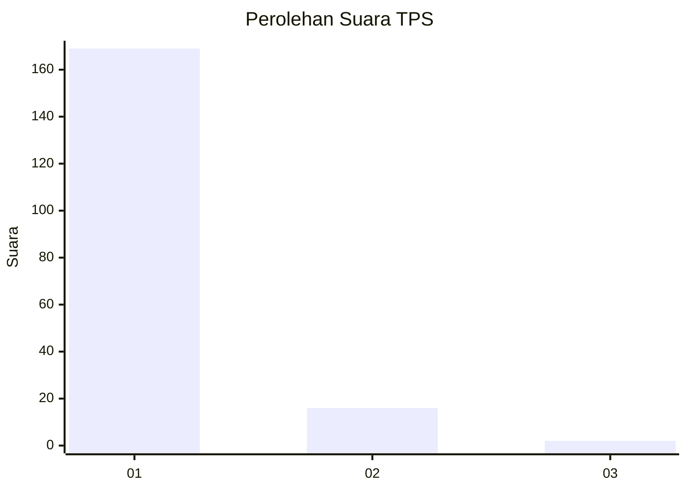
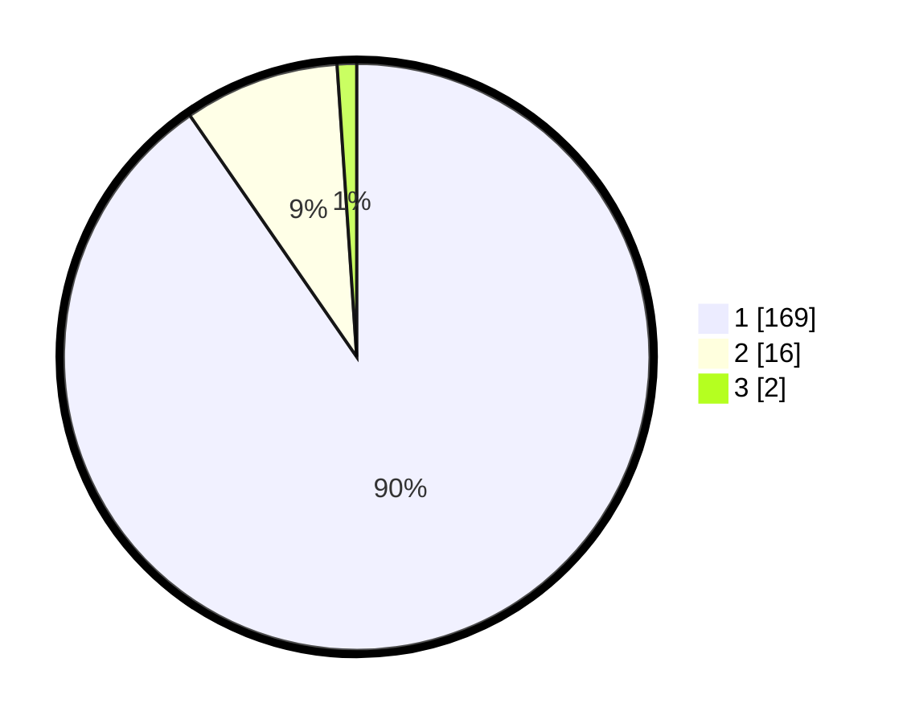

# Hasil

## Grafik

## Tabel

| No. | Nama Paslon    | Suara | Suara (raw) | Persentase |
|:--- |:-------------- | -----:| -----------:| ----------:|
| 1   | ANIES MUHAIMIN | 169   | [169][p-1]  | 90,37      |
| 2   | PRABOWO GIBRAN | 16    | [16][p-2]   | 8,56       |
| 3   | GANJAR MAHFUD  | 2     | [2][p-3]    | 1,07       |

[p-1]: https://github.com/gigit-pemilu/pemilu-2024-11-aceh/blob/main/pilpres/hitung-suara/sub/11-aceh/sub/01-aceh-selatan/sub/12-labuhan-haji-barat/sub/2012-pante-geulima/sub/003-tps/sub/paslon-1.txt
[p-2]: https://github.com/gigit-pemilu/pemilu-2024-11-aceh/blob/main/pilpres/hitung-suara/sub/11-aceh/sub/01-aceh-selatan/sub/12-labuhan-haji-barat/sub/2012-pante-geulima/sub/003-tps/sub/paslon-2.txt
[p-3]: https://github.com/gigit-pemilu/pemilu-2024-11-aceh/blob/main/pilpres/hitung-suara/sub/11-aceh/sub/01-aceh-selatan/sub/12-labuhan-haji-barat/sub/2012-pante-geulima/sub/003-tps/sub/paslon-3.txt

## Foto C Plano

https://sirekap-obj-formc.kpu.go.id/7ab2/pemilu/ppwp/11/01/12/20/12/1101122012003-20240216-162510--557e2e0b-e83c-4892-b63e-09c798765415.jpg

https://sirekap-obj-formc.kpu.go.id/7ab2/pemilu/ppwp/11/01/12/20/12/1101122012003-20240216-163246--0371ca3a-9172-4ebc-a1f1-ce7a80e2153d.jpg

https://sirekap-obj-formc.kpu.go.id/7ab2/pemilu/ppwp/11/01/12/20/12/1101122012003-20240216-164511--d3306af5-a5bb-4e01-afe1-5897169a67a3.jpg

## Metadata

| Key        | Value               |
| ---------- | ------------------- |
| Time Stamp | 2024-02-16 17:00:00 |

