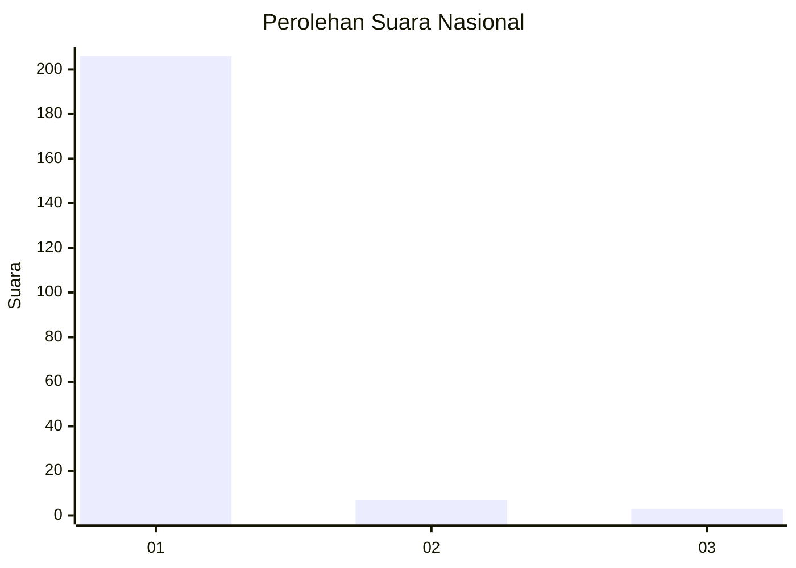
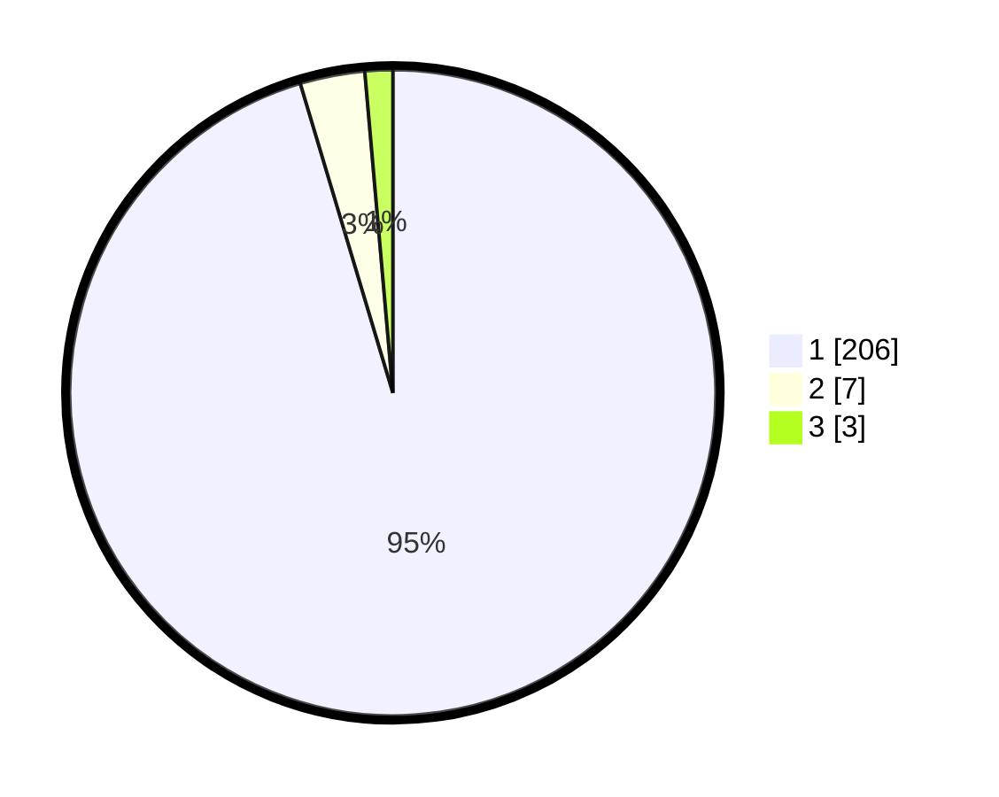

# Hasil

## Grafik

## Tabel

| No. | Nama Paslon    | Suara | Suara (raw) | Persentase |
|:--- |:-------------- | -----:| -----------:| ----------:|
| 1   | ANIES MUHAIMIN | 206   | [206][p-1]  | 95,37      |
| 2   | PRABOWO GIBRAN | 7     | [7][p-2]    | 3,24       |
| 3   | GANJAR MAHFUD  | 3     | [3][p-3]    | 1,39       |

[p-1]: https://github.com/gigit-pemilu/pemilu-2024/blob/main/pilpres/hitung-suara/sub/11-aceh/sub/01-aceh-selatan/sub/12-labuhan-haji-barat/sub/2013-panton-pawoh/sub/001-tps/sub/paslon-1.txt
[p-2]: https://github.com/gigit-pemilu/pemilu-2024/blob/main/pilpres/hitung-suara/sub/11-aceh/sub/01-aceh-selatan/sub/12-labuhan-haji-barat/sub/2013-panton-pawoh/sub/001-tps/sub/paslon-2.txt
[p-3]: https://github.com/gigit-pemilu/pemilu-2024/blob/main/pilpres/hitung-suara/sub/11-aceh/sub/01-aceh-selatan/sub/12-labuhan-haji-barat/sub/2013-panton-pawoh/sub/001-tps/sub/paslon-3.txt

## Foto C Plano

https://sirekap-obj-formc.kpu.go.id/71c2/pemilu/ppwp/11/01/12/20/13/1101122013001-20240216-124036--29caff4f-5127-42ab-af46-dc464f14eae5.jpg

https://sirekap-obj-formc.kpu.go.id/71c2/pemilu/ppwp/11/01/12/20/13/1101122013001-20240216-124814--89cc5353-0cbd-4584-b9dc-fcd50ccf1ab7.jpg

## Metadata

| Key        | Value               |
| ---------- | ------------------- |
| Time Stamp | 2024-02-24 22:31:28 |

