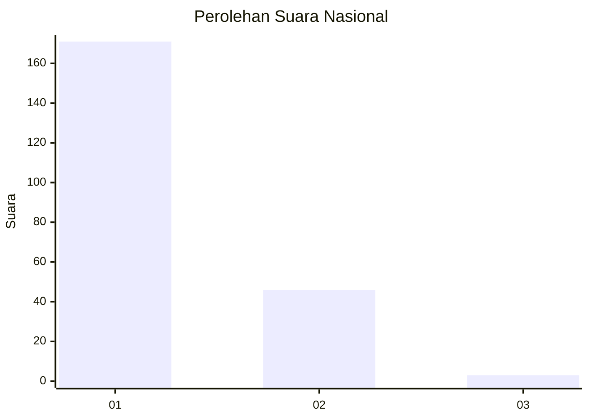
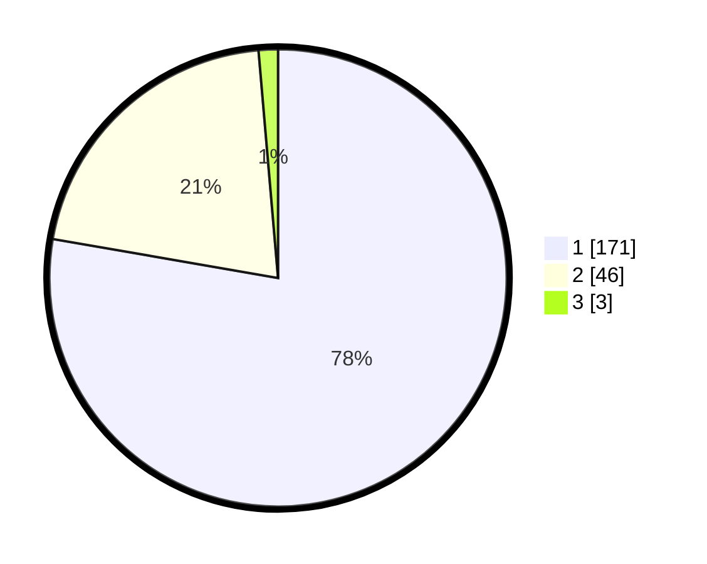

# Hasil

## Grafik

## Tabel

| No. | Nama Paslon    | Suara | Suara (raw) | Persentase |
|:--- |:-------------- | -----:| -----------:| ----------:|
| 1   | ANIES MUHAIMIN | 171   | [171][p-1]  | 77,73      |
| 2   | PRABOWO GIBRAN | 46    | [46][p-2]   | 20,91      |
| 3   | GANJAR MAHFUD  | 3     | [3][p-3]    | 1,36       |

[p-1]: https://github.com/gigit-pemilu/pemilu-2024/blob/main/pilpres/hitung-suara/sub/11-aceh/sub/01-aceh-selatan/sub/13-kluet-tengah/sub/2001-koto/sub/001-tps/sub/paslon-1.txt
[p-2]: https://github.com/gigit-pemilu/pemilu-2024/blob/main/pilpres/hitung-suara/sub/11-aceh/sub/01-aceh-selatan/sub/13-kluet-tengah/sub/2001-koto/sub/001-tps/sub/paslon-2.txt
[p-3]: https://github.com/gigit-pemilu/pemilu-2024/blob/main/pilpres/hitung-suara/sub/11-aceh/sub/01-aceh-selatan/sub/13-kluet-tengah/sub/2001-koto/sub/001-tps/sub/paslon-3.txt

## Foto C Plano

https://sirekap-obj-formc.kpu.go.id/f706/pemilu/ppwp/11/01/13/20/01/1101132001001-20240214-185758--ea800ae3-0765-4131-8325-6541c12b7ed7.jpg

https://sirekap-obj-formc.kpu.go.id/f706/pemilu/ppwp/11/01/13/20/01/1101132001001-20240214-185932--ecd6bfe6-a9a4-41b5-b4f8-d43c53076078.jpg

https://sirekap-obj-formc.kpu.go.id/f706/pemilu/ppwp/11/01/13/20/01/1101132001001-20240214-193441--f84718db-4c06-4343-98d2-fe5b84420998.jpg

## Metadata

| Key        | Value               |
| ---------- | ------------------- |
| Time Stamp | 2024-02-14 21:46:01 |

## DATA PEMILIH TETAP

Jumlah pemilih dalam DPT: **251**.
 * L: **124**.
 * P: **127**.

## DATA PENGGUNA HAK PILIH

Jumlah pengguna hak pilih dalam DPT: **225**.
 * L: **110**.
 * P: **115**.

Jumlah pengguna hak pilih dalam DPTb: **0**.
 * L: **0**.
 * P: **0**.

Jumlah pengguna hak pilih dalam DPK: **0**.
 * L: **0**.
 * P: **0**.

Jumlah pengguna hak pilih: **225**.
 * L: **110**.
 * P: **115**.

## JUMLAH SUARA SAH DAN TIDAK SAH

JUMLAH SELURUH SUARA SAH: **220**.

JUMLAH SUARA TIDAK SAH: **5**.

JUMLAH SELURUH SUARA SAH DAN SUARA TIDAK SAH: **225**.

