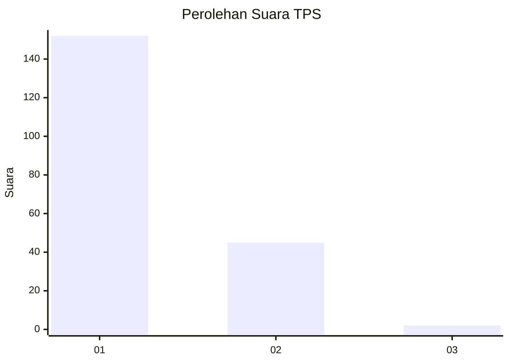
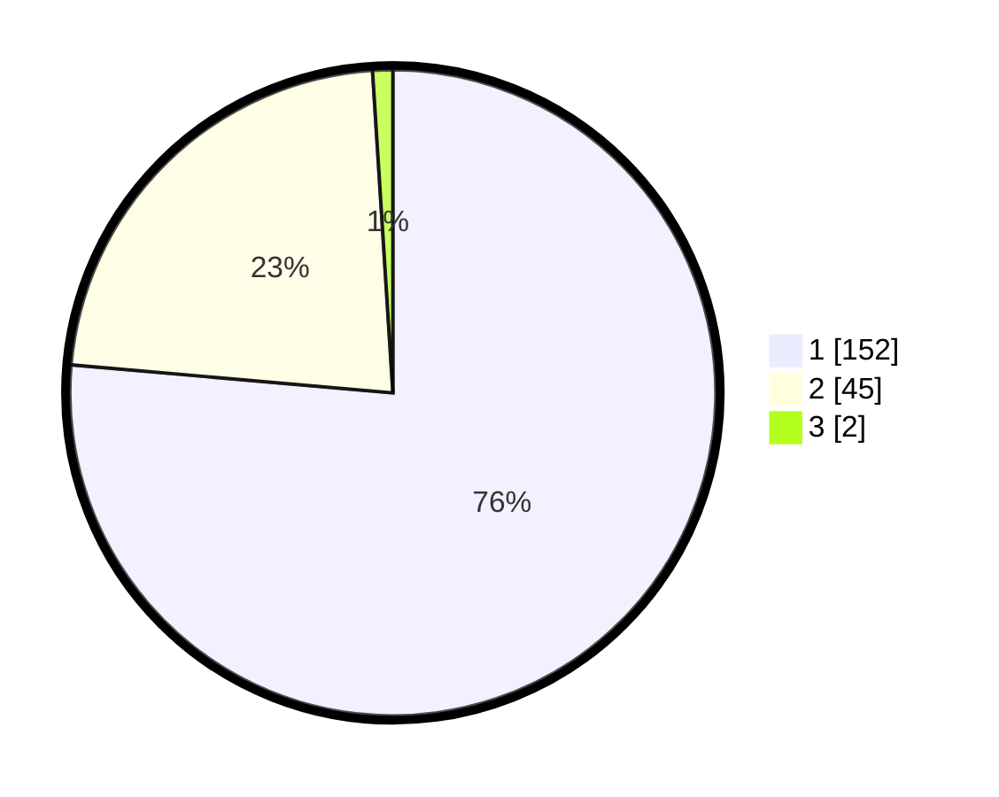

# Hasil

## Grafik

## Tabel

| No. | Nama Paslon    | Suara | Suara (raw) | Persentase |
|:--- |:-------------- | -----:| -----------:| ----------:|
| 1   | ANIES MUHAIMIN | 152   | [152][p-1]  | 76,38      |
| 2   | PRABOWO GIBRAN | 45    | [45][p-2]   | 22,61      |
| 3   | GANJAR MAHFUD  | 2     | [2][p-3]    | 1,01       |

[p-1]: https://github.com/gigit-pemilu/pemilu-2024-11-aceh/blob/main/pilpres/hitung-suara/sub/11-aceh/sub/01-aceh-selatan/sub/13-kluet-tengah/sub/2001-koto/sub/002-tps/sub/paslon-1.txt
[p-2]: https://github.com/gigit-pemilu/pemilu-2024-11-aceh/blob/main/pilpres/hitung-suara/sub/11-aceh/sub/01-aceh-selatan/sub/13-kluet-tengah/sub/2001-koto/sub/002-tps/sub/paslon-2.txt
[p-3]: https://github.com/gigit-pemilu/pemilu-2024-11-aceh/blob/main/pilpres/hitung-suara/sub/11-aceh/sub/01-aceh-selatan/sub/13-kluet-tengah/sub/2001-koto/sub/002-tps/sub/paslon-3.txt

## Foto C Plano

https://sirekap-obj-formc.kpu.go.id/4a3d/pemilu/ppwp/11/01/13/20/01/1101132001002-20240215-211311--bf7a73c6-41aa-4861-ab79-b3e42040e8df.jpg

https://sirekap-obj-formc.kpu.go.id/4a3d/pemilu/ppwp/11/01/13/20/01/1101132001002-20240215-211313--38e71f3c-c0e2-441b-a134-9a2dea3d69de.jpg

https://sirekap-obj-formc.kpu.go.id/4a3d/pemilu/ppwp/11/01/13/20/01/1101132001002-20240215-211312--7d8b82c5-1053-473e-a274-131ee102367c.jpg

## Metadata

| Key        | Value               |
| ---------- | ------------------- |
| Time Stamp | 2024-02-15 22:30:27 |

## DATA PEMILIH TETAP

Jumlah pemilih dalam DPT: **239**.
 * L: **123**.
 * P: **116**.

## DATA PENGGUNA HAK PILIH

Jumlah pengguna hak pilih dalam DPT: **204**.
 * L: **101**.
 * P: **103**.

Jumlah pengguna hak pilih dalam DPTb: **0**.
 * L: **0**.
 * P: **0**.

Jumlah pengguna hak pilih dalam DPK: **0**.
 * L: **0**.
 * P: **0**.

Jumlah pengguna hak pilih: **204**.
 * L: **101**.
 * P: **103**.

## JUMLAH SUARA SAH DAN TIDAK SAH

JUMLAH SELURUH SUARA SAH: **199**.

JUMLAH SUARA TIDAK SAH: **5**.

JUMLAH SELURUH SUARA SAH DAN SUARA TIDAK SAH: **204**.

