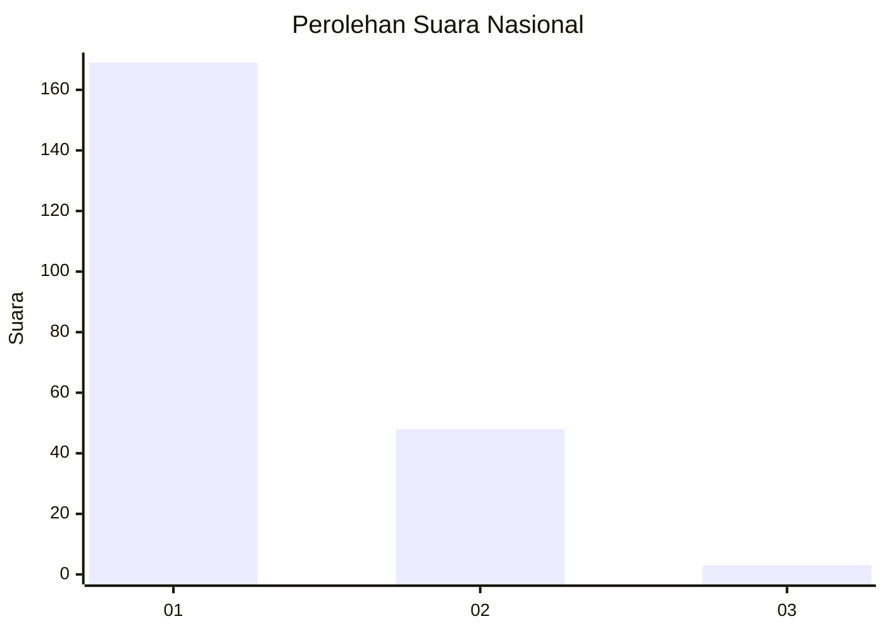
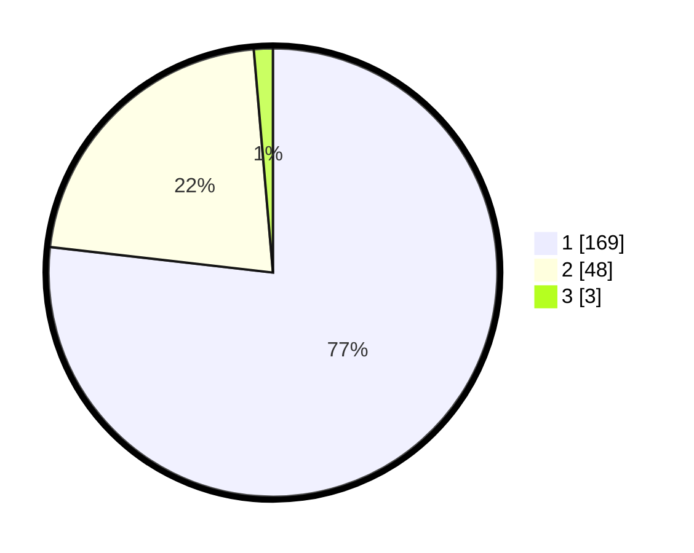

# Hasil

## Grafik

## Tabel

| No. | Nama Paslon    | Suara | Suara (raw) | Persentase |
|:--- |:-------------- | -----:| -----------:| ----------:|
| 1   | ANIES MUHAIMIN | 169   | [169][p-1]  | 76,82      |
| 2   | PRABOWO GIBRAN | 48    | [48][p-2]   | 21,82      |
| 3   | GANJAR MAHFUD  | 3     | [3][p-3]    | 1,36       |

[p-1]: https://github.com/gigit-pemilu/pemilu-2024/blob/main/pilpres/hitung-suara/sub/11-aceh/sub/01-aceh-selatan/sub/13-kluet-tengah/sub/2001-koto/sub/003-tps/sub/paslon-1.txt
[p-2]: https://github.com/gigit-pemilu/pemilu-2024/blob/main/pilpres/hitung-suara/sub/11-aceh/sub/01-aceh-selatan/sub/13-kluet-tengah/sub/2001-koto/sub/003-tps/sub/paslon-2.txt
[p-3]: https://github.com/gigit-pemilu/pemilu-2024/blob/main/pilpres/hitung-suara/sub/11-aceh/sub/01-aceh-selatan/sub/13-kluet-tengah/sub/2001-koto/sub/003-tps/sub/paslon-3.txt

## Foto C Plano

https://sirekap-obj-formc.kpu.go.id/0d1d/pemilu/ppwp/11/01/13/20/01/1101132001003-20240219-175145--d5aec8f1-ca88-4701-86ae-a18128b77628.jpg

https://sirekap-obj-formc.kpu.go.id/0d1d/pemilu/ppwp/11/01/13/20/01/1101132001003-20240219-175147--a43b3da2-080b-4499-9af6-5c378f9dca18.jpg

https://sirekap-obj-formc.kpu.go.id/0d1d/pemilu/ppwp/11/01/13/20/01/1101132001003-20240219-175146--dfc945e8-f9dd-43e9-9ea8-0bfdd2a21658.jpg

## Metadata

| Key        | Value               |
| ---------- | ------------------- |
| Time Stamp | 2024-02-20 22:00:00 |

## DATA PEMILIH TETAP

Jumlah pemilih dalam DPT: **262**.
 * L: **126**.
 * P: **136**.

## DATA PENGGUNA HAK PILIH

Jumlah pengguna hak pilih dalam DPT: **224**.
 * L: **109**.
 * P: **115**.

Jumlah pengguna hak pilih dalam DPTb: **2**.
 * L: **0**.
 * P: **2**.

Jumlah pengguna hak pilih dalam DPK: **0**.
 * L: **0**.
 * P: **0**.

Jumlah pengguna hak pilih: **226**.
 * L: **109**.
 * P: **117**.

## JUMLAH SUARA SAH DAN TIDAK SAH

JUMLAH SELURUH SUARA SAH: **220**.

JUMLAH SUARA TIDAK SAH: **6**.

JUMLAH SELURUH SUARA SAH DAN SUARA TIDAK SAH: **226**.

