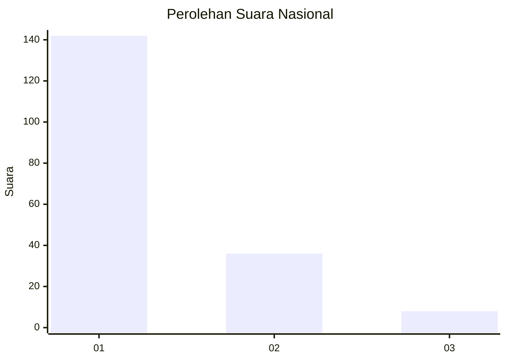
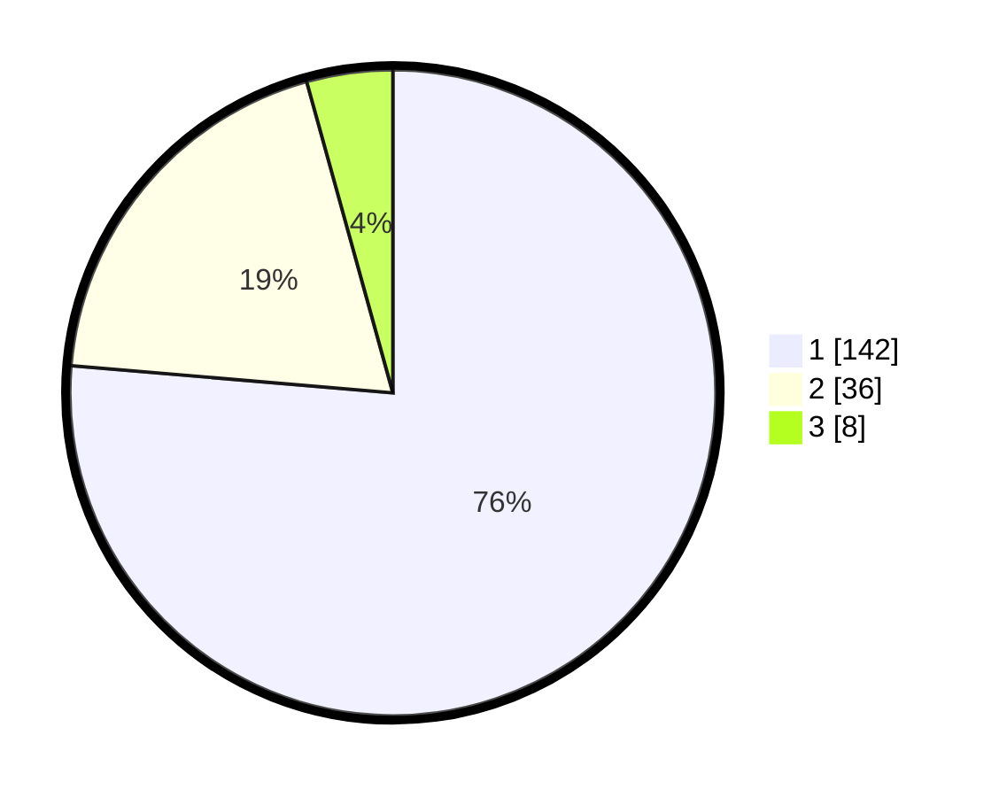

# Hasil

## Grafik

## Tabel

| No. | Nama Paslon    | Suara | Suara (raw) | Persentase |
|:--- |:-------------- | -----:| -----------:| ----------:|
| 1   | ANIES MUHAIMIN | 142   | [142][p-1]  | 76,34      |
| 2   | PRABOWO GIBRAN | 36    | [36][p-2]   | 19,35      |
| 3   | GANJAR MAHFUD  | 8     | [8][p-3]    | 4,30       |

[p-1]: https://github.com/gigit-pemilu/pemilu-2024/blob/main/pilpres/hitung-suara/sub/11-aceh/sub/01-aceh-selatan/sub/13-kluet-tengah/sub/2002-alur-keujrun/sub/001-tps/sub/paslon-1.txt
[p-2]: https://github.com/gigit-pemilu/pemilu-2024/blob/main/pilpres/hitung-suara/sub/11-aceh/sub/01-aceh-selatan/sub/13-kluet-tengah/sub/2002-alur-keujrun/sub/001-tps/sub/paslon-2.txt
[p-3]: https://github.com/gigit-pemilu/pemilu-2024/blob/main/pilpres/hitung-suara/sub/11-aceh/sub/01-aceh-selatan/sub/13-kluet-tengah/sub/2002-alur-keujrun/sub/001-tps/sub/paslon-3.txt

## Foto C Plano

https://sirekap-obj-formc.kpu.go.id/9ddf/pemilu/ppwp/11/01/13/20/02/1101132002001-20240217-170124--1c821277-452d-4f40-86f6-cdb0bb0a9ba1.jpg

https://sirekap-obj-formc.kpu.go.id/9ddf/pemilu/ppwp/11/01/13/20/02/1101132002001-20240217-170125--0985cf77-e596-422f-b882-71d25906b680.jpg

https://sirekap-obj-formc.kpu.go.id/9ddf/pemilu/ppwp/11/01/13/20/02/1101132002001-20240217-170124--3f5ff82d-cbd2-43d4-a33d-467423b684da.jpg

## Metadata

| Key        | Value               |
| ---------- | ------------------- |
| Time Stamp | 2024-02-24 22:31:28 |

## DATA PEMILIH TETAP

Jumlah pemilih dalam DPT: **201**.
 * L: **112**.
 * P: **89**.

## DATA PENGGUNA HAK PILIH

Jumlah pengguna hak pilih dalam DPT: **187**.
 * L: **103**.
 * P: **84**.

Jumlah pengguna hak pilih dalam DPTb: **0**.
 * L: **0**.
 * P: **0**.

Jumlah pengguna hak pilih dalam DPK: **0**.
 * L: **0**.
 * P: **0**.

Jumlah pengguna hak pilih: **187**.
 * L: **103**.
 * P: **84**.

## JUMLAH SUARA SAH DAN TIDAK SAH

JUMLAH SELURUH SUARA SAH: **0**.

JUMLAH SUARA TIDAK SAH: **0**.

JUMLAH SELURUH SUARA SAH DAN SUARA TIDAK SAH: **0**.

