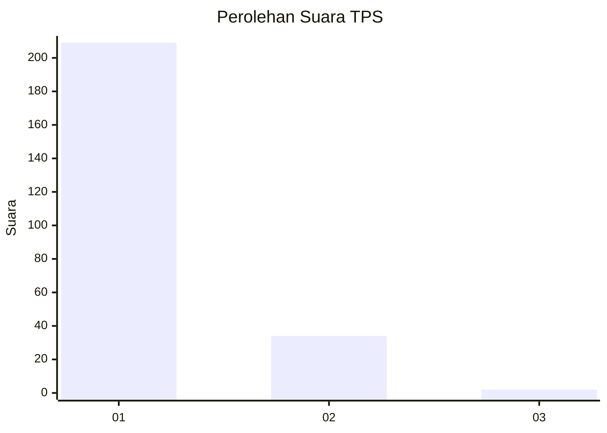
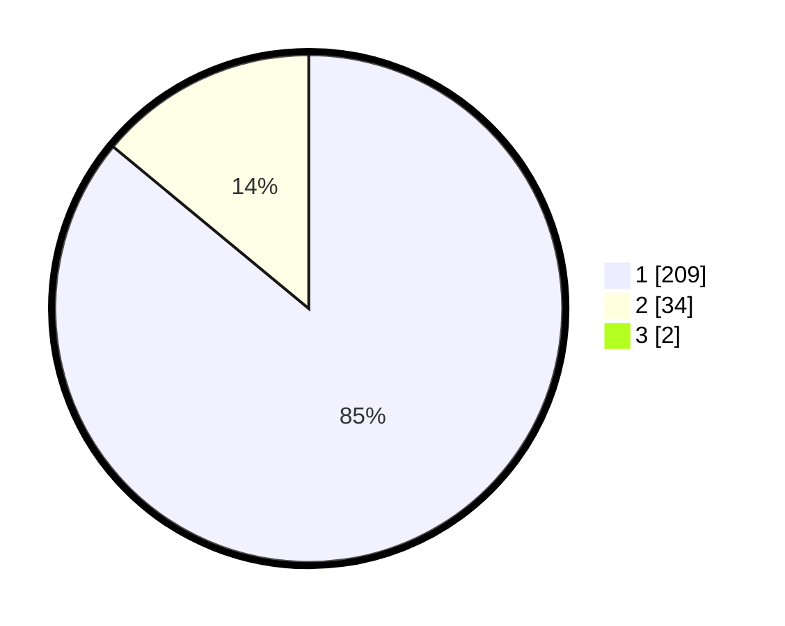

# Hasil

## Grafik

## Tabel

| No. | Nama Paslon    | Suara | Suara (raw) | Persentase |
|:--- |:-------------- | -----:| -----------:| ----------:|
| 1   | ANIES MUHAIMIN | 209   | [209][p-1]  | 85,31      |
| 2   | PRABOWO GIBRAN | 34    | [34][p-2]   | 13,88      |
| 3   | GANJAR MAHFUD  | 2     | [2][p-3]    | 0,82       |

[p-1]: https://github.com/gigit-pemilu/pemilu-2024-11-aceh/blob/main/pilpres/hitung-suara/sub/11-aceh/sub/01-aceh-selatan/sub/13-kluet-tengah/sub/2003-jambo-papan/sub/001-tps/sub/paslon-1.txt
[p-2]: https://github.com/gigit-pemilu/pemilu-2024-11-aceh/blob/main/pilpres/hitung-suara/sub/11-aceh/sub/01-aceh-selatan/sub/13-kluet-tengah/sub/2003-jambo-papan/sub/001-tps/sub/paslon-2.txt
[p-3]: https://github.com/gigit-pemilu/pemilu-2024-11-aceh/blob/main/pilpres/hitung-suara/sub/11-aceh/sub/01-aceh-selatan/sub/13-kluet-tengah/sub/2003-jambo-papan/sub/001-tps/sub/paslon-3.txt

## Foto C Plano

https://sirekap-obj-formc.kpu.go.id/9665/pemilu/ppwp/11/01/13/20/03/1101132003001-20240218-085550--47d896da-e2e8-4e06-9906-96a97557d1da.jpg

https://sirekap-obj-formc.kpu.go.id/9665/pemilu/ppwp/11/01/13/20/03/1101132003001-20240218-085552--6047c640-b2d3-4766-b035-dec977ad2269.jpg

https://sirekap-obj-formc.kpu.go.id/9665/pemilu/ppwp/11/01/13/20/03/1101132003001-20240218-085551--cbc091b6-d3e7-44a4-96fd-84b280069acb.jpg

## Metadata

| Key        | Value               |
| ---------- | ------------------- |
| Time Stamp | 2024-02-19 06:16:00 |

## DATA PEMILIH TETAP

Jumlah pemilih dalam DPT: **282**.
 * L: **148**.
 * P: **134**.

## DATA PENGGUNA HAK PILIH

Jumlah pengguna hak pilih dalam DPT: **242**.
 * L: **125**.
 * P: **117**.

Jumlah pengguna hak pilih dalam DPTb: **0**.
 * L: **0**.
 * P: **0**.

Jumlah pengguna hak pilih dalam DPK: **4**.
 * L: **1**.
 * P: **3**.

Jumlah pengguna hak pilih: **246**.
 * L: **126**.
 * P: **120**.

## JUMLAH SUARA SAH DAN TIDAK SAH

JUMLAH SELURUH SUARA SAH: **245**.

JUMLAH SUARA TIDAK SAH: **1**.

JUMLAH SELURUH SUARA SAH DAN SUARA TIDAK SAH: **246**.

