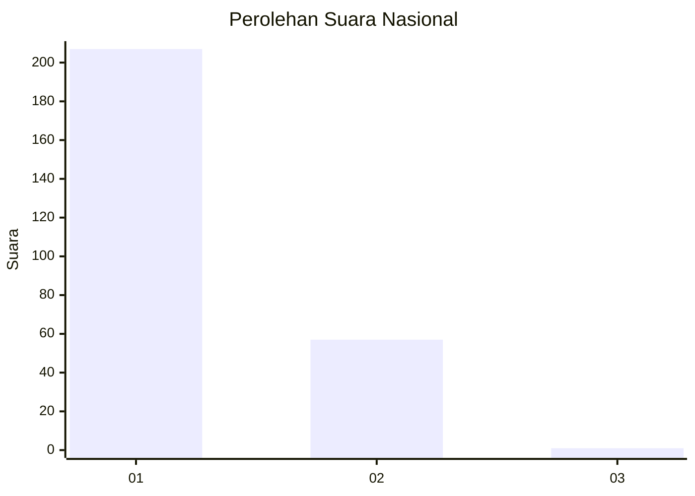
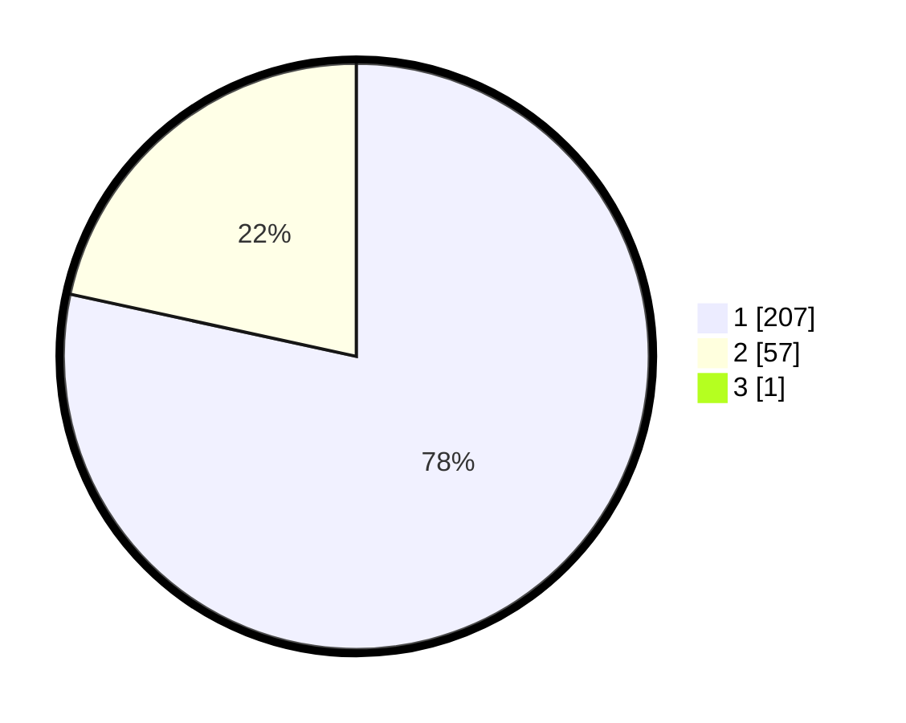

# Hasil

## Grafik

## Tabel

| No. | Nama Paslon    | Suara | Suara (raw) | Persentase |
|:--- |:-------------- | -----:| -----------:| ----------:|
| 1   | ANIES MUHAIMIN | 207   | [207][p-1]  | 78,11      |
| 2   | PRABOWO GIBRAN | 57    | [57][p-2]   | 21,51      |
| 3   | GANJAR MAHFUD  | 1     | [1][p-3]    | 0,38       |

[p-1]: https://github.com/gigit-pemilu/pemilu-2024/blob/main/pilpres/hitung-suara/sub/11-aceh/sub/01-aceh-selatan/sub/13-kluet-tengah/sub/2013-simpang-tiga/sub/001-tps/sub/paslon-1.txt
[p-2]: https://github.com/gigit-pemilu/pemilu-2024/blob/main/pilpres/hitung-suara/sub/11-aceh/sub/01-aceh-selatan/sub/13-kluet-tengah/sub/2013-simpang-tiga/sub/001-tps/sub/paslon-2.txt
[p-3]: https://github.com/gigit-pemilu/pemilu-2024/blob/main/pilpres/hitung-suara/sub/11-aceh/sub/01-aceh-selatan/sub/13-kluet-tengah/sub/2013-simpang-tiga/sub/001-tps/sub/paslon-3.txt

## Foto C Plano

https://sirekap-obj-formc.kpu.go.id/f3c0/pemilu/ppwp/11/01/13/20/13/1101132013001-20240214-224602--8872196f-d6cc-4951-b42e-e8d2933be9cc.jpg

https://sirekap-obj-formc.kpu.go.id/f3c0/pemilu/ppwp/11/01/13/20/13/1101132013001-20240214-222326--740dbe28-fde5-4b64-b060-780d81da2af0.jpg

https://sirekap-obj-formc.kpu.go.id/f3c0/pemilu/ppwp/11/01/13/20/13/1101132013001-20240214-222223--ef733445-8b81-4f88-b05e-0bd52f281d4c.jpg

## Metadata

| Key        | Value               |
| ---------- | ------------------- |
| Time Stamp | 2024-02-24 22:31:28 |

## DATA PEMILIH TETAP

Jumlah pemilih dalam DPT: **287**.
 * L: **151**.
 * P: **136**.

## DATA PENGGUNA HAK PILIH

Jumlah pengguna hak pilih dalam DPT: **260**.
 * L: **137**.
 * P: **123**.

Jumlah pengguna hak pilih dalam DPTb: **0**.
 * L: **0**.
 * P: **0**.

Jumlah pengguna hak pilih dalam DPK: **13**.
 * L: **4**.
 * P: **9**.

Jumlah pengguna hak pilih: **273**.
 * L: **141**.
 * P: **132**.

## JUMLAH SUARA SAH DAN TIDAK SAH

JUMLAH SELURUH SUARA SAH: **265**.

JUMLAH SUARA TIDAK SAH: **8**.

JUMLAH SELURUH SUARA SAH DAN SUARA TIDAK SAH: **273**.

