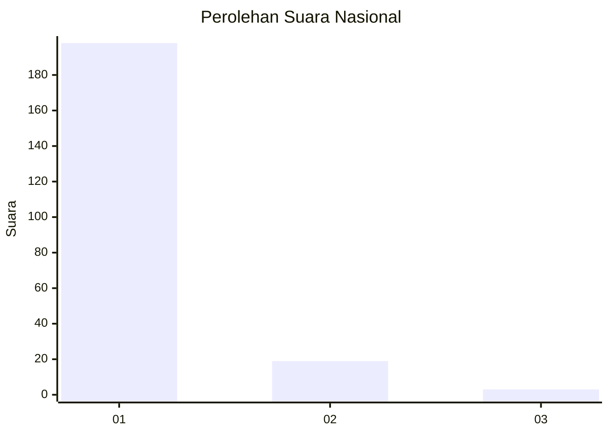
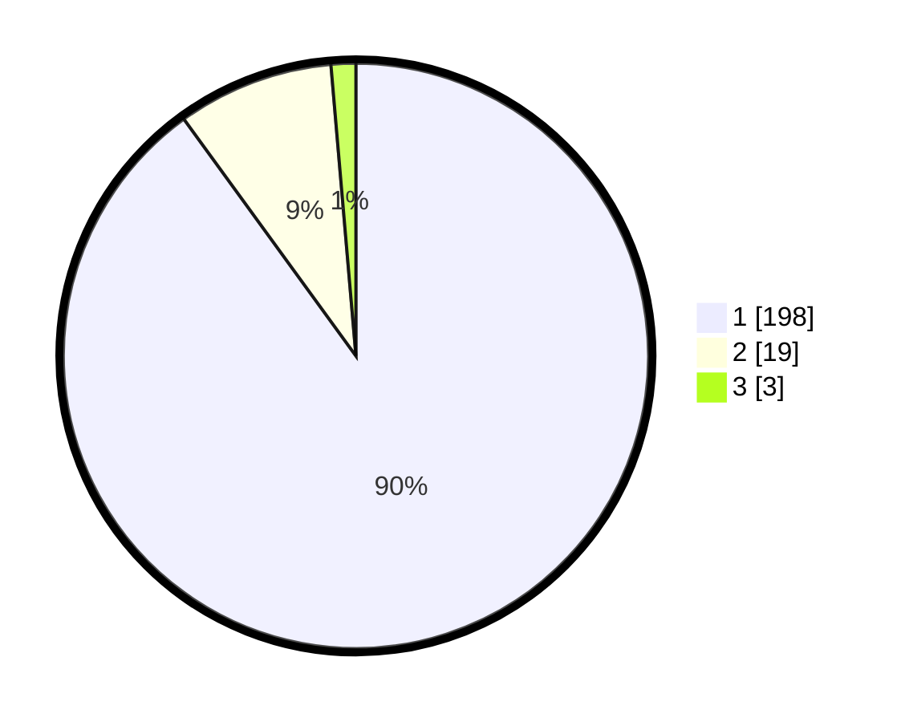

# Hasil

## Grafik

## Tabel

| No. | Nama Paslon    | Suara | Suara (raw) | Persentase |
|:--- |:-------------- | -----:| -----------:| ----------:|
| 1   | ANIES MUHAIMIN | 198   | [198][p-1]  | 90,00      |
| 2   | PRABOWO GIBRAN | 19    | [19][p-2]   | 8,64       |
| 3   | GANJAR MAHFUD  | 3     | [3][p-3]    | 1,36       |

[p-1]: https://github.com/gigit-pemilu/pemilu-2024/blob/main/pilpres/hitung-suara/sub/11-aceh/sub/01-aceh-selatan/sub/14-kluet-timur/sub/2001-paya-dapur/sub/001-tps/sub/paslon-1.txt
[p-2]: https://github.com/gigit-pemilu/pemilu-2024/blob/main/pilpres/hitung-suara/sub/11-aceh/sub/01-aceh-selatan/sub/14-kluet-timur/sub/2001-paya-dapur/sub/001-tps/sub/paslon-2.txt
[p-3]: https://github.com/gigit-pemilu/pemilu-2024/blob/main/pilpres/hitung-suara/sub/11-aceh/sub/01-aceh-selatan/sub/14-kluet-timur/sub/2001-paya-dapur/sub/001-tps/sub/paslon-3.txt

## Foto C Plano

https://sirekap-obj-formc.kpu.go.id/1faa/pemilu/ppwp/11/01/14/20/01/1101142001001-20240216-162925--0a7a9c7e-9433-41af-bfec-2b5069dabb5e.jpg

https://sirekap-obj-formc.kpu.go.id/1faa/pemilu/ppwp/11/01/14/20/01/1101142001001-20240216-162927--e957a5e6-ab5e-41c9-9197-34865cac71ae.jpg

https://sirekap-obj-formc.kpu.go.id/1faa/pemilu/ppwp/11/01/14/20/01/1101142001001-20240216-162926--1bea4b09-398c-43d1-9f69-5d4766be4a8d.jpg

## Metadata

| Key        | Value               |
| ---------- | ------------------- |
| Time Stamp | 2024-02-16 21:01:00 |

## DATA PEMILIH TETAP

Jumlah pemilih dalam DPT: **266**.
 * L: **126**.
 * P: **140**.

## DATA PENGGUNA HAK PILIH

Jumlah pengguna hak pilih dalam DPT: **222**.
 * L: **104**.
 * P: **118**.

Jumlah pengguna hak pilih dalam DPTb: **1**.
 * L: **1**.
 * P: **0**.

Jumlah pengguna hak pilih dalam DPK: **1**.
 * L: **0**.
 * P: **1**.

Jumlah pengguna hak pilih: **224**.
 * L: **105**.
 * P: **119**.

## JUMLAH SUARA SAH DAN TIDAK SAH

JUMLAH SELURUH SUARA SAH: **220**.

JUMLAH SUARA TIDAK SAH: **4**.

JUMLAH SELURUH SUARA SAH DAN SUARA TIDAK SAH: **224**.

