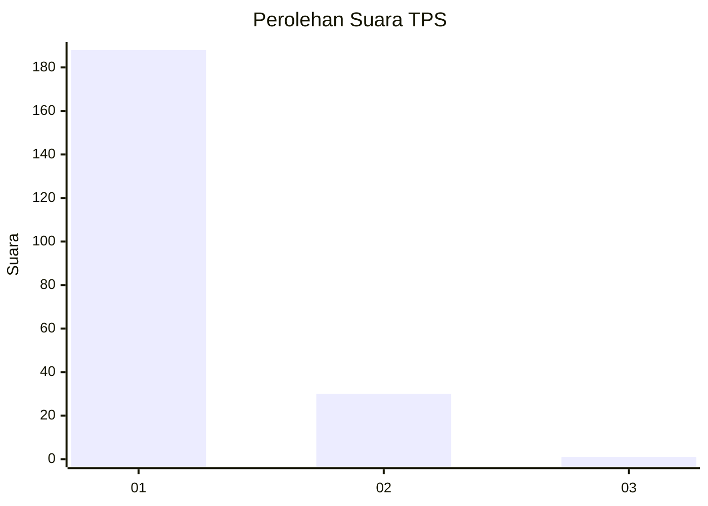
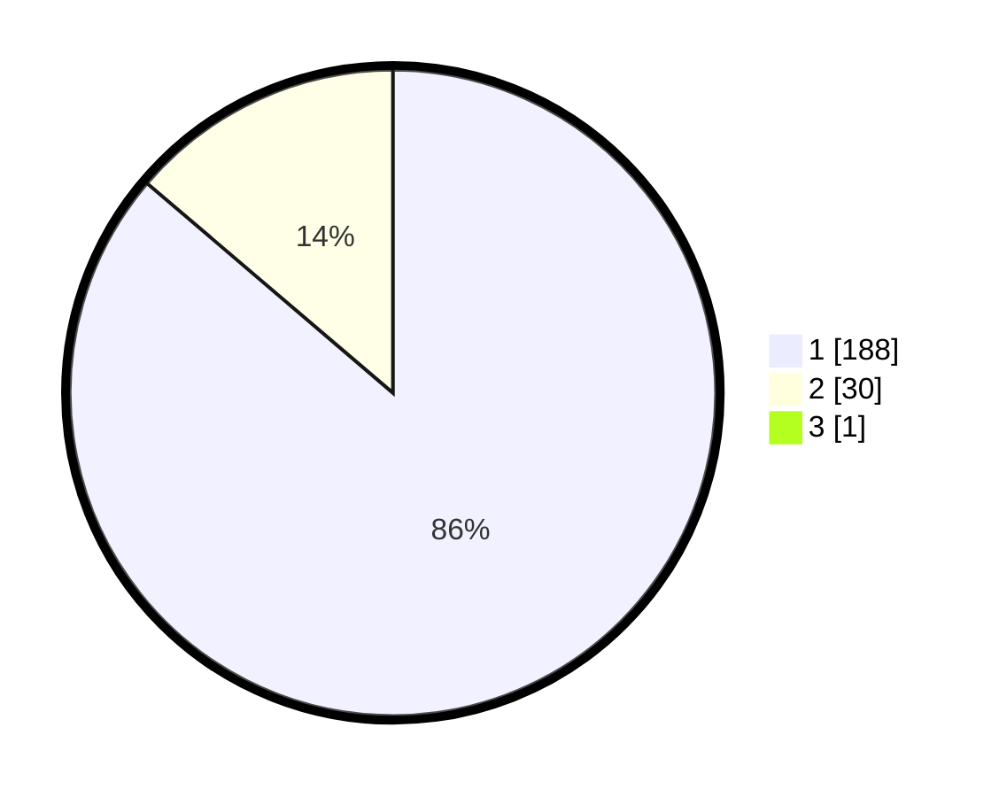

# Hasil

## Grafik

## Tabel

| No. | Nama Paslon    | Suara | Suara (raw) | Persentase |
|:--- |:-------------- | -----:| -----------:| ----------:|
| 1   | ANIES MUHAIMIN | 188   | [188][p-1]  | 85,84      |
| 2   | PRABOWO GIBRAN | 30    | [30][p-2]   | 13,70      |
| 3   | GANJAR MAHFUD  | 1     | [1][p-3]    | 0,46       |

[p-1]: https://github.com/gigit-pemilu/pemilu-2024-11-aceh/blob/main/pilpres/hitung-suara/sub/11-aceh/sub/01-aceh-selatan/sub/14-kluet-timur/sub/2001-paya-dapur/sub/002-tps/sub/paslon-1.txt
[p-2]: https://github.com/gigit-pemilu/pemilu-2024-11-aceh/blob/main/pilpres/hitung-suara/sub/11-aceh/sub/01-aceh-selatan/sub/14-kluet-timur/sub/2001-paya-dapur/sub/002-tps/sub/paslon-2.txt
[p-3]: https://github.com/gigit-pemilu/pemilu-2024-11-aceh/blob/main/pilpres/hitung-suara/sub/11-aceh/sub/01-aceh-selatan/sub/14-kluet-timur/sub/2001-paya-dapur/sub/002-tps/sub/paslon-3.txt

## Foto C Plano

https://sirekap-obj-formc.kpu.go.id/bf77/pemilu/ppwp/11/01/14/20/01/1101142001002-20240217-003355--fba4b291-0fc4-4d75-b94f-cca10388b588.jpg

https://sirekap-obj-formc.kpu.go.id/bf77/pemilu/ppwp/11/01/14/20/01/1101142001002-20240217-003357--a23c09b5-09df-4e4c-acfa-4a7d77fc73d9.jpg

https://sirekap-obj-formc.kpu.go.id/bf77/pemilu/ppwp/11/01/14/20/01/1101142001002-20240217-003356--ff1f0895-6020-402a-86dc-e2f9b7303494.jpg

## Metadata

| Key        | Value               |
| ---------- | ------------------- |
| Time Stamp | 2024-02-17 11:00:02 |

## DATA PEMILIH TETAP

Jumlah pemilih dalam DPT: **258**.
 * L: **142**.
 * P: **116**.

## DATA PENGGUNA HAK PILIH

Jumlah pengguna hak pilih dalam DPT: **219**.
 * L: **103**.
 * P: **116**.

Jumlah pengguna hak pilih dalam DPTb: **0**.
 * L: **0**.
 * P: **0**.

Jumlah pengguna hak pilih dalam DPK: **1**.
 * L: **1**.
 * P: **0**.

Jumlah pengguna hak pilih: **220**.
 * L: **104**.
 * P: **116**.

## JUMLAH SUARA SAH DAN TIDAK SAH

JUMLAH SELURUH SUARA SAH: **219**.

JUMLAH SUARA TIDAK SAH: **1**.

JUMLAH SELURUH SUARA SAH DAN SUARA TIDAK SAH: **220**.

