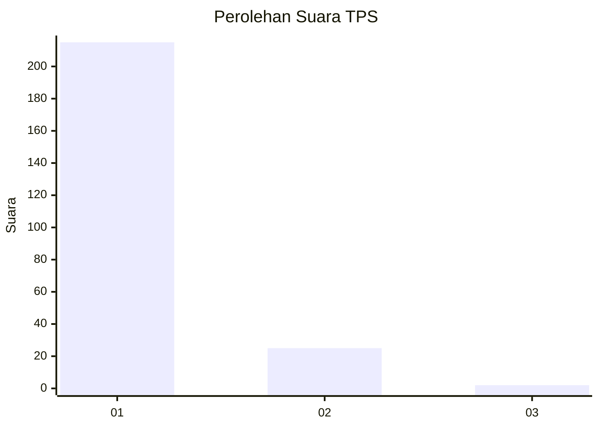
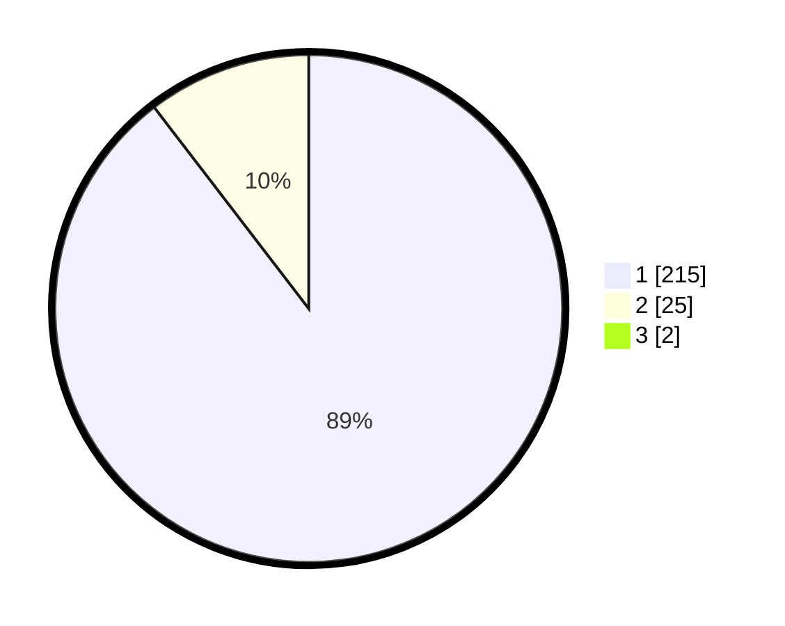

# Hasil

## Grafik

## Tabel

| No. | Nama Paslon    | Suara | Suara (raw) | Persentase |
|:--- |:-------------- | -----:| -----------:| ----------:|
| 1   | ANIES MUHAIMIN | 215   | [215][p-1]  | 88,84      |
| 2   | PRABOWO GIBRAN | 25    | [25][p-2]   | 10,33      |
| 3   | GANJAR MAHFUD  | 2     | [2][p-3]    | 0,83       |

[p-1]: https://github.com/gigit-pemilu/pemilu-2024-11-aceh/blob/main/pilpres/hitung-suara/sub/11-aceh/sub/01-aceh-selatan/sub/14-kluet-timur/sub/2001-paya-dapur/sub/003-tps/sub/paslon-1.txt
[p-2]: https://github.com/gigit-pemilu/pemilu-2024-11-aceh/blob/main/pilpres/hitung-suara/sub/11-aceh/sub/01-aceh-selatan/sub/14-kluet-timur/sub/2001-paya-dapur/sub/003-tps/sub/paslon-2.txt
[p-3]: https://github.com/gigit-pemilu/pemilu-2024-11-aceh/blob/main/pilpres/hitung-suara/sub/11-aceh/sub/01-aceh-selatan/sub/14-kluet-timur/sub/2001-paya-dapur/sub/003-tps/sub/paslon-3.txt

## Foto C Plano

https://sirekap-obj-formc.kpu.go.id/4146/pemilu/ppwp/11/01/14/20/01/1101142001003-20240216-190444--b9ff2c10-e6ea-4b6e-b504-8cd74f9a3d23.jpg

https://sirekap-obj-formc.kpu.go.id/4146/pemilu/ppwp/11/01/14/20/01/1101142001003-20240216-190446--cca77aa3-1191-4613-81fe-8e7d3f575cd7.jpg

https://sirekap-obj-formc.kpu.go.id/4146/pemilu/ppwp/11/01/14/20/01/1101142001003-20240216-190445--bab52c03-bf79-4504-b59d-b30e3005d6a1.jpg

## Metadata

| Key        | Value               |
| ---------- | ------------------- |
| Time Stamp | 2024-02-16 21:01:00 |

## DATA PEMILIH TETAP

Jumlah pemilih dalam DPT: **282**.
 * L: **141**.
 * P: **141**.

## DATA PENGGUNA HAK PILIH

Jumlah pengguna hak pilih dalam DPT: **242**.
 * L: **118**.
 * P: **124**.

Jumlah pengguna hak pilih dalam DPTb: **0**.
 * L: **0**.
 * P: **0**.

Jumlah pengguna hak pilih dalam DPK: **2**.
 * L: **1**.
 * P: **1**.

Jumlah pengguna hak pilih: **244**.
 * L: **119**.
 * P: **125**.

## JUMLAH SUARA SAH DAN TIDAK SAH

JUMLAH SELURUH SUARA SAH: **242**.

JUMLAH SUARA TIDAK SAH: **2**.

JUMLAH SELURUH SUARA SAH DAN SUARA TIDAK SAH: **244**.

