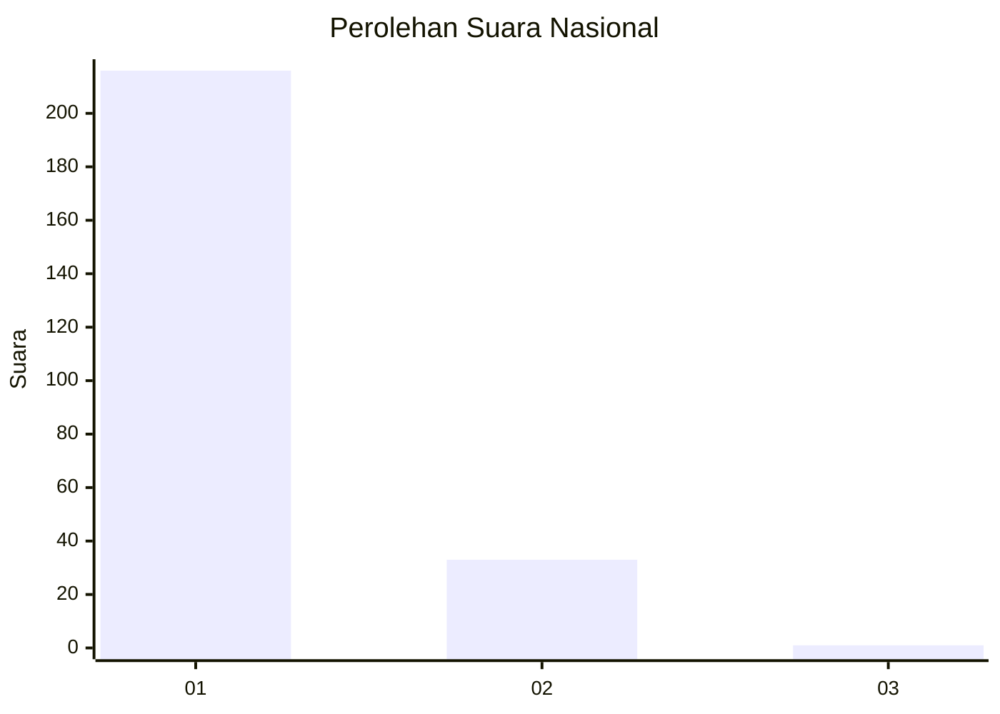
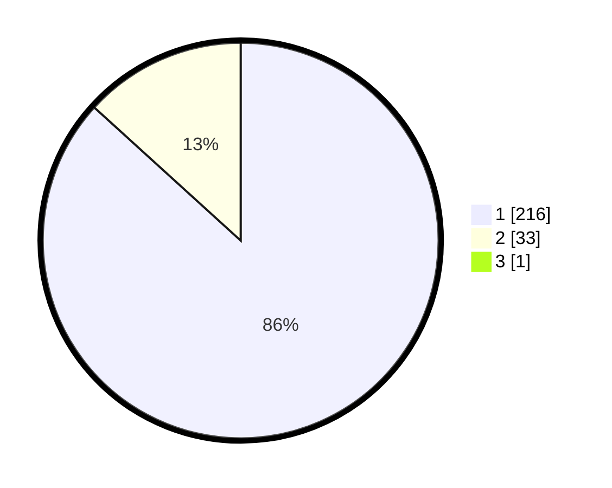

# Hasil

## Grafik

## Tabel

| No. | Nama Paslon    | Suara | Suara (raw) | Persentase |
|:--- |:-------------- | -----:| -----------:| ----------:|
| 1   | ANIES MUHAIMIN | 216   | [216][p-1]  | 86,40      |
| 2   | PRABOWO GIBRAN | 33    | [33][p-2]   | 13,20      |
| 3   | GANJAR MAHFUD  | 1     | [1][p-3]    | 0,40       |

[p-1]: https://github.com/gigit-pemilu/pemilu-2024/blob/main/pilpres/hitung-suara/sub/11-aceh/sub/01-aceh-selatan/sub/14-kluet-timur/sub/2001-paya-dapur/sub/004-tps/sub/paslon-1.txt
[p-2]: https://github.com/gigit-pemilu/pemilu-2024/blob/main/pilpres/hitung-suara/sub/11-aceh/sub/01-aceh-selatan/sub/14-kluet-timur/sub/2001-paya-dapur/sub/004-tps/sub/paslon-2.txt
[p-3]: https://github.com/gigit-pemilu/pemilu-2024/blob/main/pilpres/hitung-suara/sub/11-aceh/sub/01-aceh-selatan/sub/14-kluet-timur/sub/2001-paya-dapur/sub/004-tps/sub/paslon-3.txt

## Foto C Plano

https://sirekap-obj-formc.kpu.go.id/6533/pemilu/ppwp/11/01/14/20/01/1101142001004-20240214-200247--aaa176aa-6bdc-49dd-bb22-66f403bb5865.jpg

https://sirekap-obj-formc.kpu.go.id/6533/pemilu/ppwp/11/01/14/20/01/1101142001004-20240214-200441--9f1f4b4d-c5ac-4ce1-a804-7f6864e397bb.jpg

https://sirekap-obj-formc.kpu.go.id/6533/pemilu/ppwp/11/01/14/20/01/1101142001004-20240214-200534--57ce3355-c66c-4984-8f54-544f0ac24a9f.jpg

## Metadata

| Key        | Value               |
| ---------- | ------------------- |
| Time Stamp | 2024-02-16 12:51:22 |

## DATA PEMILIH TETAP

Jumlah pemilih dalam DPT: **289**.
 * L: **145**.
 * P: **144**.

## DATA PENGGUNA HAK PILIH

Jumlah pengguna hak pilih dalam DPT: **250**.
 * L: **124**.
 * P: **126**.

Jumlah pengguna hak pilih dalam DPTb: **0**.
 * L: **0**.
 * P: **0**.

Jumlah pengguna hak pilih dalam DPK: **2**.
 * L: **1**.
 * P: **1**.

Jumlah pengguna hak pilih: **252**.
 * L: **125**.
 * P: **127**.

## JUMLAH SUARA SAH DAN TIDAK SAH

JUMLAH SELURUH SUARA SAH: **250**.

JUMLAH SUARA TIDAK SAH: **2**.

JUMLAH SELURUH SUARA SAH DAN SUARA TIDAK SAH: **252**.

