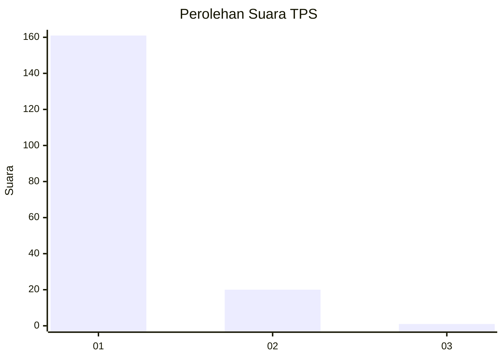
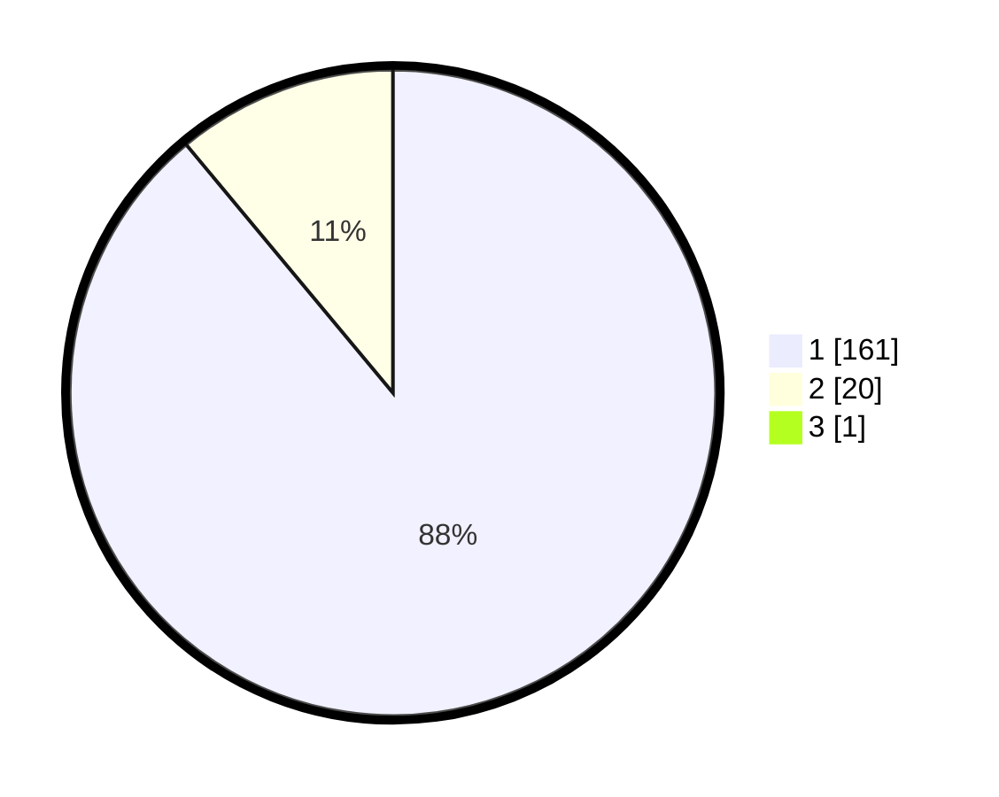

# Hasil

## Grafik

## Tabel

| No. | Nama Paslon    | Suara | Suara (raw) | Persentase |
|:--- |:-------------- | -----:| -----------:| ----------:|
| 1   | ANIES MUHAIMIN | 161   | [161][p-1]  | 88,46      |
| 2   | PRABOWO GIBRAN | 20    | [20][p-2]   | 10,99      |
| 3   | GANJAR MAHFUD  | 1     | [1][p-3]    | 0,55       |

[p-1]: https://github.com/gigit-pemilu/pemilu-2024-11-aceh/blob/main/pilpres/hitung-suara/sub/11-aceh/sub/01-aceh-selatan/sub/14-kluet-timur/sub/2001-paya-dapur/sub/005-tps/sub/paslon-1.txt
[p-2]: https://github.com/gigit-pemilu/pemilu-2024-11-aceh/blob/main/pilpres/hitung-suara/sub/11-aceh/sub/01-aceh-selatan/sub/14-kluet-timur/sub/2001-paya-dapur/sub/005-tps/sub/paslon-2.txt
[p-3]: https://github.com/gigit-pemilu/pemilu-2024-11-aceh/blob/main/pilpres/hitung-suara/sub/11-aceh/sub/01-aceh-selatan/sub/14-kluet-timur/sub/2001-paya-dapur/sub/005-tps/sub/paslon-3.txt

## Foto C Plano

https://sirekap-obj-formc.kpu.go.id/38bc/pemilu/ppwp/11/01/14/20/01/1101142001005-20240214-202741--df03b562-ceb9-4235-8587-8af64a596731.jpg

https://sirekap-obj-formc.kpu.go.id/38bc/pemilu/ppwp/11/01/14/20/01/1101142001005-20240215-234750--743091be-080f-44be-8599-aa924fbba8fa.jpg

https://sirekap-obj-formc.kpu.go.id/38bc/pemilu/ppwp/11/01/14/20/01/1101142001005-20240215-234748--39dfec03-f9fd-46ee-8d45-06728040bdfe.jpg

## Metadata

| Key        | Value               |
| ---------- | ------------------- |
| Time Stamp | 2024-02-24 22:31:28 |

## DATA PEMILIH TETAP

Jumlah pemilih dalam DPT: **227**.
 * L: **112**.
 * P: **115**.

## DATA PENGGUNA HAK PILIH

Jumlah pengguna hak pilih dalam DPT: **186**.
 * L: **86**.
 * P: **100**.

Jumlah pengguna hak pilih dalam DPTb: **0**.
 * L: **0**.
 * P: **0**.

Jumlah pengguna hak pilih dalam DPK: **2**.
 * L: **1**.
 * P: **1**.

Jumlah pengguna hak pilih: **188**.
 * L: **87**.
 * P: **101**.

## JUMLAH SUARA SAH DAN TIDAK SAH

JUMLAH SELURUH SUARA SAH: **182**.

JUMLAH SUARA TIDAK SAH: **6**.

JUMLAH SELURUH SUARA SAH DAN SUARA TIDAK SAH: **188**.

