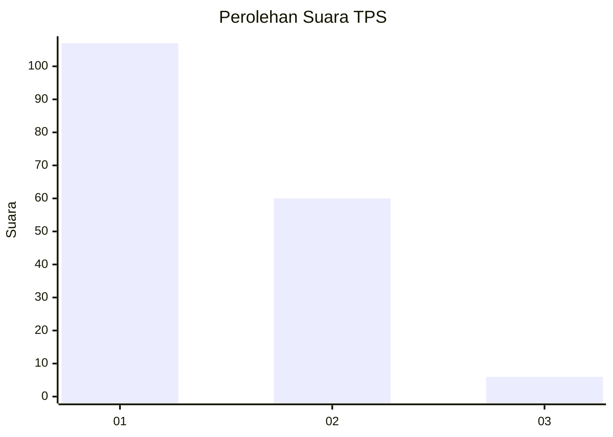
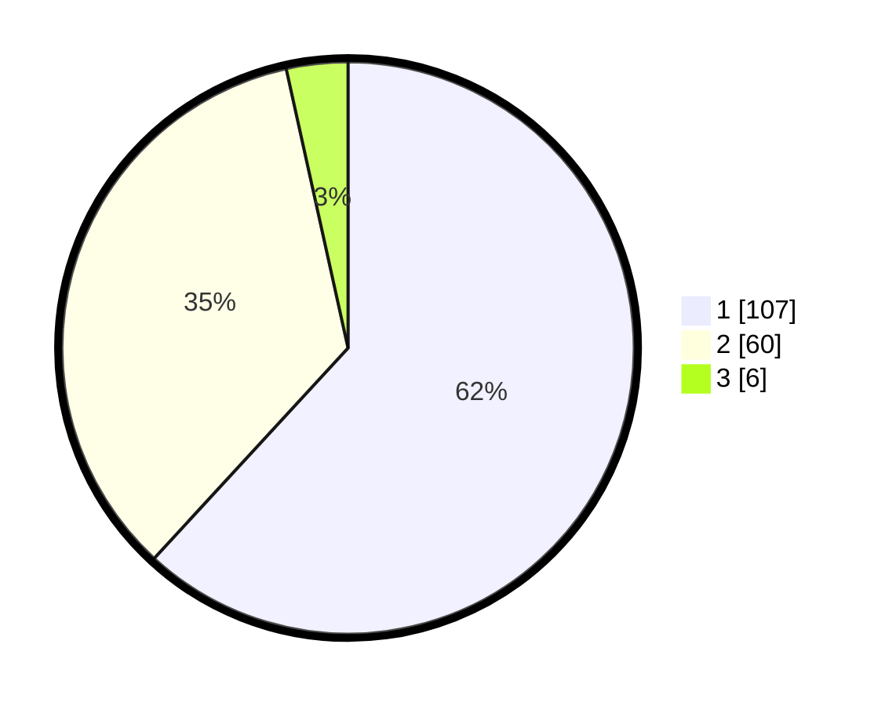

# Hasil

## Grafik

## Tabel

| No. | Nama Paslon    | Suara | Suara (raw) | Persentase |
|:--- |:-------------- | -----:| -----------:| ----------:|
| 1   | ANIES MUHAIMIN | 107   | [107][p-1]  | 61,85      |
| 2   | PRABOWO GIBRAN | 60    | [60][p-2]   | 34,68      |
| 3   | GANJAR MAHFUD  | 6     | [6][p-3]    | 3,47       |

[p-1]: https://github.com/gigit-pemilu/pemilu-2024-11-aceh/blob/main/pilpres/hitung-suara/sub/11-aceh/sub/01-aceh-selatan/sub/14-kluet-timur/sub/2004-durian-kawan/sub/005-tps/sub/paslon-1.txt
[p-2]: https://github.com/gigit-pemilu/pemilu-2024-11-aceh/blob/main/pilpres/hitung-suara/sub/11-aceh/sub/01-aceh-selatan/sub/14-kluet-timur/sub/2004-durian-kawan/sub/005-tps/sub/paslon-2.txt
[p-3]: https://github.com/gigit-pemilu/pemilu-2024-11-aceh/blob/main/pilpres/hitung-suara/sub/11-aceh/sub/01-aceh-selatan/sub/14-kluet-timur/sub/2004-durian-kawan/sub/005-tps/sub/paslon-3.txt

## Foto C Plano

https://sirekap-obj-formc.kpu.go.id/1592/pemilu/ppwp/11/01/14/20/04/1101142004005-20240215-095145--06e931a2-c463-47a7-a232-88682ce39e12.jpg

https://sirekap-obj-formc.kpu.go.id/1592/pemilu/ppwp/11/01/14/20/04/1101142004005-20240215-114257--9fd99b29-2bf7-48bb-a678-ea0abdd46774.jpg

https://sirekap-obj-formc.kpu.go.id/1592/pemilu/ppwp/11/01/14/20/04/1101142004005-20240215-114500--b86b5af4-59a3-4078-8a69-a38964b53510.jpg

## Metadata

| Key        | Value               |
| ---------- | ------------------- |
| Time Stamp | 2024-02-25 11:00:00 |

