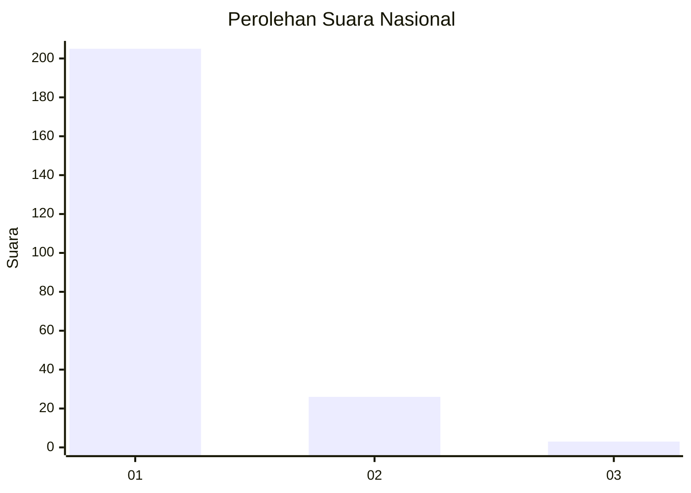
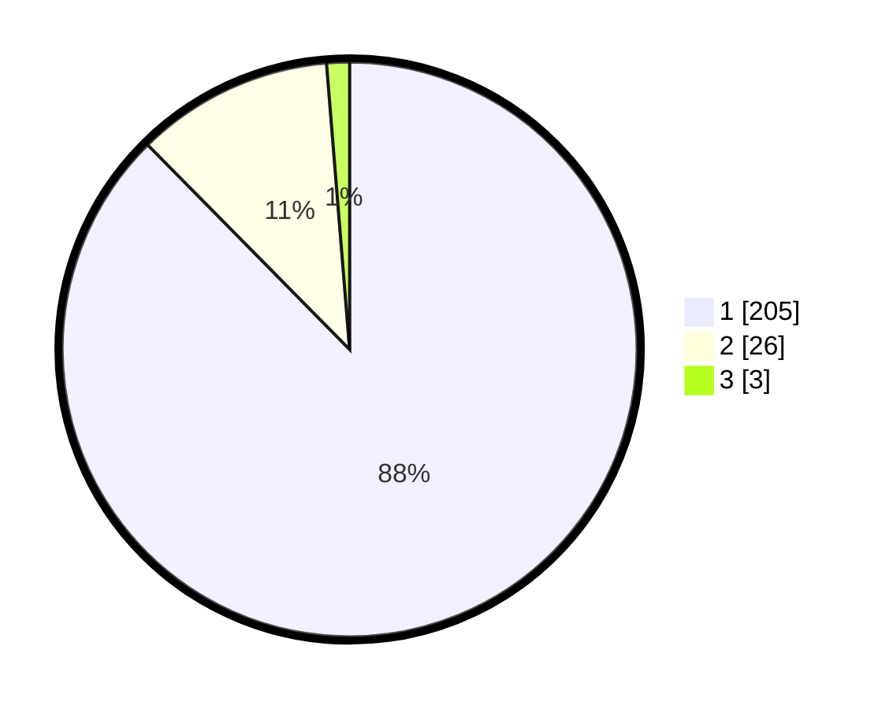

# Hasil

## Grafik

## Tabel

| No. | Nama Paslon    | Suara | Suara (raw) | Persentase |
|:--- |:-------------- | -----:| -----------:| ----------:|
| 1   | ANIES MUHAIMIN | 205   | [205][p-1]  | 87,61      |
| 2   | PRABOWO GIBRAN | 26    | [26][p-2]   | 11,11      |
| 3   | GANJAR MAHFUD  | 3     | [3][p-3]    | 1,28       |

[p-1]: https://github.com/gigit-pemilu/pemilu-2024/blob/main/pilpres/hitung-suara/sub/11-aceh/sub/01-aceh-selatan/sub/14-kluet-timur/sub/2007-pucuk-lembang/sub/001-tps/sub/paslon-1.txt
[p-2]: https://github.com/gigit-pemilu/pemilu-2024/blob/main/pilpres/hitung-suara/sub/11-aceh/sub/01-aceh-selatan/sub/14-kluet-timur/sub/2007-pucuk-lembang/sub/001-tps/sub/paslon-2.txt
[p-3]: https://github.com/gigit-pemilu/pemilu-2024/blob/main/pilpres/hitung-suara/sub/11-aceh/sub/01-aceh-selatan/sub/14-kluet-timur/sub/2007-pucuk-lembang/sub/001-tps/sub/paslon-3.txt

## Foto C Plano

https://sirekap-obj-formc.kpu.go.id/5534/pemilu/ppwp/11/01/14/20/07/1101142007001-20240216-140248--4cab3a1d-c4b0-4a24-9b7a-e2629d42b036.jpg

https://sirekap-obj-formc.kpu.go.id/5534/pemilu/ppwp/11/01/14/20/07/1101142007001-20240216-140249--bc77cbd8-b6f8-42f4-8e11-9ab179df51ae.jpg

https://sirekap-obj-formc.kpu.go.id/5534/pemilu/ppwp/11/01/14/20/07/1101142007001-20240216-140248--3107e5bc-b0a7-4d53-8f7b-b4fd422a4526.jpg

## Metadata

| Key        | Value               |
| ---------- | ------------------- |
| Time Stamp | 2024-02-16 21:01:00 |

## DATA PEMILIH TETAP

Jumlah pemilih dalam DPT: **268**.
 * L: **136**.
 * P: **132**.

## DATA PENGGUNA HAK PILIH

Jumlah pengguna hak pilih dalam DPT: **236**.
 * L: **121**.
 * P: **115**.

Jumlah pengguna hak pilih dalam DPTb: **2**.
 * L: **2**.
 * P: **0**.

Jumlah pengguna hak pilih dalam DPK: **2**.
 * L: **0**.
 * P: **2**.

Jumlah pengguna hak pilih: **240**.
 * L: **123**.
 * P: **117**.

## JUMLAH SUARA SAH DAN TIDAK SAH

JUMLAH SELURUH SUARA SAH: **234**.

JUMLAH SUARA TIDAK SAH: **6**.

JUMLAH SELURUH SUARA SAH DAN SUARA TIDAK SAH: **240**.

