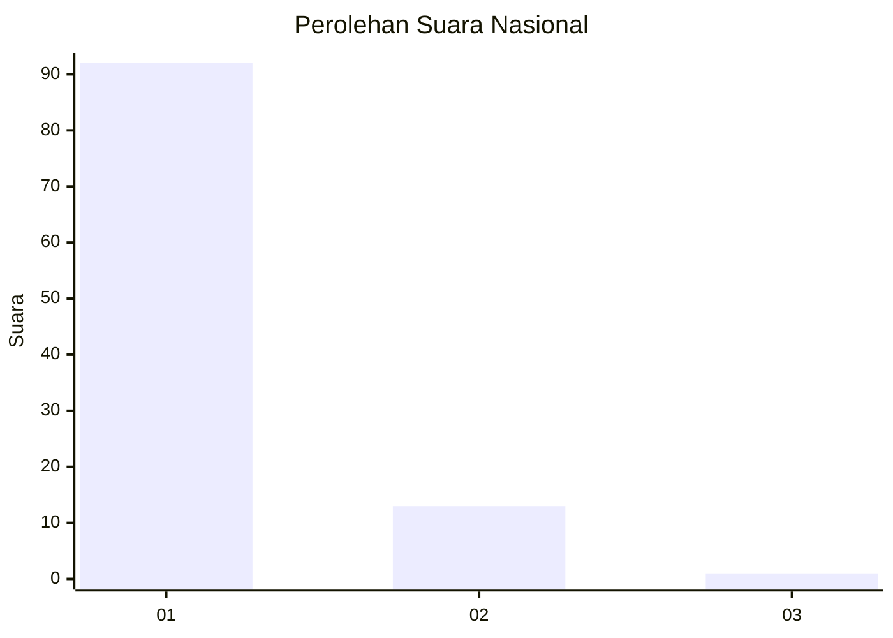
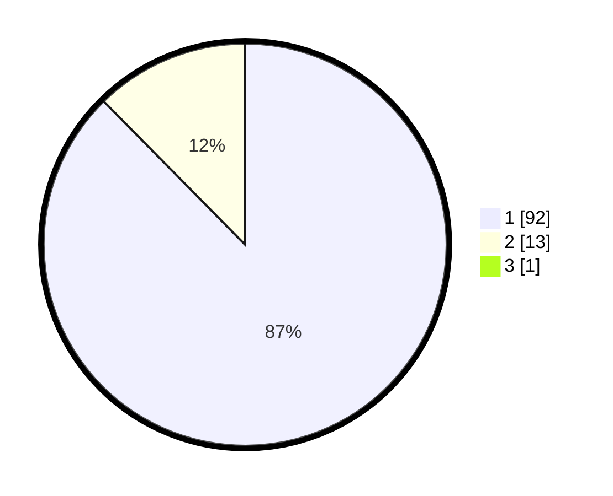

# Hasil

## Grafik

## Tabel

| No. | Nama Paslon    | Suara | Suara (raw) | Persentase |
|:--- |:-------------- | -----:| -----------:| ----------:|
| 1   | ANIES MUHAIMIN | 92    | [92][p-1]   | 86,79      |
| 2   | PRABOWO GIBRAN | 13    | [13][p-2]   | 12,26      |
| 3   | GANJAR MAHFUD  | 1     | [1][p-3]    | 0,94       |

[p-1]: https://github.com/gigit-pemilu/pemilu-2024/blob/main/pilpres/hitung-suara/sub/11-aceh/sub/01-aceh-selatan/sub/14-kluet-timur/sub/2009-lawe-cimanok/sub/005-tps/sub/paslon-1.txt
[p-2]: https://github.com/gigit-pemilu/pemilu-2024/blob/main/pilpres/hitung-suara/sub/11-aceh/sub/01-aceh-selatan/sub/14-kluet-timur/sub/2009-lawe-cimanok/sub/005-tps/sub/paslon-2.txt
[p-3]: https://github.com/gigit-pemilu/pemilu-2024/blob/main/pilpres/hitung-suara/sub/11-aceh/sub/01-aceh-selatan/sub/14-kluet-timur/sub/2009-lawe-cimanok/sub/005-tps/sub/paslon-3.txt

## Foto C Plano

https://sirekap-obj-formc.kpu.go.id/14e0/pemilu/ppwp/11/01/14/20/09/1101142009005-20240222-013028--489ffe50-60e3-460e-9626-7bc8b0a4555c.jpg

https://sirekap-obj-formc.kpu.go.id/14e0/pemilu/ppwp/11/01/14/20/09/1101142009005-20240222-013222--d4d4768d-804e-4de4-a086-3413194199a7.jpg

https://sirekap-obj-formc.kpu.go.id/14e0/pemilu/ppwp/11/01/14/20/09/1101142009005-20240222-013347--40955a21-0d1e-404d-a00d-17034adf4e3d.jpg

## Metadata

| Key        | Value               |
| ---------- | ------------------- |
| Time Stamp | 2024-02-22 18:00:00 |

## DATA PEMILIH TETAP

Jumlah pemilih dalam DPT: **110**.
 * L: **64**.
 * P: **46**.

## DATA PENGGUNA HAK PILIH

Jumlah pengguna hak pilih dalam DPT: **109**.
 * L: **63**.
 * P: **46**.

Jumlah pengguna hak pilih dalam DPTb: **0**.
 * L: **0**.
 * P: **0**.

Jumlah pengguna hak pilih dalam DPK: **2**.
 * L: **1**.
 * P: **1**.

Jumlah pengguna hak pilih: **111**.
 * L: **64**.
 * P: **47**.

## JUMLAH SUARA SAH DAN TIDAK SAH

JUMLAH SELURUH SUARA SAH: **106**.

JUMLAH SUARA TIDAK SAH: **5**.

JUMLAH SELURUH SUARA SAH DAN SUARA TIDAK SAH: **111**.

