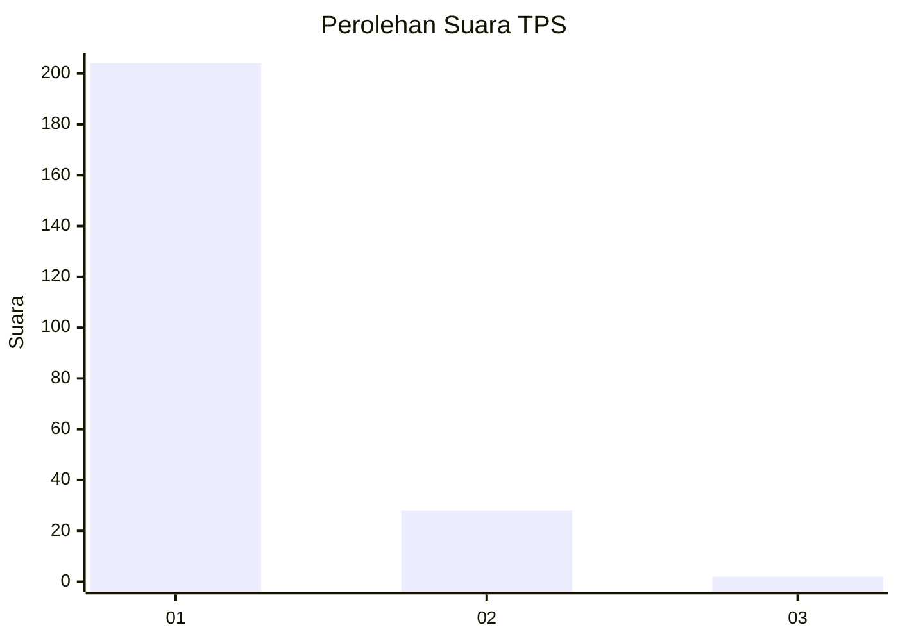
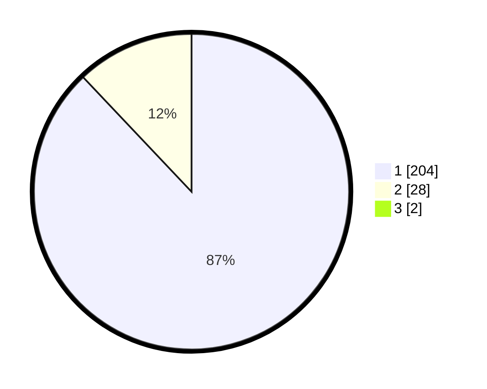

# Hasil

## Grafik

## Tabel

| No. | Nama Paslon    | Suara | Suara (raw) | Persentase |
|:--- |:-------------- | -----:| -----------:| ----------:|
| 1   | ANIES MUHAIMIN | 204   | [204][p-1]  | 87,18      |
| 2   | PRABOWO GIBRAN | 28    | [28][p-2]   | 11,97      |
| 3   | GANJAR MAHFUD  | 2     | [2][p-3]    | 0,85       |

[p-1]: https://github.com/gigit-pemilu/pemilu-2024-11-aceh/blob/main/pilpres/hitung-suara/sub/11-aceh/sub/01-aceh-selatan/sub/15-bakongan-timur/sub/2001-pasie-seubadeh/sub/001-tps/sub/paslon-1.txt
[p-2]: https://github.com/gigit-pemilu/pemilu-2024-11-aceh/blob/main/pilpres/hitung-suara/sub/11-aceh/sub/01-aceh-selatan/sub/15-bakongan-timur/sub/2001-pasie-seubadeh/sub/001-tps/sub/paslon-2.txt
[p-3]: https://github.com/gigit-pemilu/pemilu-2024-11-aceh/blob/main/pilpres/hitung-suara/sub/11-aceh/sub/01-aceh-selatan/sub/15-bakongan-timur/sub/2001-pasie-seubadeh/sub/001-tps/sub/paslon-3.txt

## Foto C Plano

https://sirekap-obj-formc.kpu.go.id/7d5e/pemilu/ppwp/11/01/15/20/01/1101152001001-20240218-111753--a19e6404-53d2-4e6a-b26c-7f2149d9f8ff.jpg

https://sirekap-obj-formc.kpu.go.id/7d5e/pemilu/ppwp/11/01/15/20/01/1101152001001-20240218-111754--700c2ad5-a536-4fdc-a3ba-d1b1a6e27880.jpg

https://sirekap-obj-formc.kpu.go.id/7d5e/pemilu/ppwp/11/01/15/20/01/1101152001001-20240218-111753--d19733fe-d227-4fb6-b86b-396257be9220.jpg

## Metadata

| Key        | Value               |
| ---------- | ------------------- |
| Time Stamp | 2024-02-19 06:16:00 |

## DATA PEMILIH TETAP

Jumlah pemilih dalam DPT: **276**.
 * L: **141**.
 * P: **135**.

## DATA PENGGUNA HAK PILIH

Jumlah pengguna hak pilih dalam DPT: **237**.
 * L: **121**.
 * P: **116**.

Jumlah pengguna hak pilih dalam DPTb: **1**.
 * L: **1**.
 * P: **0**.

Jumlah pengguna hak pilih dalam DPK: **0**.
 * L: **0**.
 * P: **0**.

Jumlah pengguna hak pilih: **238**.
 * L: **122**.
 * P: **116**.

## JUMLAH SUARA SAH DAN TIDAK SAH

JUMLAH SELURUH SUARA SAH: **234**.

JUMLAH SUARA TIDAK SAH: **4**.

JUMLAH SELURUH SUARA SAH DAN SUARA TIDAK SAH: **238**.

