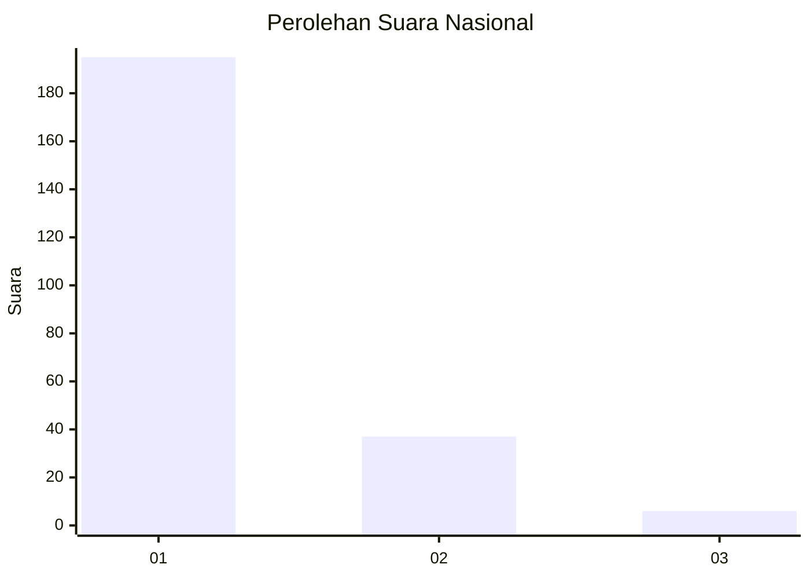
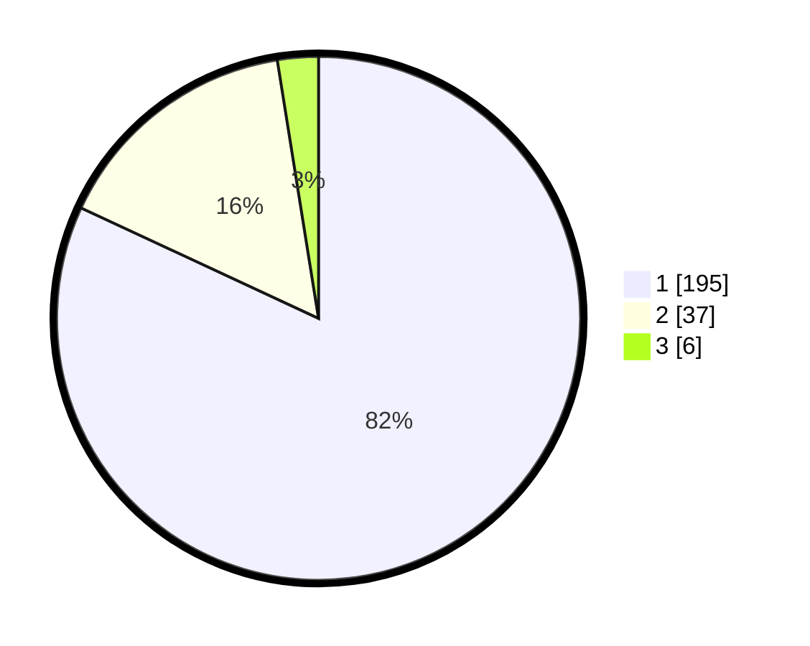

# Hasil

## Grafik

## Tabel

| No. | Nama Paslon    | Suara | Suara (raw) | Persentase |
|:--- |:-------------- | -----:| -----------:| ----------:|
| 1   | ANIES MUHAIMIN | 195   | [195][p-1]  | 81,93      |
| 2   | PRABOWO GIBRAN | 37    | [37][p-2]   | 15,55      |
| 3   | GANJAR MAHFUD  | 6     | [6][p-3]    | 2,52       |

[p-1]: https://github.com/gigit-pemilu/pemilu-2024/blob/main/pilpres/hitung-suara/sub/11-aceh/sub/01-aceh-selatan/sub/15-bakongan-timur/sub/2001-pasie-seubadeh/sub/003-tps/sub/paslon-1.txt
[p-2]: https://github.com/gigit-pemilu/pemilu-2024/blob/main/pilpres/hitung-suara/sub/11-aceh/sub/01-aceh-selatan/sub/15-bakongan-timur/sub/2001-pasie-seubadeh/sub/003-tps/sub/paslon-2.txt
[p-3]: https://github.com/gigit-pemilu/pemilu-2024/blob/main/pilpres/hitung-suara/sub/11-aceh/sub/01-aceh-selatan/sub/15-bakongan-timur/sub/2001-pasie-seubadeh/sub/003-tps/sub/paslon-3.txt

## Foto C Plano

https://sirekap-obj-formc.kpu.go.id/e691/pemilu/ppwp/11/01/15/20/01/1101152001003-20240218-123600--d7b36a02-7840-4696-b84b-eae0a7c54adc.jpg

https://sirekap-obj-formc.kpu.go.id/e691/pemilu/ppwp/11/01/15/20/01/1101152001003-20240218-123602--aef38250-8b5c-4fcc-80ae-84f9f830e492.jpg

https://sirekap-obj-formc.kpu.go.id/e691/pemilu/ppwp/11/01/15/20/01/1101152001003-20240218-123601--932e1db2-11bb-4e5a-9936-83228e636127.jpg

## Metadata

| Key        | Value               |
| ---------- | ------------------- |
| Time Stamp | 2024-02-19 06:16:00 |

## DATA PEMILIH TETAP

Jumlah pemilih dalam DPT: **279**.
 * L: **137**.
 * P: **142**.

## DATA PENGGUNA HAK PILIH

Jumlah pengguna hak pilih dalam DPT: **243**.
 * L: **111**.
 * P: **132**.

Jumlah pengguna hak pilih dalam DPTb: **1**.
 * L: **0**.
 * P: **1**.

Jumlah pengguna hak pilih dalam DPK: **0**.
 * L: **0**.
 * P: **0**.

Jumlah pengguna hak pilih: **244**.
 * L: **111**.
 * P: **133**.

## JUMLAH SUARA SAH DAN TIDAK SAH

JUMLAH SELURUH SUARA SAH: **238**.

JUMLAH SUARA TIDAK SAH: **6**.

JUMLAH SELURUH SUARA SAH DAN SUARA TIDAK SAH: **244**.

