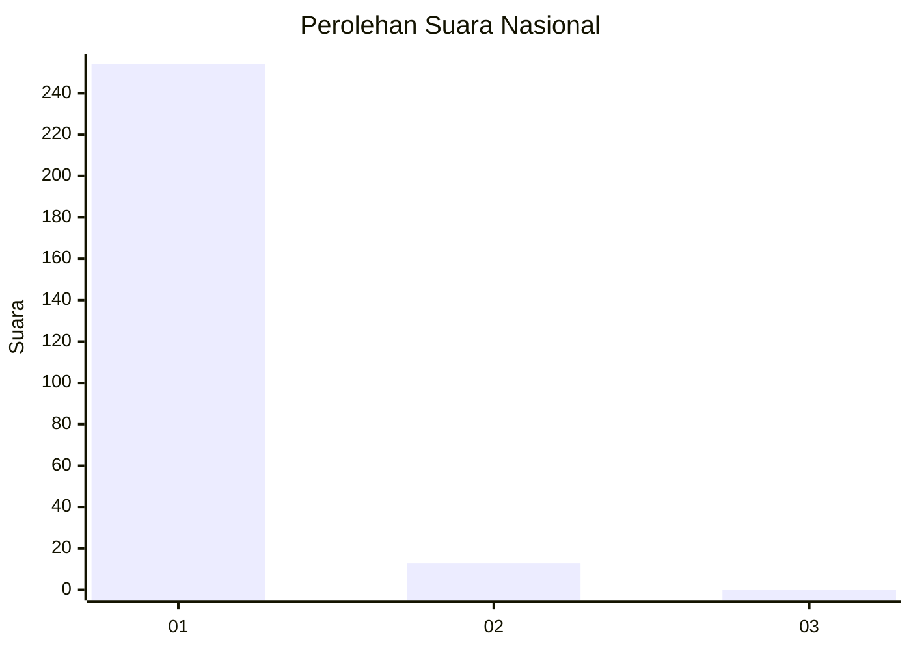
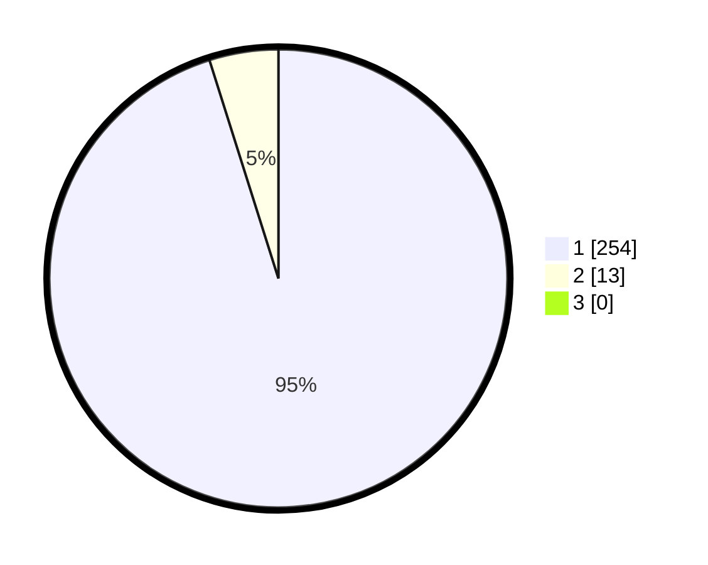

# Hasil

## Grafik

## Tabel

| No. | Nama Paslon    | Suara | Suara (raw) | Persentase |
|:--- |:-------------- | -----:| -----------:| ----------:|
| 1   | ANIES MUHAIMIN | 254   | [254][p-1]  | 95,13      |
| 2   | PRABOWO GIBRAN | 13    | [13][p-2]   | 4,87       |
| 3   | GANJAR MAHFUD  | 0     | [0][p-3]    | 0,00       |

[p-1]: https://github.com/gigit-pemilu/pemilu-2024/blob/main/pilpres/hitung-suara/sub/11-aceh/sub/01-aceh-selatan/sub/15-bakongan-timur/sub/2003-ujong-pulo-rayeuk/sub/002-tps/sub/paslon-1.txt
[p-2]: https://github.com/gigit-pemilu/pemilu-2024/blob/main/pilpres/hitung-suara/sub/11-aceh/sub/01-aceh-selatan/sub/15-bakongan-timur/sub/2003-ujong-pulo-rayeuk/sub/002-tps/sub/paslon-2.txt
[p-3]: https://github.com/gigit-pemilu/pemilu-2024/blob/main/pilpres/hitung-suara/sub/11-aceh/sub/01-aceh-selatan/sub/15-bakongan-timur/sub/2003-ujong-pulo-rayeuk/sub/002-tps/sub/paslon-3.txt

## Foto C Plano

https://sirekap-obj-formc.kpu.go.id/0ef5/pemilu/ppwp/11/01/15/20/03/1101152003002-20240216-132251--2787c25b-fdf9-4420-8cf7-794a0128c2e1.jpg

https://sirekap-obj-formc.kpu.go.id/0ef5/pemilu/ppwp/11/01/15/20/03/1101152003002-20240216-132252--6d7f2ef8-317e-4681-93fc-88e6dcda9426.jpg

https://sirekap-obj-formc.kpu.go.id/0ef5/pemilu/ppwp/11/01/15/20/03/1101152003002-20240216-132251--d8294dd3-ee57-4d4e-89f0-277175040331.jpg

## Metadata

| Key        | Value               |
| ---------- | ------------------- |
| Time Stamp | 2024-02-16 21:01:00 |

## DATA PEMILIH TETAP

Jumlah pemilih dalam DPT: **278**.
 * L: **140**.
 * P: **138**.

## DATA PENGGUNA HAK PILIH

Jumlah pengguna hak pilih dalam DPT: **264**.
 * L: **133**.
 * P: **131**.

Jumlah pengguna hak pilih dalam DPTb: **2**.
 * L: **1**.
 * P: **1**.

Jumlah pengguna hak pilih dalam DPK: **1**.
 * L: **0**.
 * P: **1**.

Jumlah pengguna hak pilih: **267**.
 * L: **134**.
 * P: **133**.

## JUMLAH SUARA SAH DAN TIDAK SAH

JUMLAH SELURUH SUARA SAH: **267**.

JUMLAH SUARA TIDAK SAH: **0**.

JUMLAH SELURUH SUARA SAH DAN SUARA TIDAK SAH: **267**.

