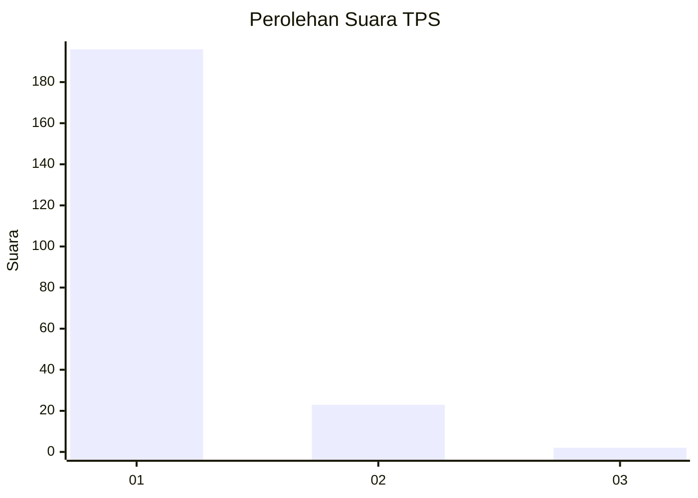
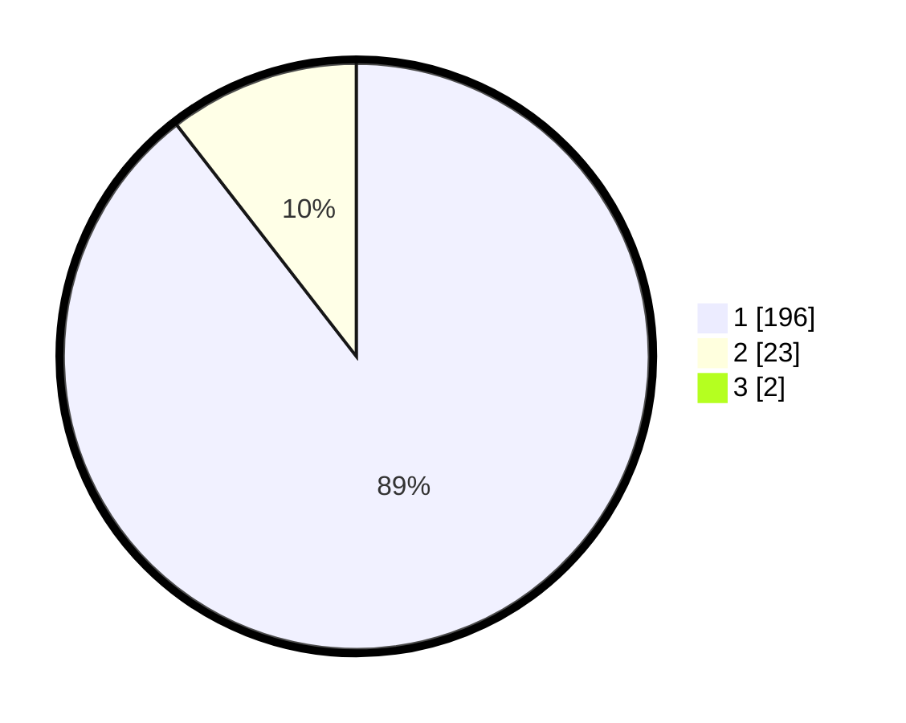

# Hasil

## Grafik

## Tabel

| No. | Nama Paslon    | Suara | Suara (raw) | Persentase |
|:--- |:-------------- | -----:| -----------:| ----------:|
| 1   | ANIES MUHAIMIN | 196   | [196][p-1]  | 88,69      |
| 2   | PRABOWO GIBRAN | 23    | [23][p-2]   | 10,41      |
| 3   | GANJAR MAHFUD  | 2     | [2][p-3]    | 0,90       |

[p-1]: https://github.com/gigit-pemilu/pemilu-2024-11-aceh/blob/main/pilpres/hitung-suara/sub/11-aceh/sub/01-aceh-selatan/sub/15-bakongan-timur/sub/2004-sawah-tingkeum/sub/002-tps/sub/paslon-1.txt
[p-2]: https://github.com/gigit-pemilu/pemilu-2024-11-aceh/blob/main/pilpres/hitung-suara/sub/11-aceh/sub/01-aceh-selatan/sub/15-bakongan-timur/sub/2004-sawah-tingkeum/sub/002-tps/sub/paslon-2.txt
[p-3]: https://github.com/gigit-pemilu/pemilu-2024-11-aceh/blob/main/pilpres/hitung-suara/sub/11-aceh/sub/01-aceh-selatan/sub/15-bakongan-timur/sub/2004-sawah-tingkeum/sub/002-tps/sub/paslon-3.txt

## Foto C Plano

https://sirekap-obj-formc.kpu.go.id/b96c/pemilu/ppwp/11/01/15/20/04/1101152004002-20240215-233444--3d84fc32-aa22-4920-9a1d-8b0b298b43b0.jpg

https://sirekap-obj-formc.kpu.go.id/b96c/pemilu/ppwp/11/01/15/20/04/1101152004002-20240215-233447--6c7e1e9b-808b-43da-836f-30cdc62f1791.jpg

https://sirekap-obj-formc.kpu.go.id/b96c/pemilu/ppwp/11/01/15/20/04/1101152004002-20240215-233446--aeacb81f-5e25-4dd4-87a2-b3cb1932dffb.jpg

## Metadata

| Key        | Value               |
| ---------- | ------------------- |
| Time Stamp | 2024-02-16 12:51:22 |

## DATA PEMILIH TETAP

Jumlah pemilih dalam DPT: **244**.
 * L: **133**.
 * P: **111**.

## DATA PENGGUNA HAK PILIH

Jumlah pengguna hak pilih dalam DPT: **221**.
 * L: **120**.
 * P: **101**.

Jumlah pengguna hak pilih dalam DPTb: **0**.
 * L: **0**.
 * P: **0**.

Jumlah pengguna hak pilih dalam DPK: **5**.
 * L: **4**.
 * P: **1**.

Jumlah pengguna hak pilih: **226**.
 * L: **124**.
 * P: **102**.

## JUMLAH SUARA SAH DAN TIDAK SAH

JUMLAH SELURUH SUARA SAH: **221**.

JUMLAH SUARA TIDAK SAH: **5**.

JUMLAH SELURUH SUARA SAH DAN SUARA TIDAK SAH: **226**.

