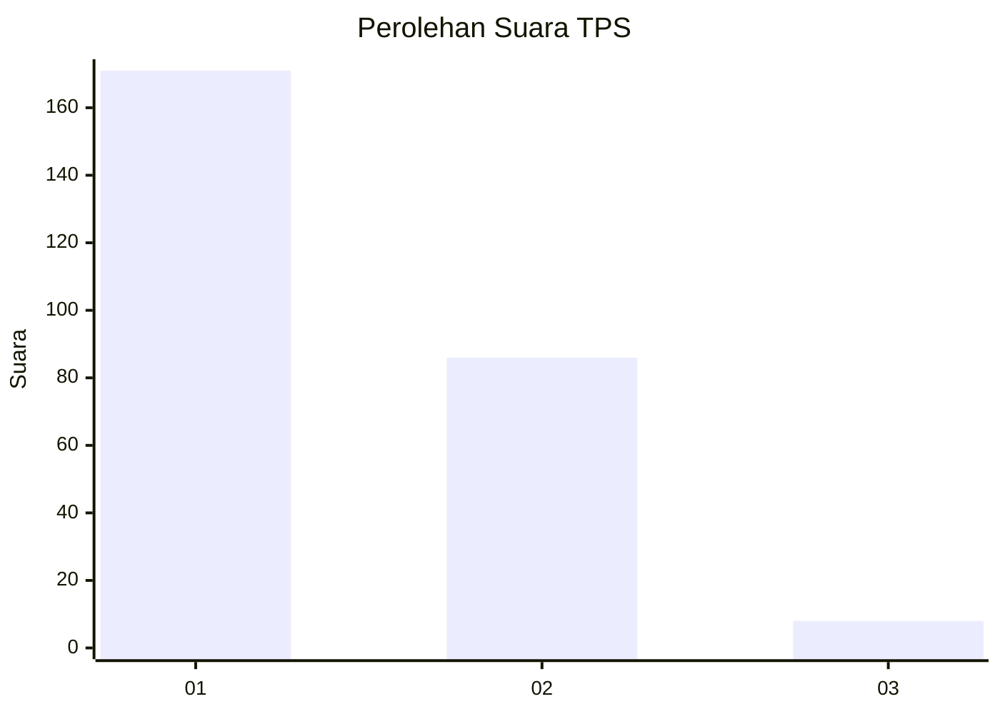
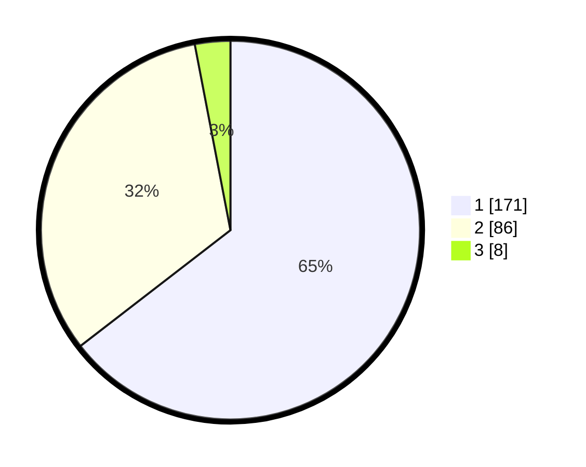

# Hasil

## Grafik

## Tabel

| No. | Nama Paslon    | Suara | Suara (raw) | Persentase |
|:--- |:-------------- | -----:| -----------:| ----------:|
| 1   | ANIES MUHAIMIN | 171   | [171][p-1]  | 64,53      |
| 2   | PRABOWO GIBRAN | 86    | [86][p-2]   | 32,45      |
| 3   | GANJAR MAHFUD  | 8     | [8][p-3]    | 3,02       |

[p-1]: https://github.com/gigit-pemilu/pemilu-2024-11-aceh/blob/main/pilpres/hitung-suara/sub/11-aceh/sub/01-aceh-selatan/sub/16-trumon-timur/sub/2005-pinto-rimba/sub/002-tps/sub/paslon-1.txt
[p-2]: https://github.com/gigit-pemilu/pemilu-2024-11-aceh/blob/main/pilpres/hitung-suara/sub/11-aceh/sub/01-aceh-selatan/sub/16-trumon-timur/sub/2005-pinto-rimba/sub/002-tps/sub/paslon-2.txt
[p-3]: https://github.com/gigit-pemilu/pemilu-2024-11-aceh/blob/main/pilpres/hitung-suara/sub/11-aceh/sub/01-aceh-selatan/sub/16-trumon-timur/sub/2005-pinto-rimba/sub/002-tps/sub/paslon-3.txt

## Foto C Plano

https://sirekap-obj-formc.kpu.go.id/2ca2/pemilu/ppwp/11/01/16/20/05/1101162005002-20240220-201516--ad3c6646-5984-4ad4-9d32-bf5efcbc0236.jpg

https://sirekap-obj-formc.kpu.go.id/2ca2/pemilu/ppwp/11/01/16/20/05/1101162005002-20240220-201711--63114cf0-e70c-4171-a227-a92bf80c8e74.jpg

https://sirekap-obj-formc.kpu.go.id/2ca2/pemilu/ppwp/11/01/16/20/05/1101162005002-20240220-201830--87428c80-70f6-4098-b9f1-1e9882d70159.jpg

## Metadata

| Key        | Value               |
| ---------- | ------------------- |
| Time Stamp | 2024-02-20 21:00:00 |

## DATA PEMILIH TETAP

Jumlah pemilih dalam DPT: **297**.
 * L: **151**.
 * P: **146**.

## DATA PENGGUNA HAK PILIH

Jumlah pengguna hak pilih dalam DPT: **262**.
 * L: **134**.
 * P: **128**.

Jumlah pengguna hak pilih dalam DPTb: **3**.
 * L: **802**.
 * P: **1**.

Jumlah pengguna hak pilih dalam DPK: **0**.
 * L: **0**.
 * P: **0**.

Jumlah pengguna hak pilih: **265**.
 * L: **136**.
 * P: **129**.

## JUMLAH SUARA SAH DAN TIDAK SAH

JUMLAH SELURUH SUARA SAH: **265**.

JUMLAH SUARA TIDAK SAH: **0**.

JUMLAH SELURUH SUARA SAH DAN SUARA TIDAK SAH: **265**.

