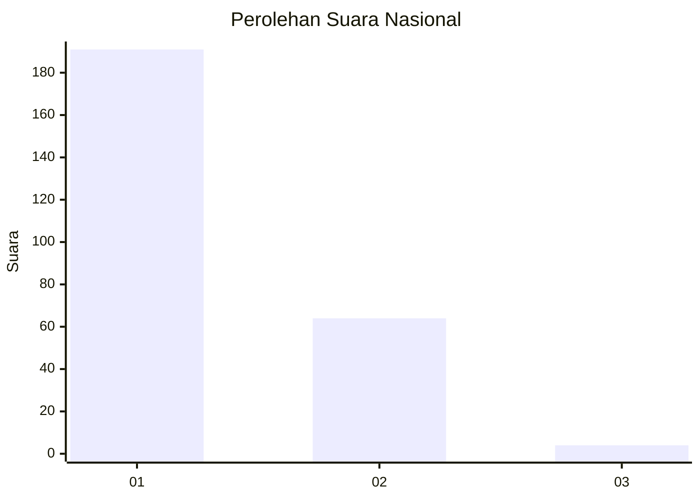
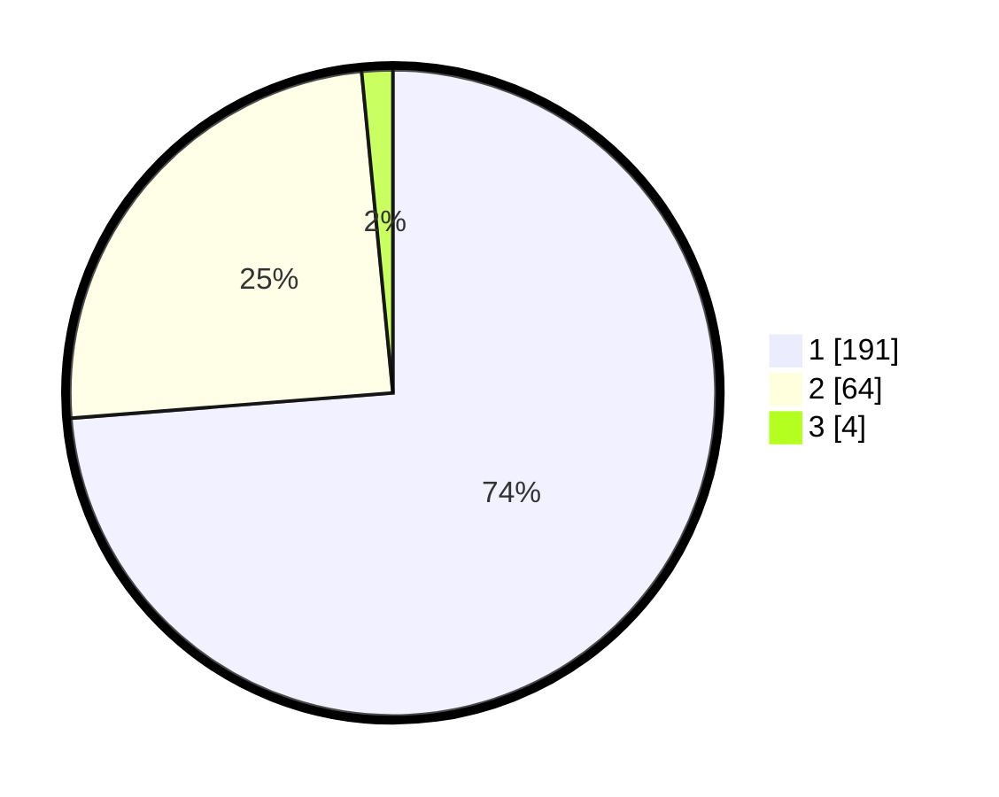

# Hasil

## Grafik

## Tabel

| No. | Nama Paslon    | Suara | Suara (raw) | Persentase |
|:--- |:-------------- | -----:| -----------:| ----------:|
| 1   | ANIES MUHAIMIN | 191   | [191][p-1]  | 73,75      |
| 2   | PRABOWO GIBRAN | 64    | [64][p-2]   | 24,71      |
| 3   | GANJAR MAHFUD  | 4     | [4][p-3]    | 1,54       |

[p-1]: https://github.com/gigit-pemilu/pemilu-2024/blob/main/pilpres/hitung-suara/sub/11-aceh/sub/01-aceh-selatan/sub/16-trumon-timur/sub/2005-pinto-rimba/sub/003-tps/sub/paslon-1.txt
[p-2]: https://github.com/gigit-pemilu/pemilu-2024/blob/main/pilpres/hitung-suara/sub/11-aceh/sub/01-aceh-selatan/sub/16-trumon-timur/sub/2005-pinto-rimba/sub/003-tps/sub/paslon-2.txt
[p-3]: https://github.com/gigit-pemilu/pemilu-2024/blob/main/pilpres/hitung-suara/sub/11-aceh/sub/01-aceh-selatan/sub/16-trumon-timur/sub/2005-pinto-rimba/sub/003-tps/sub/paslon-3.txt

## Foto C Plano

https://sirekap-obj-formc.kpu.go.id/03d1/pemilu/ppwp/11/01/16/20/05/1101162005003-20240216-070910--5799c4a5-1649-4ee9-a4bb-fa956a2ea9c8.jpg

https://sirekap-obj-formc.kpu.go.id/03d1/pemilu/ppwp/11/01/16/20/05/1101162005003-20240216-152524--21d3612d-7f88-4e5a-916a-2dac502ba985.jpg

https://sirekap-obj-formc.kpu.go.id/03d1/pemilu/ppwp/11/01/16/20/05/1101162005003-20240216-152648--61840615-337e-4c22-80a4-ee492585b0c6.jpg

## Metadata

| Key        | Value               |
| ---------- | ------------------- |
| Time Stamp | 2024-02-16 16:25:10 |

## DATA PEMILIH TETAP

Jumlah pemilih dalam DPT: **297**.
 * L: **149**.
 * P: **148**.

## DATA PENGGUNA HAK PILIH

Jumlah pengguna hak pilih dalam DPT: **252**.
 * L: **126**.
 * P: **126**.

Jumlah pengguna hak pilih dalam DPTb: **0**.
 * L: **0**.
 * P: **0**.

Jumlah pengguna hak pilih dalam DPK: **12**.
 * L: **6**.
 * P: **6**.

Jumlah pengguna hak pilih: **264**.
 * L: **132**.
 * P: **132**.

## JUMLAH SUARA SAH DAN TIDAK SAH

JUMLAH SELURUH SUARA SAH: **259**.

JUMLAH SUARA TIDAK SAH: **5**.

JUMLAH SELURUH SUARA SAH DAN SUARA TIDAK SAH: **264**.

