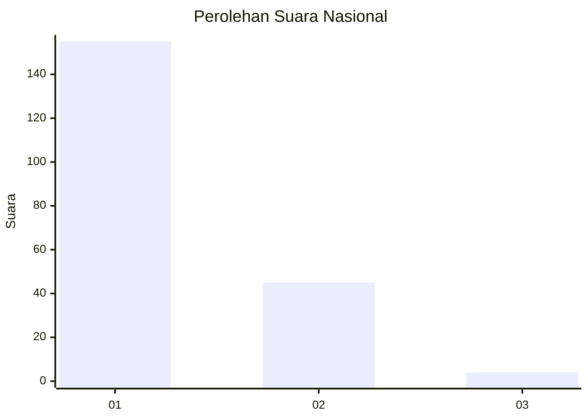
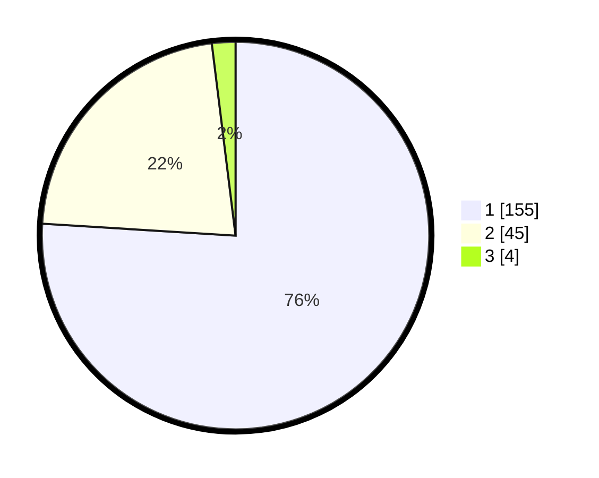

# Hasil

## Grafik

## Tabel

| No. | Nama Paslon    | Suara | Suara (raw) | Persentase |
|:--- |:-------------- | -----:| -----------:| ----------:|
| 1   | ANIES MUHAIMIN | 155   | [155][p-1]  | 75,98      |
| 2   | PRABOWO GIBRAN | 45    | [45][p-2]   | 22,06      |
| 3   | GANJAR MAHFUD  | 4     | [4][p-3]    | 1,96       |

[p-1]: https://github.com/gigit-pemilu/pemilu-2024/blob/main/pilpres/hitung-suara/sub/11-aceh/sub/01-aceh-selatan/sub/16-trumon-timur/sub/2006-krueng-luas/sub/002-tps/sub/paslon-1.txt
[p-2]: https://github.com/gigit-pemilu/pemilu-2024/blob/main/pilpres/hitung-suara/sub/11-aceh/sub/01-aceh-selatan/sub/16-trumon-timur/sub/2006-krueng-luas/sub/002-tps/sub/paslon-2.txt
[p-3]: https://github.com/gigit-pemilu/pemilu-2024/blob/main/pilpres/hitung-suara/sub/11-aceh/sub/01-aceh-selatan/sub/16-trumon-timur/sub/2006-krueng-luas/sub/002-tps/sub/paslon-3.txt

## Foto C Plano

https://sirekap-obj-formc.kpu.go.id/3e33/pemilu/ppwp/11/01/16/20/06/1101162006002-20240215-003622--7f1e1cb4-1232-4e74-9882-36ecd57247e5.jpg

https://sirekap-obj-formc.kpu.go.id/3e33/pemilu/ppwp/11/01/16/20/06/1101162006002-20240214-225646--8aac5bf7-018c-4d1d-93cd-91314de2c7cb.jpg

https://sirekap-obj-formc.kpu.go.id/3e33/pemilu/ppwp/11/01/16/20/06/1101162006002-20240215-004113--f5817702-6ecf-4625-83e8-938921afbd7b.jpg

## Metadata

| Key        | Value               |
| ---------- | ------------------- |
| Time Stamp | 2024-02-16 21:01:00 |

## DATA PEMILIH TETAP

Jumlah pemilih dalam DPT: **214**.
 * L: **102**.
 * P: **112**.

## DATA PENGGUNA HAK PILIH

Jumlah pengguna hak pilih dalam DPT: **201**.
 * L: **95**.
 * P: **106**.

Jumlah pengguna hak pilih dalam DPTb: **0**.
 * L: **0**.
 * P: **0**.

Jumlah pengguna hak pilih dalam DPK: **7**.
 * L: **4**.
 * P: **3**.

Jumlah pengguna hak pilih: **208**.
 * L: **99**.
 * P: **109**.

## JUMLAH SUARA SAH DAN TIDAK SAH

JUMLAH SELURUH SUARA SAH: **204**.

JUMLAH SUARA TIDAK SAH: **4**.

JUMLAH SELURUH SUARA SAH DAN SUARA TIDAK SAH: **208**.

