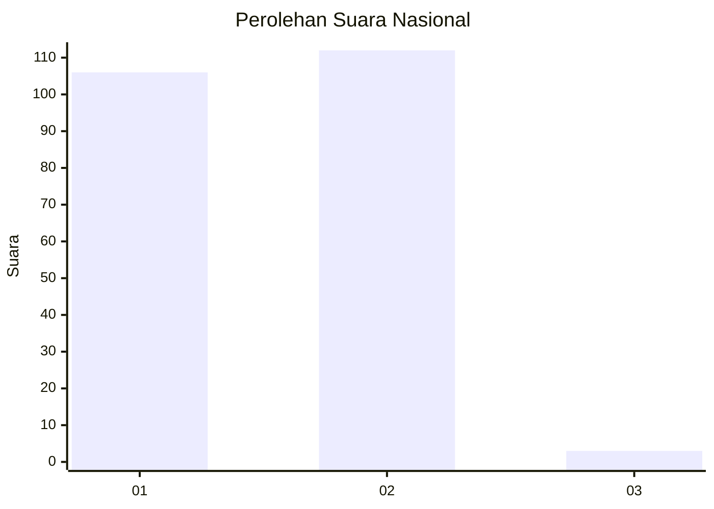
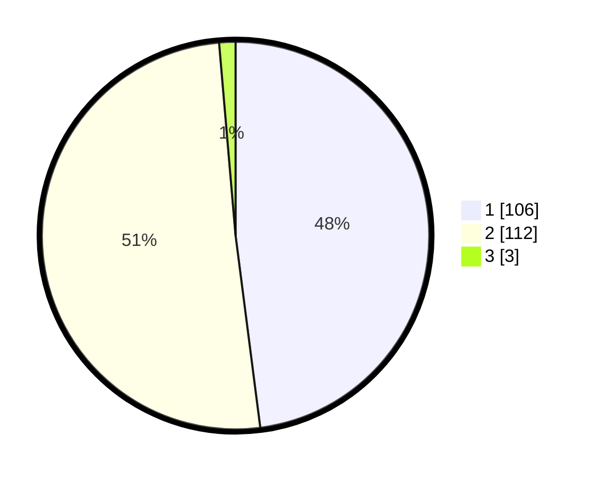

# Hasil

## Grafik

## Tabel

| No. | Nama Paslon    | Suara | Suara (raw) | Persentase |
|:--- |:-------------- | -----:| -----------:| ----------:|
| 1   | ANIES MUHAIMIN | 106   | [106][p-1]  | 47,96      |
| 2   | PRABOWO GIBRAN | 112   | [112][p-2]  | 50,68      |
| 3   | GANJAR MAHFUD  | 3     | [3][p-3]    | 1,36       |

[p-1]: https://github.com/gigit-pemilu/pemilu-2024/blob/main/pilpres/hitung-suara/sub/11-aceh/sub/01-aceh-selatan/sub/16-trumon-timur/sub/2007-jambo-dalem/sub/004-tps/sub/paslon-1.txt
[p-2]: https://github.com/gigit-pemilu/pemilu-2024/blob/main/pilpres/hitung-suara/sub/11-aceh/sub/01-aceh-selatan/sub/16-trumon-timur/sub/2007-jambo-dalem/sub/004-tps/sub/paslon-2.txt
[p-3]: https://github.com/gigit-pemilu/pemilu-2024/blob/main/pilpres/hitung-suara/sub/11-aceh/sub/01-aceh-selatan/sub/16-trumon-timur/sub/2007-jambo-dalem/sub/004-tps/sub/paslon-3.txt

## Foto C Plano

https://sirekap-obj-formc.kpu.go.id/c166/pemilu/ppwp/11/01/16/20/07/1101162007004-20240215-000946--891cbbd8-8b4d-45e1-8e90-7761db609fd2.jpg

https://sirekap-obj-formc.kpu.go.id/c166/pemilu/ppwp/11/01/16/20/07/1101162007004-20240215-001411--55124ec8-7717-4fcf-a213-e101126416dd.jpg

https://sirekap-obj-formc.kpu.go.id/c166/pemilu/ppwp/11/01/16/20/07/1101162007004-20240215-001713--d5be7e43-ba3d-4c71-bbc3-e10faaf06366.jpg

## Metadata

| Key        | Value               |
| ---------- | ------------------- |
| Time Stamp | 2024-02-24 22:31:28 |

