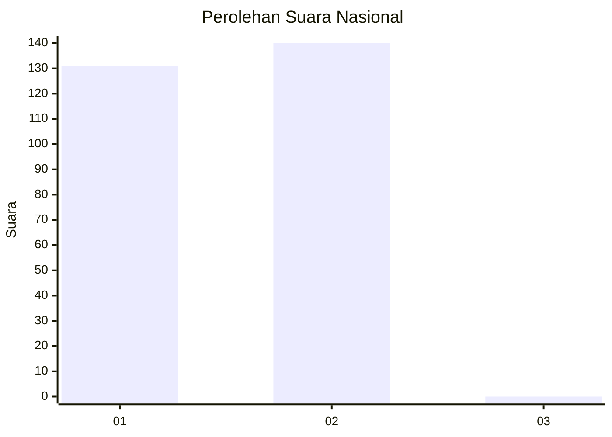
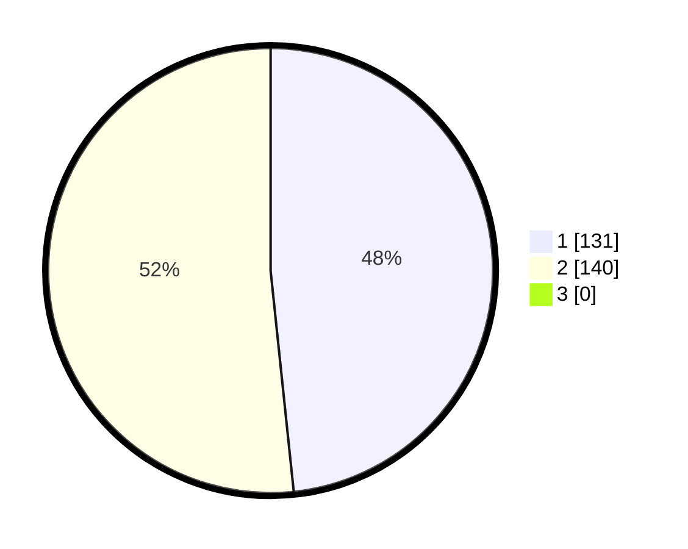

# Hasil

## Grafik

## Tabel

| No. | Nama Paslon    | Suara | Suara (raw) | Persentase |
|:--- |:-------------- | -----:| -----------:| ----------:|
| 1   | ANIES MUHAIMIN | 131   | [131][p-1]  | 48,34      |
| 2   | PRABOWO GIBRAN | 140   | [140][p-2]  | 51,66      |
| 3   | GANJAR MAHFUD  | 0     | [0][p-3]    | 0,00       |

[p-1]: https://github.com/gigit-pemilu/pemilu-2024/blob/main/pilpres/hitung-suara/sub/11-aceh/sub/01-aceh-selatan/sub/16-trumon-timur/sub/2007-jambo-dalem/sub/005-tps/sub/paslon-1.txt
[p-2]: https://github.com/gigit-pemilu/pemilu-2024/blob/main/pilpres/hitung-suara/sub/11-aceh/sub/01-aceh-selatan/sub/16-trumon-timur/sub/2007-jambo-dalem/sub/005-tps/sub/paslon-2.txt
[p-3]: https://github.com/gigit-pemilu/pemilu-2024/blob/main/pilpres/hitung-suara/sub/11-aceh/sub/01-aceh-selatan/sub/16-trumon-timur/sub/2007-jambo-dalem/sub/005-tps/sub/paslon-3.txt

## Foto C Plano

https://sirekap-obj-formc.kpu.go.id/cdae/pemilu/ppwp/11/01/16/20/07/1101162007005-20240215-002528--c7ddc1f4-67e9-4695-bf49-cf7dcbc282d1.jpg

https://sirekap-obj-formc.kpu.go.id/cdae/pemilu/ppwp/11/01/16/20/07/1101162007005-20240215-002640--042d2ab3-c1aa-4552-9d5e-56baab8671b0.jpg

https://sirekap-obj-formc.kpu.go.id/cdae/pemilu/ppwp/11/01/16/20/07/1101162007005-20240215-002842--ab4401c9-a0b8-4e78-a456-578d9425c3b6.jpg

## Metadata

| Key        | Value               |
| ---------- | ------------------- |
| Time Stamp | 2024-02-16 21:01:00 |

