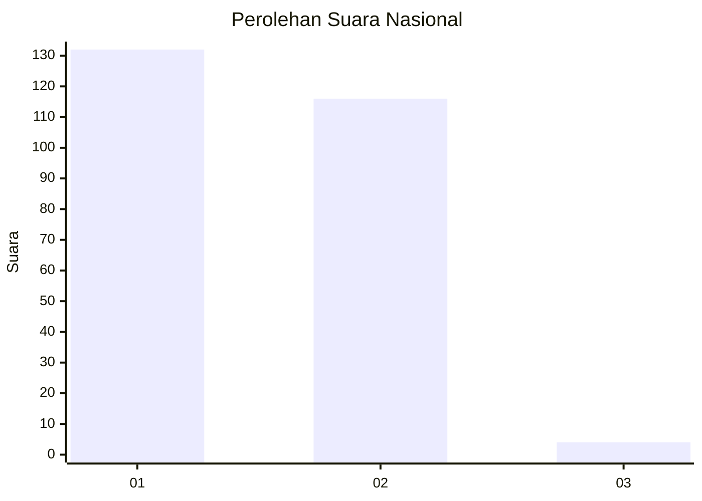
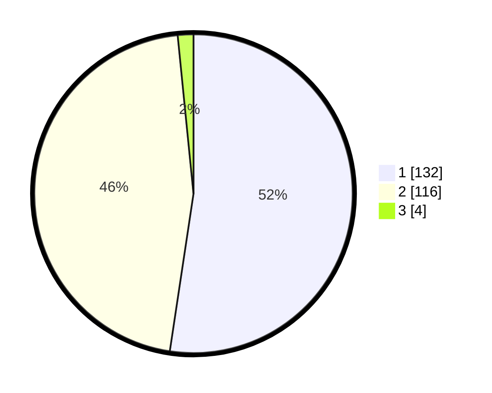

# Hasil

## Grafik

## Tabel

| No. | Nama Paslon    | Suara | Suara (raw) | Persentase |
|:--- |:-------------- | -----:| -----------:| ----------:|
| 1   | ANIES MUHAIMIN | 132   | [132][p-1]  | 52,38      |
| 2   | PRABOWO GIBRAN | 116   | [116][p-2]  | 46,03      |
| 3   | GANJAR MAHFUD  | 4     | [4][p-3]    | 1,59       |

[p-1]: https://github.com/gigit-pemilu/pemilu-2024/blob/main/pilpres/hitung-suara/sub/11-aceh/sub/01-aceh-selatan/sub/16-trumon-timur/sub/2008-kapa-sesak/sub/004-tps/sub/paslon-1.txt
[p-2]: https://github.com/gigit-pemilu/pemilu-2024/blob/main/pilpres/hitung-suara/sub/11-aceh/sub/01-aceh-selatan/sub/16-trumon-timur/sub/2008-kapa-sesak/sub/004-tps/sub/paslon-2.txt
[p-3]: https://github.com/gigit-pemilu/pemilu-2024/blob/main/pilpres/hitung-suara/sub/11-aceh/sub/01-aceh-selatan/sub/16-trumon-timur/sub/2008-kapa-sesak/sub/004-tps/sub/paslon-3.txt

## Foto C Plano

https://sirekap-obj-formc.kpu.go.id/61fd/pemilu/ppwp/11/01/16/20/08/1101162008004-20240215-163649--f298e81a-b037-48f0-9de7-b366b606f6c5.jpg

https://sirekap-obj-formc.kpu.go.id/61fd/pemilu/ppwp/11/01/16/20/08/1101162008004-20240215-163921--ef53dd13-bf73-4b6a-8c5c-1ea69d9d0619.jpg

https://sirekap-obj-formc.kpu.go.id/61fd/pemilu/ppwp/11/01/16/20/08/1101162008004-20240222-184619--c4d4a0d4-5f11-48b3-b886-189e30287310.jpg

## Metadata

| Key        | Value               |
| ---------- | ------------------- |
| Time Stamp | 2024-02-22 19:00:00 |

