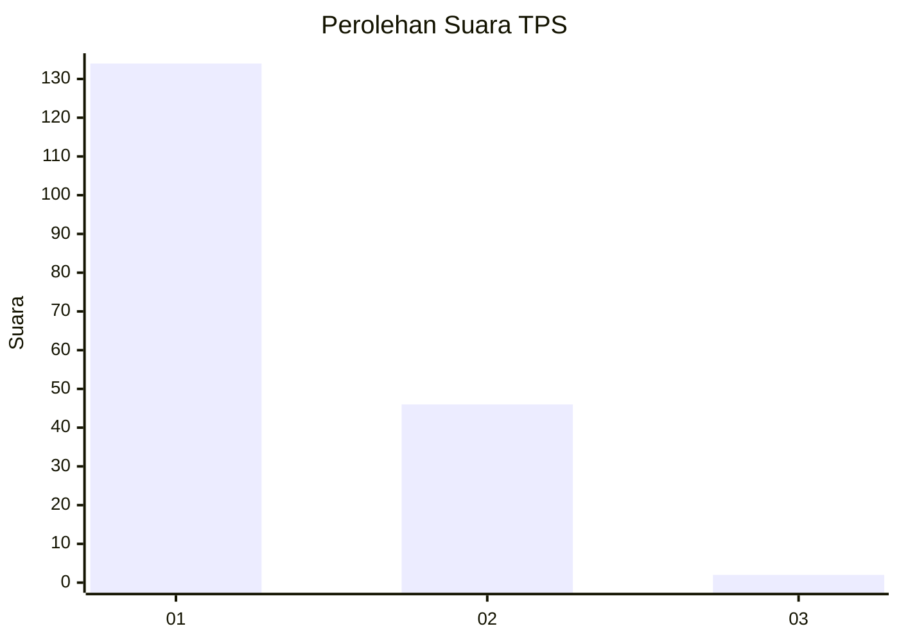
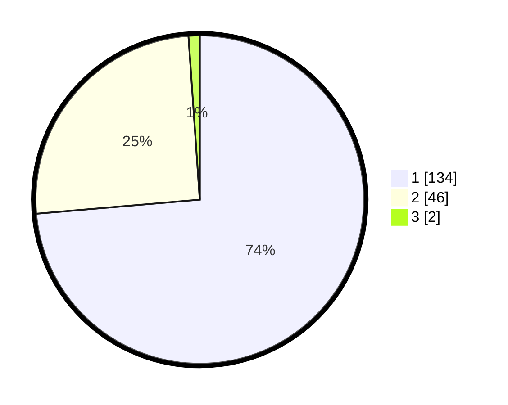

# Hasil

## Grafik

## Tabel

| No. | Nama Paslon    | Suara | Suara (raw) | Persentase |
|:--- |:-------------- | -----:| -----------:| ----------:|
| 1   | ANIES MUHAIMIN | 134   | [134][p-1]  | 73,63      |
| 2   | PRABOWO GIBRAN | 46    | [46][p-2]   | 25,27      |
| 3   | GANJAR MAHFUD  | 2     | [2][p-3]    | 1,10       |

[p-1]: https://github.com/gigit-pemilu/pemilu-2024-11-aceh/blob/main/pilpres/hitung-suara/sub/11-aceh/sub/01-aceh-selatan/sub/16-trumon-timur/sub/2010-seuneubok-pusaka/sub/002-tps/sub/paslon-1.txt
[p-2]: https://github.com/gigit-pemilu/pemilu-2024-11-aceh/blob/main/pilpres/hitung-suara/sub/11-aceh/sub/01-aceh-selatan/sub/16-trumon-timur/sub/2010-seuneubok-pusaka/sub/002-tps/sub/paslon-2.txt
[p-3]: https://github.com/gigit-pemilu/pemilu-2024-11-aceh/blob/main/pilpres/hitung-suara/sub/11-aceh/sub/01-aceh-selatan/sub/16-trumon-timur/sub/2010-seuneubok-pusaka/sub/002-tps/sub/paslon-3.txt

## Foto C Plano

https://sirekap-obj-formc.kpu.go.id/f044/pemilu/ppwp/11/01/16/20/10/1101162010002-20240222-131204--78882f39-7c75-429e-8ca4-8e47fafaa547.jpg

https://sirekap-obj-formc.kpu.go.id/f044/pemilu/ppwp/11/01/16/20/10/1101162010002-20240222-125833--88f35649-16a3-4ef3-a7d6-c0d4f3b0fda2.jpg

https://sirekap-obj-formc.kpu.go.id/f044/pemilu/ppwp/11/01/16/20/10/1101162010002-20240222-130228--6d532aef-2eeb-488a-a8d4-a613e277a4d2.jpg

## Metadata

| Key        | Value               |
| ---------- | ------------------- |
| Time Stamp | 2024-02-22 17:00:00 |

## DATA PEMILIH TETAP

Jumlah pemilih dalam DPT: **271**.
 * L: **139**.
 * P: **132**.

## DATA PENGGUNA HAK PILIH

Jumlah pengguna hak pilih dalam DPT: **246**.
 * L: **127**.
 * P: **119**.

Jumlah pengguna hak pilih dalam DPTb: **4**.
 * L: **3**.
 * P: **1**.

Jumlah pengguna hak pilih dalam DPK: **0**.
 * L: **0**.
 * P: **0**.

Jumlah pengguna hak pilih: **250**.
 * L: **130**.
 * P: **120**.

## JUMLAH SUARA SAH DAN TIDAK SAH

JUMLAH SELURUH SUARA SAH: **243**.

JUMLAH SUARA TIDAK SAH: **7**.

JUMLAH SELURUH SUARA SAH DAN SUARA TIDAK SAH: **250**.

