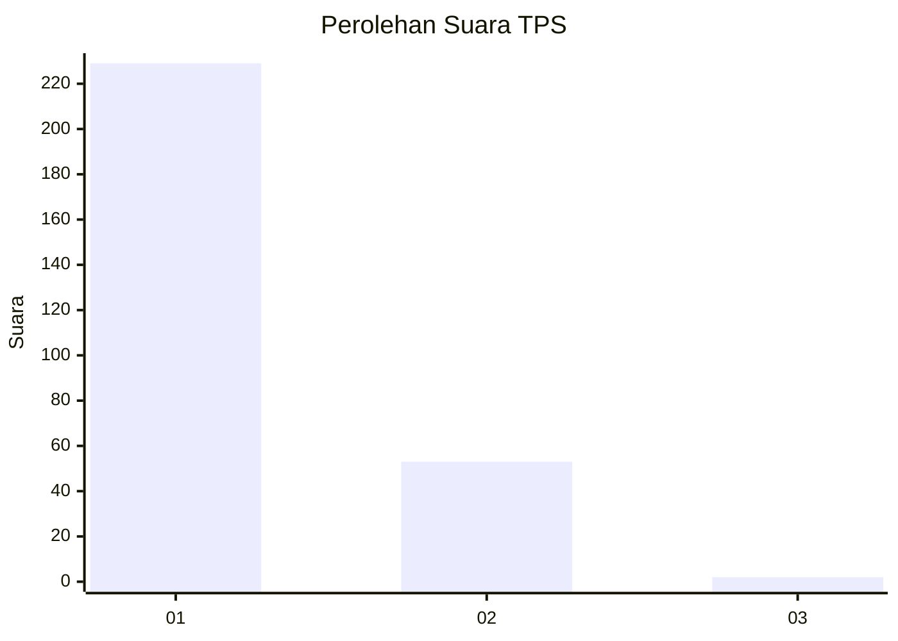
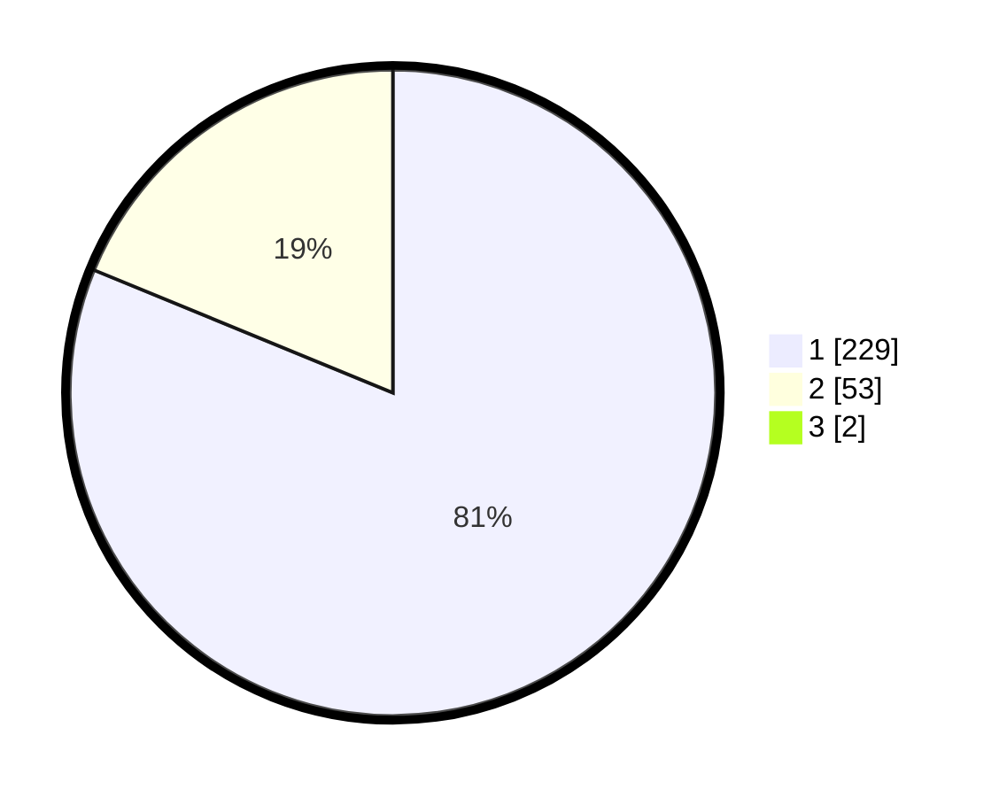

# Hasil

## Grafik

## Tabel

| No. | Nama Paslon    | Suara | Suara (raw) | Persentase |
|:--- |:-------------- | -----:| -----------:| ----------:|
| 1   | ANIES MUHAIMIN | 229   | [229][p-1]  | 80,63      |
| 2   | PRABOWO GIBRAN | 53    | [53][p-2]   | 18,66      |
| 3   | GANJAR MAHFUD  | 2     | [2][p-3]    | 0,70       |

[p-1]: https://github.com/gigit-pemilu/pemilu-2024-11-aceh/blob/main/pilpres/hitung-suara/sub/11-aceh/sub/01-aceh-selatan/sub/17-kota-bahagia/sub/2001-buket-gadeng/sub/001-tps/sub/paslon-1.txt
[p-2]: https://github.com/gigit-pemilu/pemilu-2024-11-aceh/blob/main/pilpres/hitung-suara/sub/11-aceh/sub/01-aceh-selatan/sub/17-kota-bahagia/sub/2001-buket-gadeng/sub/001-tps/sub/paslon-2.txt
[p-3]: https://github.com/gigit-pemilu/pemilu-2024-11-aceh/blob/main/pilpres/hitung-suara/sub/11-aceh/sub/01-aceh-selatan/sub/17-kota-bahagia/sub/2001-buket-gadeng/sub/001-tps/sub/paslon-3.txt

## Foto C Plano

https://sirekap-obj-formc.kpu.go.id/ca26/pemilu/ppwp/11/01/17/20/01/1101172001001-20240215-013342--a06a26c2-0e82-4402-a333-c7a23249fbd1.jpg

https://sirekap-obj-formc.kpu.go.id/ca26/pemilu/ppwp/11/01/17/20/01/1101172001001-20240215-013544--b389cf41-27c5-4334-ad1b-6a8475907d8d.jpg

https://sirekap-obj-formc.kpu.go.id/ca26/pemilu/ppwp/11/01/17/20/01/1101172001001-20240215-013722--752b071b-5ef9-4e29-b201-8b4fb578094f.jpg

## Metadata

| Key        | Value               |
| ---------- | ------------------- |
| Time Stamp | 2024-02-15 09:00:24 |

## DATA PEMILIH TETAP

Jumlah pemilih dalam DPT: **278**.
 * L: **142**.
 * P: **136**.

## DATA PENGGUNA HAK PILIH

Jumlah pengguna hak pilih dalam DPT: **272**.
 * L: **142**.
 * P: **130**.

Jumlah pengguna hak pilih dalam DPTb: **0**.
 * L: **0**.
 * P: **0**.

Jumlah pengguna hak pilih dalam DPK: **12**.
 * L: **2**.
 * P: **10**.

Jumlah pengguna hak pilih: **284**.
 * L: **144**.
 * P: **140**.

## JUMLAH SUARA SAH DAN TIDAK SAH

JUMLAH SELURUH SUARA SAH: **282**.

JUMLAH SUARA TIDAK SAH: **2**.

JUMLAH SELURUH SUARA SAH DAN SUARA TIDAK SAH: **284**.

