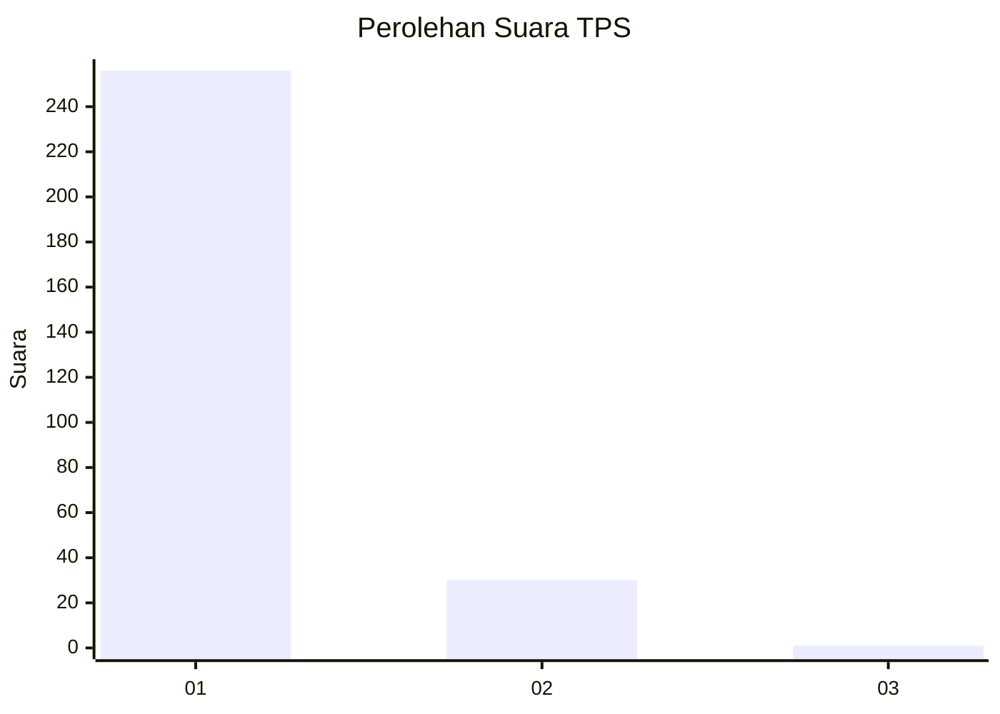
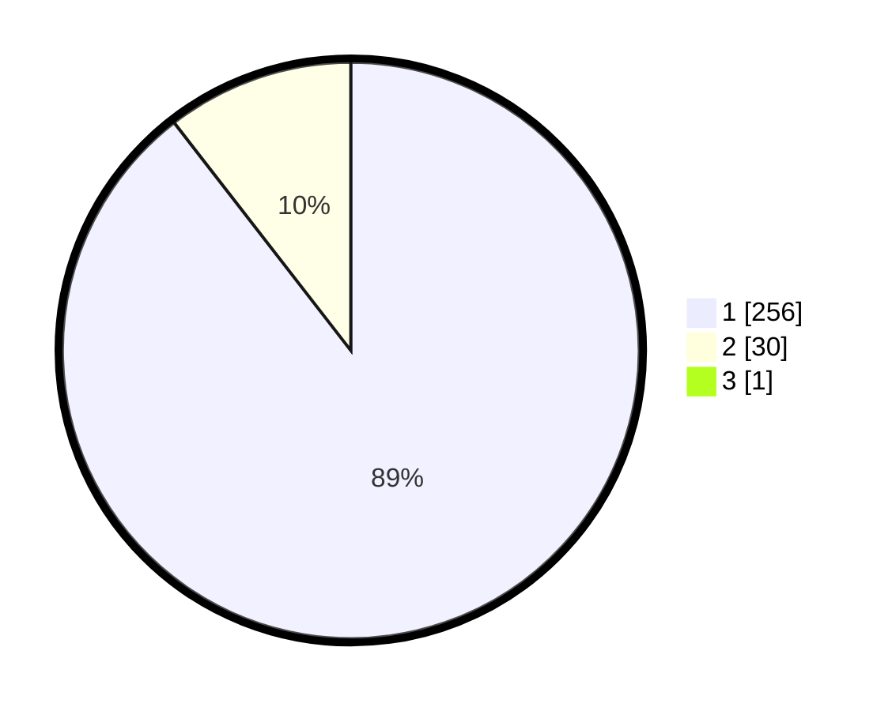

# Hasil

## Grafik

## Tabel

| No. | Nama Paslon    | Suara | Suara (raw) | Persentase |
|:--- |:-------------- | -----:| -----------:| ----------:|
| 1   | ANIES MUHAIMIN | 256   | [256][p-1]  | 89,20      |
| 2   | PRABOWO GIBRAN | 30    | [30][p-2]   | 10,45      |
| 3   | GANJAR MAHFUD  | 1     | [1][p-3]    | 0,35       |

[p-1]: https://github.com/gigit-pemilu/pemilu-2024-11-aceh/blob/main/pilpres/hitung-suara/sub/11-aceh/sub/01-aceh-selatan/sub/17-kota-bahagia/sub/2001-buket-gadeng/sub/002-tps/sub/paslon-1.txt
[p-2]: https://github.com/gigit-pemilu/pemilu-2024-11-aceh/blob/main/pilpres/hitung-suara/sub/11-aceh/sub/01-aceh-selatan/sub/17-kota-bahagia/sub/2001-buket-gadeng/sub/002-tps/sub/paslon-2.txt
[p-3]: https://github.com/gigit-pemilu/pemilu-2024-11-aceh/blob/main/pilpres/hitung-suara/sub/11-aceh/sub/01-aceh-selatan/sub/17-kota-bahagia/sub/2001-buket-gadeng/sub/002-tps/sub/paslon-3.txt

## Foto C Plano

https://sirekap-obj-formc.kpu.go.id/5f75/pemilu/ppwp/11/01/17/20/01/1101172001002-20240214-205532--687991a8-fee5-484e-8e1c-20c2744fcca1.jpg

https://sirekap-obj-formc.kpu.go.id/5f75/pemilu/ppwp/11/01/17/20/01/1101172001002-20240214-203259--ddd1b76c-2875-47fa-80ae-2e5d1e922264.jpg

https://sirekap-obj-formc.kpu.go.id/5f75/pemilu/ppwp/11/01/17/20/01/1101172001002-20240214-203557--e7afa8ae-7ebf-41c0-96d3-77730968a242.jpg

## Metadata

| Key        | Value               |
| ---------- | ------------------- |
| Time Stamp | 2024-02-15 00:41:44 |

## DATA PEMILIH TETAP

Jumlah pemilih dalam DPT: **283**.
 * L: **141**.
 * P: **142**.

## DATA PENGGUNA HAK PILIH

Jumlah pengguna hak pilih dalam DPT: **280**.
 * L: **139**.
 * P: **141**.

Jumlah pengguna hak pilih dalam DPTb: **1**.
 * L: **0**.
 * P: **1**.

Jumlah pengguna hak pilih dalam DPK: **8**.
 * L: **2**.
 * P: **6**.

Jumlah pengguna hak pilih: **289**.
 * L: **141**.
 * P: **148**.

## JUMLAH SUARA SAH DAN TIDAK SAH

JUMLAH SELURUH SUARA SAH: **287**.

JUMLAH SUARA TIDAK SAH: **2**.

JUMLAH SELURUH SUARA SAH DAN SUARA TIDAK SAH: **289**.

