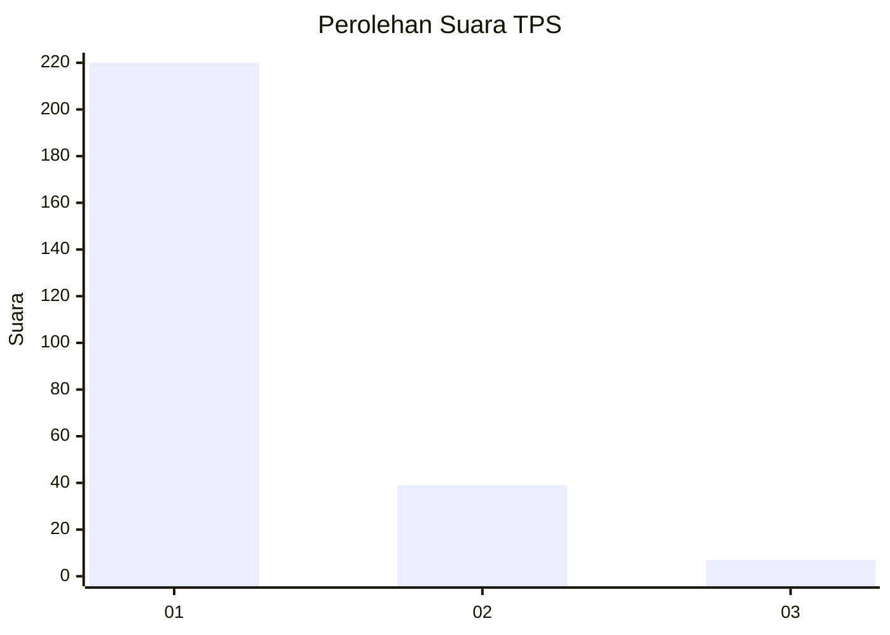
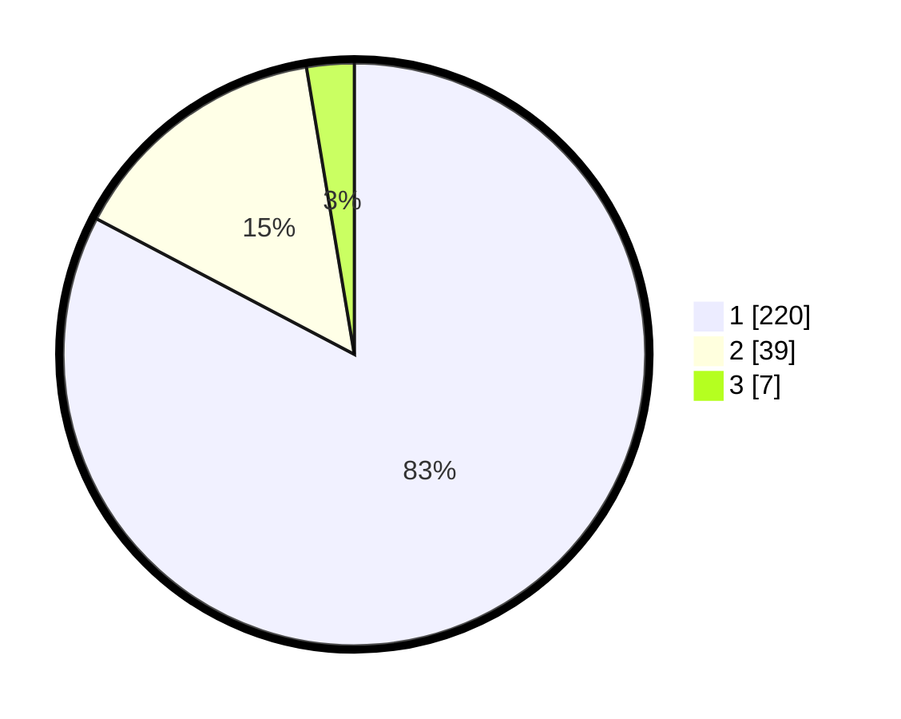

# Hasil

## Grafik

## Tabel

| No. | Nama Paslon    | Suara | Suara (raw) | Persentase |
|:--- |:-------------- | -----:| -----------:| ----------:|
| 1   | ANIES MUHAIMIN | 220   | [220][p-1]  | 82,71      |
| 2   | PRABOWO GIBRAN | 39    | [39][p-2]   | 14,66      |
| 3   | GANJAR MAHFUD  | 7     | [7][p-3]    | 2,63       |

[p-1]: https://github.com/gigit-pemilu/pemilu-2024-11-aceh/blob/main/pilpres/hitung-suara/sub/11-aceh/sub/01-aceh-selatan/sub/17-kota-bahagia/sub/2001-buket-gadeng/sub/004-tps/sub/paslon-1.txt
[p-2]: https://github.com/gigit-pemilu/pemilu-2024-11-aceh/blob/main/pilpres/hitung-suara/sub/11-aceh/sub/01-aceh-selatan/sub/17-kota-bahagia/sub/2001-buket-gadeng/sub/004-tps/sub/paslon-2.txt
[p-3]: https://github.com/gigit-pemilu/pemilu-2024-11-aceh/blob/main/pilpres/hitung-suara/sub/11-aceh/sub/01-aceh-selatan/sub/17-kota-bahagia/sub/2001-buket-gadeng/sub/004-tps/sub/paslon-3.txt

## Foto C Plano

https://sirekap-obj-formc.kpu.go.id/bbb7/pemilu/ppwp/11/01/17/20/01/1101172001004-20240215-140020--18b13762-8b33-4830-903d-1896dcd8dbd7.jpg

https://sirekap-obj-formc.kpu.go.id/bbb7/pemilu/ppwp/11/01/17/20/01/1101172001004-20240216-213807--782200ae-77b7-41c2-a696-11e2ece9cfac.jpg

https://sirekap-obj-formc.kpu.go.id/bbb7/pemilu/ppwp/11/01/17/20/01/1101172001004-20240215-140827--a81d8dff-6c56-41a1-a289-4f2bc9bdf07a.jpg

## Metadata

| Key        | Value               |
| ---------- | ------------------- |
| Time Stamp | 2024-02-17 11:00:02 |

## DATA PEMILIH TETAP

Jumlah pemilih dalam DPT: **287**.
 * L: **133**.
 * P: **154**.

## DATA PENGGUNA HAK PILIH

Jumlah pengguna hak pilih dalam DPT: **284**.
 * L: **132**.
 * P: **152**.

Jumlah pengguna hak pilih dalam DPTb: **3**.
 * L: **1**.
 * P: **2**.

Jumlah pengguna hak pilih dalam DPK: **3**.
 * L: **1**.
 * P: **2**.

Jumlah pengguna hak pilih: **290**.
 * L: **134**.
 * P: **156**.

## JUMLAH SUARA SAH DAN TIDAK SAH

JUMLAH SELURUH SUARA SAH: **266**.

JUMLAH SUARA TIDAK SAH: **24**.

JUMLAH SELURUH SUARA SAH DAN SUARA TIDAK SAH: **290**.

