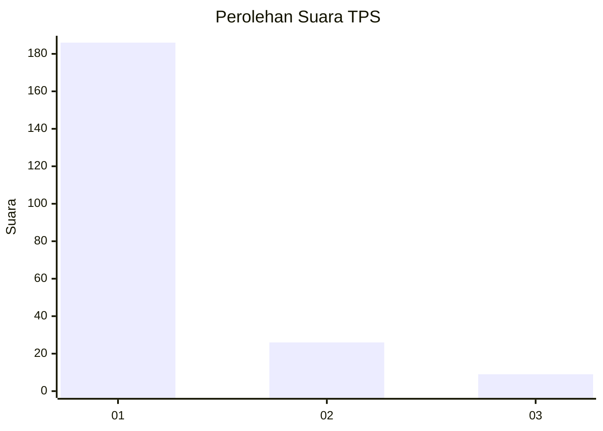
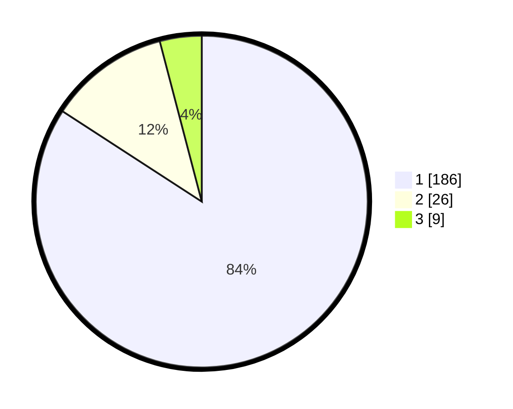

# Hasil

## Grafik

## Tabel

| No. | Nama Paslon    | Suara | Suara (raw) | Persentase |
|:--- |:-------------- | -----:| -----------:| ----------:|
| 1   | ANIES MUHAIMIN | 186   | [186][p-1]  | 84,16      |
| 2   | PRABOWO GIBRAN | 26    | [26][p-2]   | 11,76      |
| 3   | GANJAR MAHFUD  | 9     | [9][p-3]    | 4,07       |

[p-1]: https://github.com/gigit-pemilu/pemilu-2024-11-aceh/blob/main/pilpres/hitung-suara/sub/11-aceh/sub/01-aceh-selatan/sub/17-kota-bahagia/sub/2002-rambong/sub/002-tps/sub/paslon-1.txt
[p-2]: https://github.com/gigit-pemilu/pemilu-2024-11-aceh/blob/main/pilpres/hitung-suara/sub/11-aceh/sub/01-aceh-selatan/sub/17-kota-bahagia/sub/2002-rambong/sub/002-tps/sub/paslon-2.txt
[p-3]: https://github.com/gigit-pemilu/pemilu-2024-11-aceh/blob/main/pilpres/hitung-suara/sub/11-aceh/sub/01-aceh-selatan/sub/17-kota-bahagia/sub/2002-rambong/sub/002-tps/sub/paslon-3.txt

## Foto C Plano

https://sirekap-obj-formc.kpu.go.id/e45e/pemilu/ppwp/11/01/17/20/02/1101172002002-20240217-231259--e9e18c2e-7aaa-4414-b105-077444679e4c.jpg

https://sirekap-obj-formc.kpu.go.id/e45e/pemilu/ppwp/11/01/17/20/02/1101172002002-20240217-231300--ac6d3c4b-50e2-4daf-bbef-9cdbcfcb8318.jpg

https://sirekap-obj-formc.kpu.go.id/e45e/pemilu/ppwp/11/01/17/20/02/1101172002002-20240217-231300--a24c6829-ad62-463f-9db3-2ffe605d73fd.jpg

## Metadata

| Key        | Value               |
| ---------- | ------------------- |
| Time Stamp | 2024-02-19 06:16:00 |

## DATA PEMILIH TETAP

Jumlah pemilih dalam DPT: **238**.
 * L: **119**.
 * P: **119**.

## DATA PENGGUNA HAK PILIH

Jumlah pengguna hak pilih dalam DPT: **238**.
 * L: **119**.
 * P: **119**.

Jumlah pengguna hak pilih dalam DPTb: **0**.
 * L: **0**.
 * P: **0**.

Jumlah pengguna hak pilih dalam DPK: **1**.
 * L: **0**.
 * P: **1**.

Jumlah pengguna hak pilih: **239**.
 * L: **119**.
 * P: **120**.

## JUMLAH SUARA SAH DAN TIDAK SAH

JUMLAH SELURUH SUARA SAH: **221**.

JUMLAH SUARA TIDAK SAH: **4**.

JUMLAH SELURUH SUARA SAH DAN SUARA TIDAK SAH: **225**.

