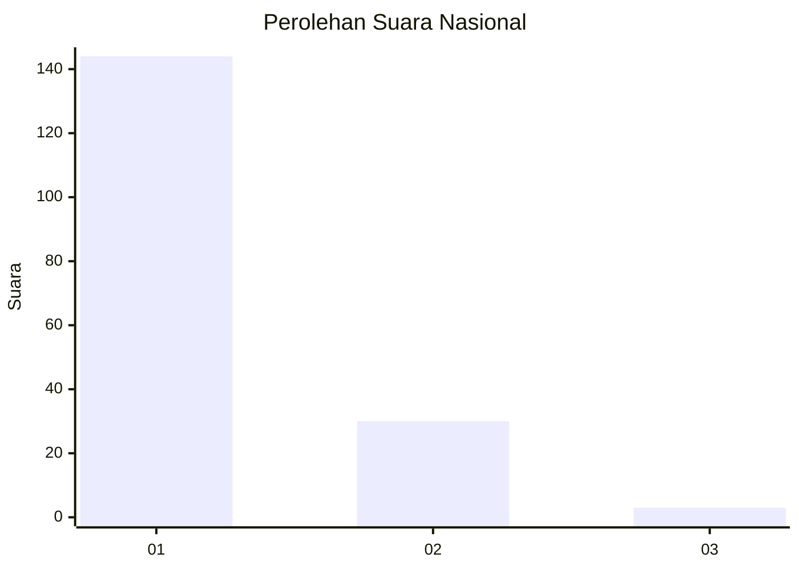
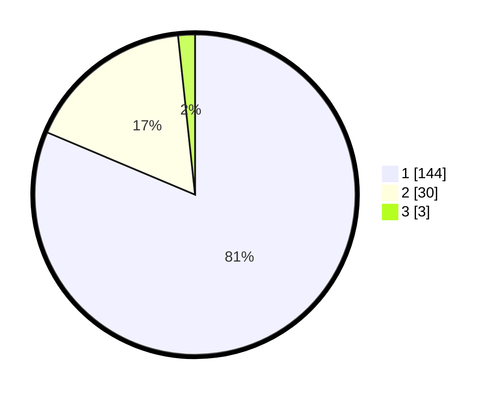

# Hasil

## Grafik

## Tabel

| No. | Nama Paslon    | Suara | Suara (raw) | Persentase |
|:--- |:-------------- | -----:| -----------:| ----------:|
| 1   | ANIES MUHAIMIN | 144   | [144][p-1]  | 81,36      |
| 2   | PRABOWO GIBRAN | 30    | [30][p-2]   | 16,95      |
| 3   | GANJAR MAHFUD  | 3     | [3][p-3]    | 1,69       |

[p-1]: https://github.com/gigit-pemilu/pemilu-2024/blob/main/pilpres/hitung-suara/sub/11-aceh/sub/01-aceh-selatan/sub/17-kota-bahagia/sub/2003-seuneubok-keuranji/sub/001-tps/sub/paslon-1.txt
[p-2]: https://github.com/gigit-pemilu/pemilu-2024/blob/main/pilpres/hitung-suara/sub/11-aceh/sub/01-aceh-selatan/sub/17-kota-bahagia/sub/2003-seuneubok-keuranji/sub/001-tps/sub/paslon-2.txt
[p-3]: https://github.com/gigit-pemilu/pemilu-2024/blob/main/pilpres/hitung-suara/sub/11-aceh/sub/01-aceh-selatan/sub/17-kota-bahagia/sub/2003-seuneubok-keuranji/sub/001-tps/sub/paslon-3.txt

## Foto C Plano

https://sirekap-obj-formc.kpu.go.id/5746/pemilu/ppwp/11/01/17/20/03/1101172003001-20240221-170910--8b5952e8-a5e4-4e76-bb43-26c1da30a6f1.jpg

https://sirekap-obj-formc.kpu.go.id/5746/pemilu/ppwp/11/01/17/20/03/1101172003001-20240221-172848--9e8b7832-4ad3-4b90-91a8-57fc5633995b.jpg

https://sirekap-obj-formc.kpu.go.id/5746/pemilu/ppwp/11/01/17/20/03/1101172003001-20240214-234222--48f1eff8-2c25-48e8-b0db-2e260f3a2070.jpg

## Metadata

| Key        | Value               |
| ---------- | ------------------- |
| Time Stamp | 2024-02-24 22:31:28 |

## DATA PEMILIH TETAP

Jumlah pemilih dalam DPT: **181**.
 * L: **90**.
 * P: **91**.

## DATA PENGGUNA HAK PILIH

Jumlah pengguna hak pilih dalam DPT: **174**.
 * L: **86**.
 * P: **88**.

Jumlah pengguna hak pilih dalam DPTb: **1**.
 * L: **0**.
 * P: **1**.

Jumlah pengguna hak pilih dalam DPK: **3**.
 * L: **2**.
 * P: **1**.

Jumlah pengguna hak pilih: **178**.
 * L: **88**.
 * P: **90**.

## JUMLAH SUARA SAH DAN TIDAK SAH

JUMLAH SELURUH SUARA SAH: **177**.

JUMLAH SUARA TIDAK SAH: **1**.

JUMLAH SELURUH SUARA SAH DAN SUARA TIDAK SAH: **178**.

