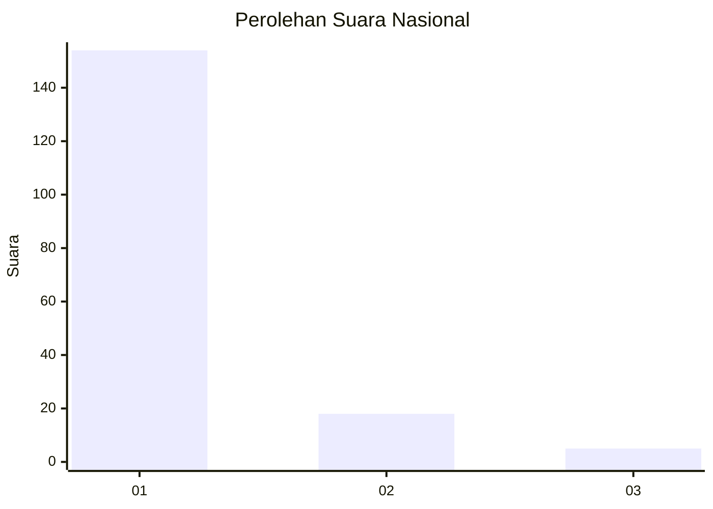
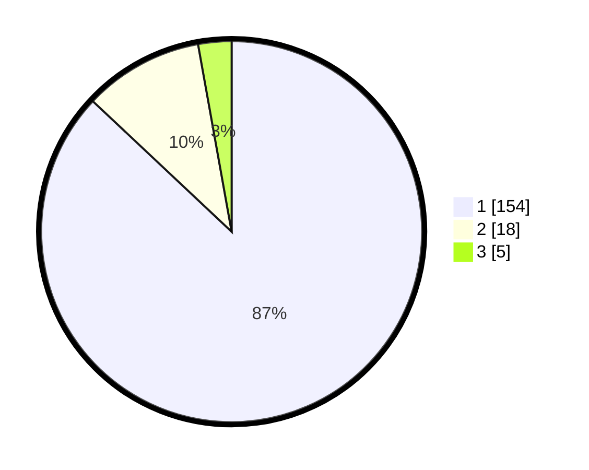

# Hasil

## Grafik

## Tabel

| No. | Nama Paslon    | Suara | Suara (raw) | Persentase |
|:--- |:-------------- | -----:| -----------:| ----------:|
| 1   | ANIES MUHAIMIN | 154   | [154][p-1]  | 87,01      |
| 2   | PRABOWO GIBRAN | 18    | [18][p-2]   | 10,17      |
| 3   | GANJAR MAHFUD  | 5     | [5][p-3]    | 2,82       |

[p-1]: https://github.com/gigit-pemilu/pemilu-2024/blob/main/pilpres/hitung-suara/sub/11-aceh/sub/01-aceh-selatan/sub/17-kota-bahagia/sub/2003-seuneubok-keuranji/sub/002-tps/sub/paslon-1.txt
[p-2]: https://github.com/gigit-pemilu/pemilu-2024/blob/main/pilpres/hitung-suara/sub/11-aceh/sub/01-aceh-selatan/sub/17-kota-bahagia/sub/2003-seuneubok-keuranji/sub/002-tps/sub/paslon-2.txt
[p-3]: https://github.com/gigit-pemilu/pemilu-2024/blob/main/pilpres/hitung-suara/sub/11-aceh/sub/01-aceh-selatan/sub/17-kota-bahagia/sub/2003-seuneubok-keuranji/sub/002-tps/sub/paslon-3.txt

## Foto C Plano

https://sirekap-obj-formc.kpu.go.id/6021/pemilu/ppwp/11/01/17/20/03/1101172003002-20240214-204516--99b98f11-2a3a-413c-b859-dc7738dd6aef.jpg

https://sirekap-obj-formc.kpu.go.id/6021/pemilu/ppwp/11/01/17/20/03/1101172003002-20240216-210930--07758d01-bc93-4669-92f9-d4b55684e5e8.jpg

https://sirekap-obj-formc.kpu.go.id/6021/pemilu/ppwp/11/01/17/20/03/1101172003002-20240216-210929--c3dfb8cd-8bc2-461e-bac0-39ae3c921062.jpg

## Metadata

| Key        | Value               |
| ---------- | ------------------- |
| Time Stamp | 2024-02-17 16:00:02 |

## DATA PEMILIH TETAP

Jumlah pemilih dalam DPT: **176**.
 * L: **90**.
 * P: **86**.

## DATA PENGGUNA HAK PILIH

Jumlah pengguna hak pilih dalam DPT: **175**.
 * L: **90**.
 * P: **85**.

Jumlah pengguna hak pilih dalam DPTb: **1**.
 * L: **1**.
 * P: **0**.

Jumlah pengguna hak pilih dalam DPK: **3**.
 * L: **2**.
 * P: **1**.

Jumlah pengguna hak pilih: **179**.
 * L: **93**.
 * P: **86**.

## JUMLAH SUARA SAH DAN TIDAK SAH

JUMLAH SELURUH SUARA SAH: **177**.

JUMLAH SUARA TIDAK SAH: **2**.

JUMLAH SELURUH SUARA SAH DAN SUARA TIDAK SAH: **179**.

