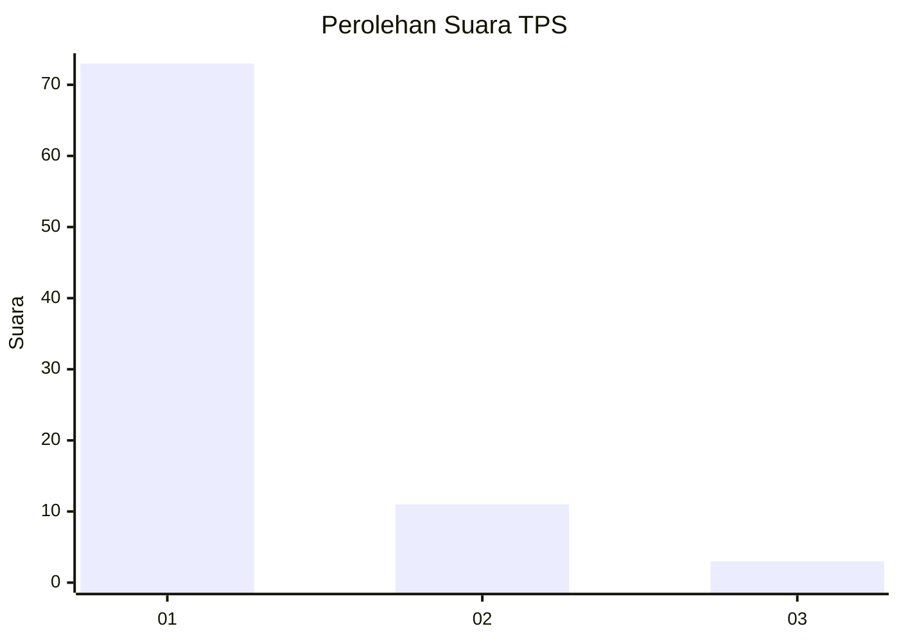
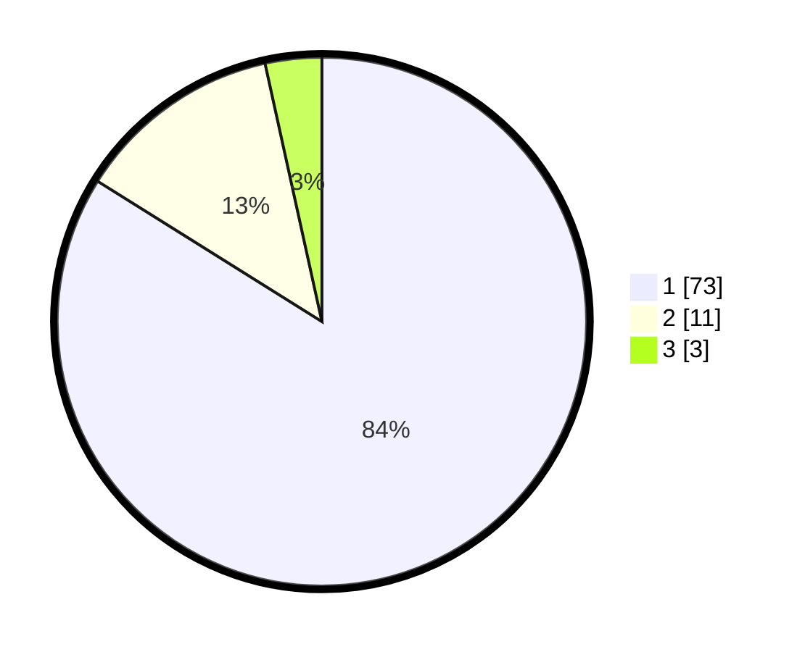

# Hasil

## Grafik

## Tabel

| No. | Nama Paslon    | Suara | Suara (raw) | Persentase |
|:--- |:-------------- | -----:| -----------:| ----------:|
| 1   | ANIES MUHAIMIN | 73    | [73][p-1]   | 83,91      |
| 2   | PRABOWO GIBRAN | 11    | [11][p-2]   | 12,64      |
| 3   | GANJAR MAHFUD  | 3     | [3][p-3]    | 3,45       |

[p-1]: https://github.com/gigit-pemilu/pemilu-2024-11-aceh/blob/main/pilpres/hitung-suara/sub/11-aceh/sub/01-aceh-selatan/sub/17-kota-bahagia/sub/2006-ujong-gunong-cut/sub/001-tps/sub/paslon-1.txt
[p-2]: https://github.com/gigit-pemilu/pemilu-2024-11-aceh/blob/main/pilpres/hitung-suara/sub/11-aceh/sub/01-aceh-selatan/sub/17-kota-bahagia/sub/2006-ujong-gunong-cut/sub/001-tps/sub/paslon-2.txt
[p-3]: https://github.com/gigit-pemilu/pemilu-2024-11-aceh/blob/main/pilpres/hitung-suara/sub/11-aceh/sub/01-aceh-selatan/sub/17-kota-bahagia/sub/2006-ujong-gunong-cut/sub/001-tps/sub/paslon-3.txt

## Foto C Plano

https://sirekap-obj-formc.kpu.go.id/7b5c/pemilu/ppwp/11/01/17/20/06/1101172006001-20240214-155840--83e2d0b1-d1cd-4d96-81e4-2de58314d40a.jpg

https://sirekap-obj-formc.kpu.go.id/7b5c/pemilu/ppwp/11/01/17/20/06/1101172006001-20240216-142051--0ebfc82a-1878-40d6-8e75-a77f7e7fa6af.jpg

https://sirekap-obj-formc.kpu.go.id/7b5c/pemilu/ppwp/11/01/17/20/06/1101172006001-20240216-142050--1ba6c2e7-7af4-473f-8282-006d96a61a2a.jpg

## Metadata

| Key        | Value               |
| ---------- | ------------------- |
| Time Stamp | 2024-02-16 21:01:00 |

## DATA PEMILIH TETAP

Jumlah pemilih dalam DPT: **94**.
 * L: **45**.
 * P: **49**.

## DATA PENGGUNA HAK PILIH

Jumlah pengguna hak pilih dalam DPT: **86**.
 * L: **40**.
 * P: **46**.

Jumlah pengguna hak pilih dalam DPTb: **1**.
 * L: **1**.
 * P: **0**.

Jumlah pengguna hak pilih dalam DPK: **0**.
 * L: **0**.
 * P: **0**.

Jumlah pengguna hak pilih: **87**.
 * L: **41**.
 * P: **46**.

## JUMLAH SUARA SAH DAN TIDAK SAH

JUMLAH SELURUH SUARA SAH: **87**.

JUMLAH SUARA TIDAK SAH: **0**.

JUMLAH SELURUH SUARA SAH DAN SUARA TIDAK SAH: **87**.

