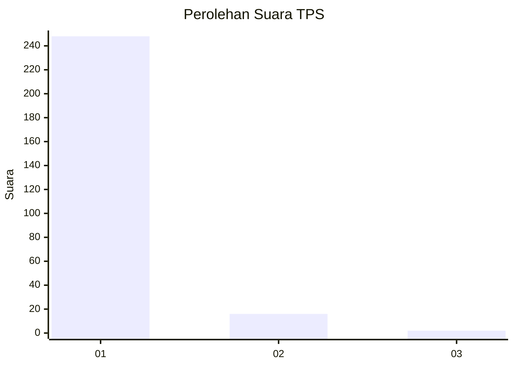
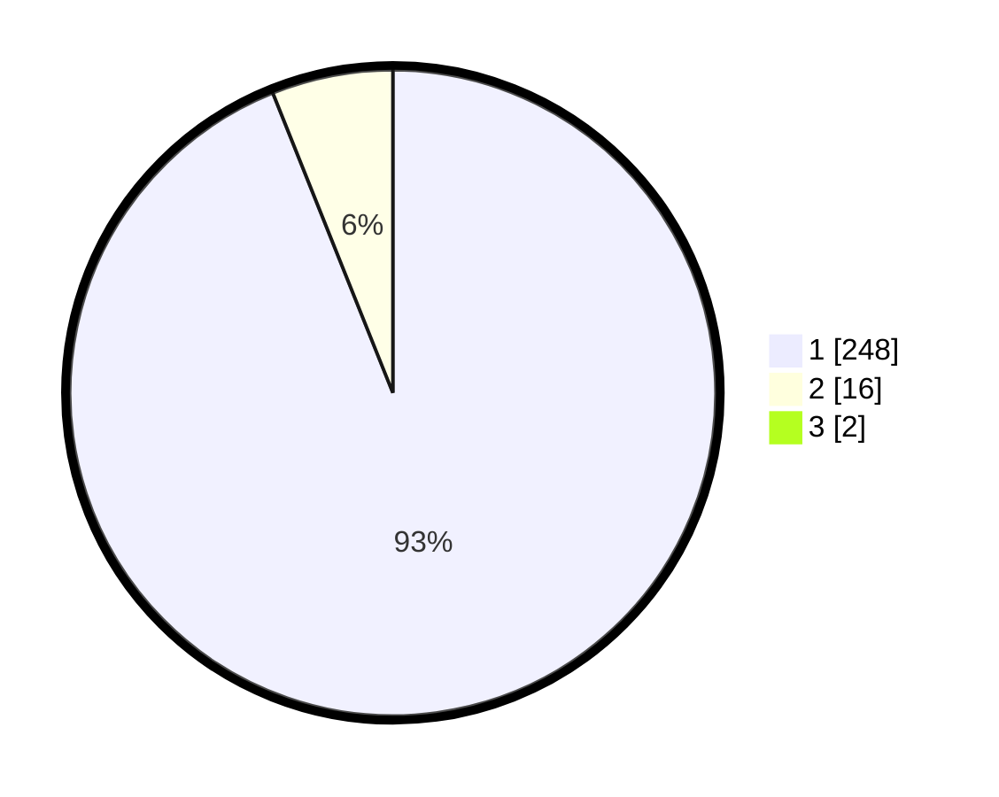

# Hasil

## Grafik

## Tabel

| No. | Nama Paslon    | Suara | Suara (raw) | Persentase |
|:--- |:-------------- | -----:| -----------:| ----------:|
| 1   | ANIES MUHAIMIN | 248   | [248][p-1]  | 93,23      |
| 2   | PRABOWO GIBRAN | 16    | [16][p-2]   | 6,02       |
| 3   | GANJAR MAHFUD  | 2     | [2][p-3]    | 0,75       |

[p-1]: https://github.com/gigit-pemilu/pemilu-2024-11-aceh/blob/main/pilpres/hitung-suara/sub/11-aceh/sub/01-aceh-selatan/sub/17-kota-bahagia/sub/2010-alurduamas/sub/002-tps/sub/paslon-1.txt
[p-2]: https://github.com/gigit-pemilu/pemilu-2024-11-aceh/blob/main/pilpres/hitung-suara/sub/11-aceh/sub/01-aceh-selatan/sub/17-kota-bahagia/sub/2010-alurduamas/sub/002-tps/sub/paslon-2.txt
[p-3]: https://github.com/gigit-pemilu/pemilu-2024-11-aceh/blob/main/pilpres/hitung-suara/sub/11-aceh/sub/01-aceh-selatan/sub/17-kota-bahagia/sub/2010-alurduamas/sub/002-tps/sub/paslon-3.txt

## Foto C Plano

https://sirekap-obj-formc.kpu.go.id/965d/pemilu/ppwp/11/01/17/20/10/1101172010002-20240215-215459--83e453de-01da-424a-ae86-27703f34edbd.jpg

https://sirekap-obj-formc.kpu.go.id/965d/pemilu/ppwp/11/01/17/20/10/1101172010002-20240215-215501--c46faaad-68c8-4810-9781-397ae7530424.jpg

https://sirekap-obj-formc.kpu.go.id/965d/pemilu/ppwp/11/01/17/20/10/1101172010002-20240215-215500--2edbb956-1f6f-46bb-ae13-ac2226baba25.jpg

## Metadata

| Key        | Value               |
| ---------- | ------------------- |
| Time Stamp | 2024-02-15 22:30:27 |

## DATA PEMILIH TETAP

Jumlah pemilih dalam DPT: **265**.
 * L: **135**.
 * P: **130**.

## DATA PENGGUNA HAK PILIH

Jumlah pengguna hak pilih dalam DPT: **251**.
 * L: **125**.
 * P: **126**.

Jumlah pengguna hak pilih dalam DPTb: **0**.
 * L: **0**.
 * P: **0**.

Jumlah pengguna hak pilih dalam DPK: **18**.
 * L: **0**.
 * P: **18**.

Jumlah pengguna hak pilih: **269**.
 * L: **125**.
 * P: **144**.

## JUMLAH SUARA SAH DAN TIDAK SAH

JUMLAH SELURUH SUARA SAH: **266**.

JUMLAH SUARA TIDAK SAH: **3**.

JUMLAH SELURUH SUARA SAH DAN SUARA TIDAK SAH: **269**.

