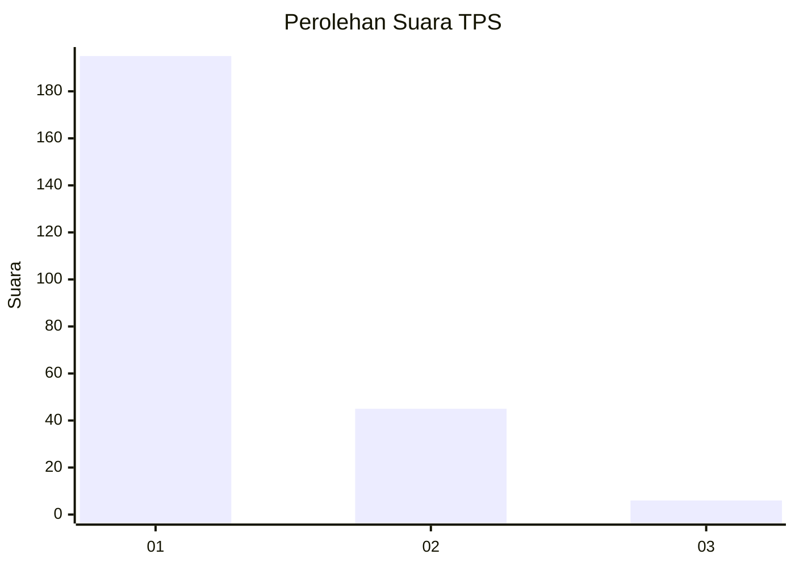
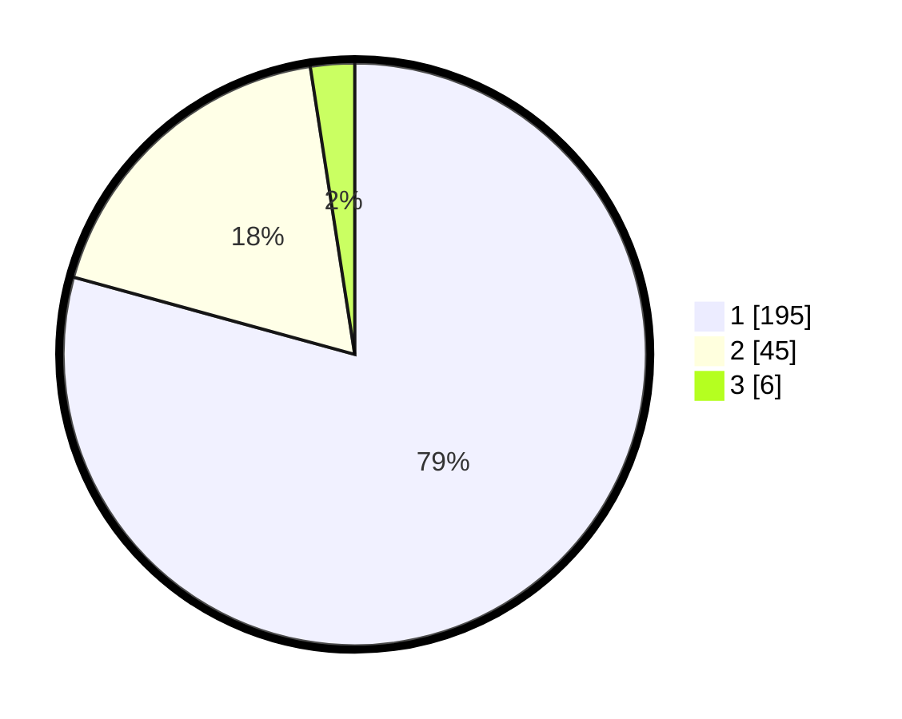

# Hasil

## Grafik

## Tabel

| No. | Nama Paslon    | Suara | Suara (raw) | Persentase |
|:--- |:-------------- | -----:| -----------:| ----------:|
| 1   | ANIES MUHAIMIN | 195   | [195][p-1]  | 79,27      |
| 2   | PRABOWO GIBRAN | 45    | [45][p-2]   | 18,29      |
| 3   | GANJAR MAHFUD  | 6     | [6][p-3]    | 2,44       |

[p-1]: https://github.com/gigit-pemilu/pemilu-2024-11-aceh/blob/main/pilpres/hitung-suara/sub/11-aceh/sub/01-aceh-selatan/sub/18-trumon-tengah/sub/2001-ladang-rimba/sub/004-tps/sub/paslon-1.txt
[p-2]: https://github.com/gigit-pemilu/pemilu-2024-11-aceh/blob/main/pilpres/hitung-suara/sub/11-aceh/sub/01-aceh-selatan/sub/18-trumon-tengah/sub/2001-ladang-rimba/sub/004-tps/sub/paslon-2.txt
[p-3]: https://github.com/gigit-pemilu/pemilu-2024-11-aceh/blob/main/pilpres/hitung-suara/sub/11-aceh/sub/01-aceh-selatan/sub/18-trumon-tengah/sub/2001-ladang-rimba/sub/004-tps/sub/paslon-3.txt

## Foto C Plano

https://sirekap-obj-formc.kpu.go.id/a1ab/pemilu/ppwp/11/01/18/20/01/1101182001004-20240217-093504--333ce80f-07ba-46e4-9e80-f44519691339.jpg

https://sirekap-obj-formc.kpu.go.id/a1ab/pemilu/ppwp/11/01/18/20/01/1101182001004-20240217-093506--6817946c-d12e-4a7d-bcf9-240e2928e364.jpg

https://sirekap-obj-formc.kpu.go.id/a1ab/pemilu/ppwp/11/01/18/20/01/1101182001004-20240217-093505--8abe2872-c1ee-463a-97eb-523e9a794e98.jpg

## Metadata

| Key        | Value               |
| ---------- | ------------------- |
| Time Stamp | 2024-02-17 16:00:02 |

## DATA PEMILIH TETAP

Jumlah pemilih dalam DPT: **293**.
 * L: **133**.
 * P: **160**.

## DATA PENGGUNA HAK PILIH

Jumlah pengguna hak pilih dalam DPT: **243**.
 * L: **120**.
 * P: **123**.

Jumlah pengguna hak pilih dalam DPTb: **4**.
 * L: **2**.
 * P: **2**.

Jumlah pengguna hak pilih dalam DPK: **4**.
 * L: **2**.
 * P: **2**.

Jumlah pengguna hak pilih: **251**.
 * L: **124**.
 * P: **127**.

## JUMLAH SUARA SAH DAN TIDAK SAH

JUMLAH SELURUH SUARA SAH: **246**.

JUMLAH SUARA TIDAK SAH: **5**.

JUMLAH SELURUH SUARA SAH DAN SUARA TIDAK SAH: **251**.

