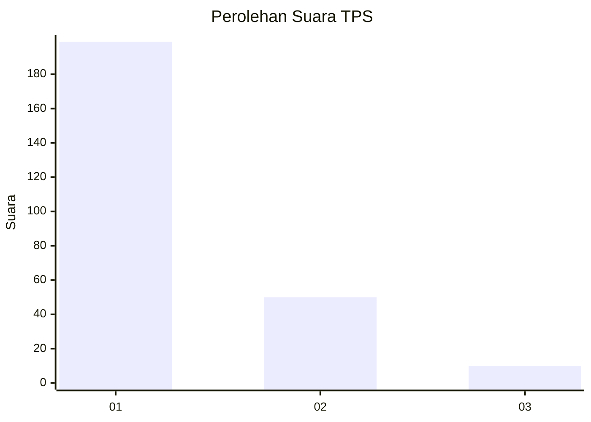
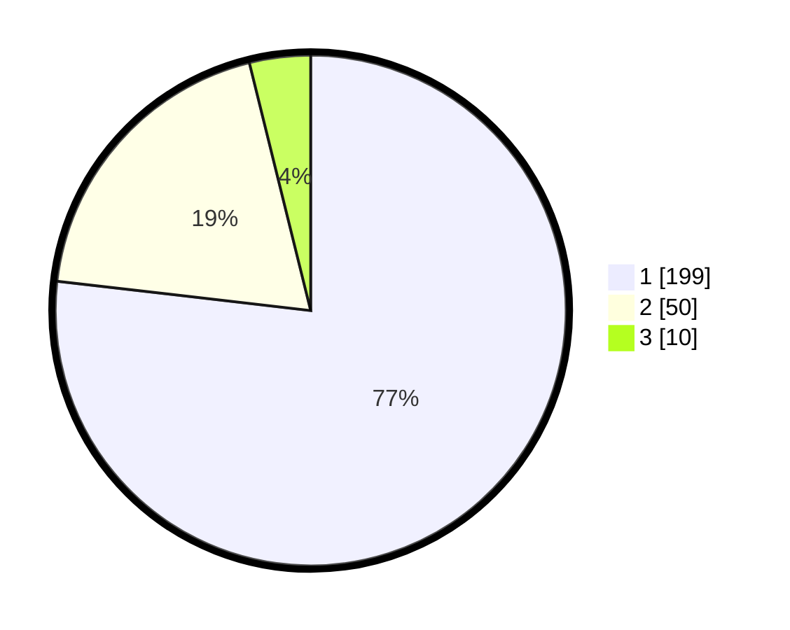

# Hasil

## Grafik

## Tabel

| No. | Nama Paslon    | Suara | Suara (raw) | Persentase |
|:--- |:-------------- | -----:| -----------:| ----------:|
| 1   | ANIES MUHAIMIN | 199   | [199][p-1]  | 76,83      |
| 2   | PRABOWO GIBRAN | 50    | [50][p-2]   | 19,31      |
| 3   | GANJAR MAHFUD  | 10    | [10][p-3]   | 3,86       |

[p-1]: https://github.com/gigit-pemilu/pemilu-2024-11-aceh/blob/main/pilpres/hitung-suara/sub/11-aceh/sub/01-aceh-selatan/sub/18-trumon-tengah/sub/2001-ladang-rimba/sub/005-tps/sub/paslon-1.txt
[p-2]: https://github.com/gigit-pemilu/pemilu-2024-11-aceh/blob/main/pilpres/hitung-suara/sub/11-aceh/sub/01-aceh-selatan/sub/18-trumon-tengah/sub/2001-ladang-rimba/sub/005-tps/sub/paslon-2.txt
[p-3]: https://github.com/gigit-pemilu/pemilu-2024-11-aceh/blob/main/pilpres/hitung-suara/sub/11-aceh/sub/01-aceh-selatan/sub/18-trumon-tengah/sub/2001-ladang-rimba/sub/005-tps/sub/paslon-3.txt

## Foto C Plano

https://sirekap-obj-formc.kpu.go.id/6135/pemilu/ppwp/11/01/18/20/01/1101182001005-20240214-215125--356a771b-4287-471e-8db2-0a7ccc309d9b.jpg

https://sirekap-obj-formc.kpu.go.id/6135/pemilu/ppwp/11/01/18/20/01/1101182001005-20240215-145946--33b80198-d0eb-4193-a43b-7858fc9802e8.jpg

https://sirekap-obj-formc.kpu.go.id/6135/pemilu/ppwp/11/01/18/20/01/1101182001005-20240214-220652--3d3c6186-e853-4640-b2ae-6913439f0990.jpg

## Metadata

| Key        | Value               |
| ---------- | ------------------- |
| Time Stamp | 2024-02-15 16:30:25 |

## DATA PEMILIH TETAP

Jumlah pemilih dalam DPT: **295**.
 * L: **141**.
 * P: **154**.

## DATA PENGGUNA HAK PILIH

Jumlah pengguna hak pilih dalam DPT: **262**.
 * L: **123**.
 * P: **139**.

Jumlah pengguna hak pilih dalam DPTb: **2**.
 * L: **1**.
 * P: **1**.

Jumlah pengguna hak pilih dalam DPK: **2**.
 * L: **1**.
 * P: **1**.

Jumlah pengguna hak pilih: **266**.
 * L: **125**.
 * P: **141**.

## JUMLAH SUARA SAH DAN TIDAK SAH

JUMLAH SELURUH SUARA SAH: **259**.

JUMLAH SUARA TIDAK SAH: **7**.

JUMLAH SELURUH SUARA SAH DAN SUARA TIDAK SAH: **266**.

