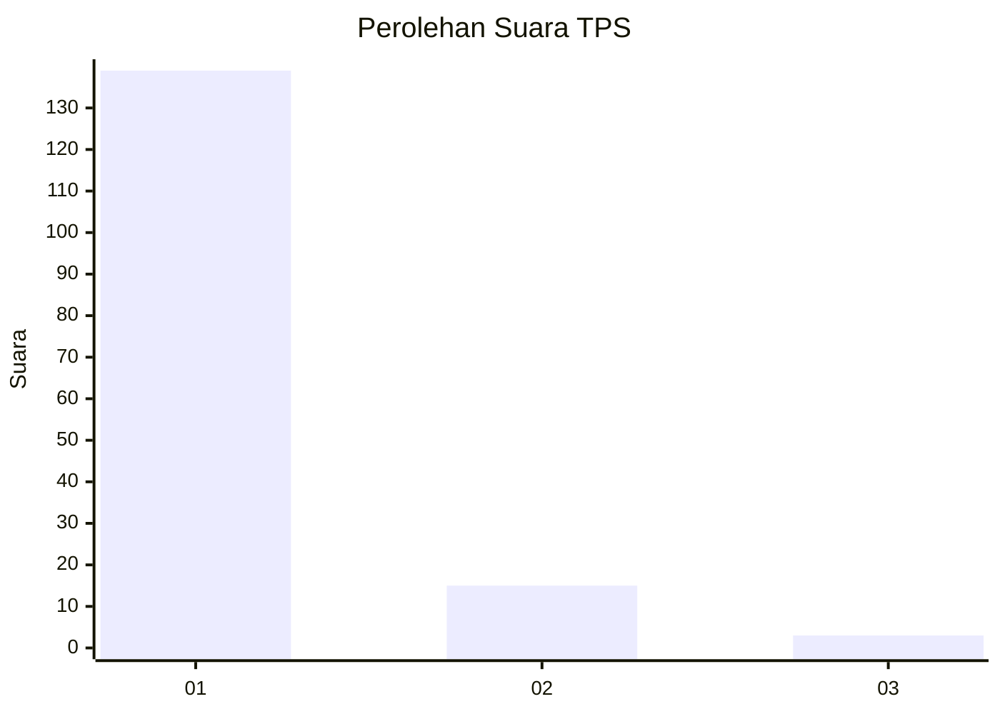
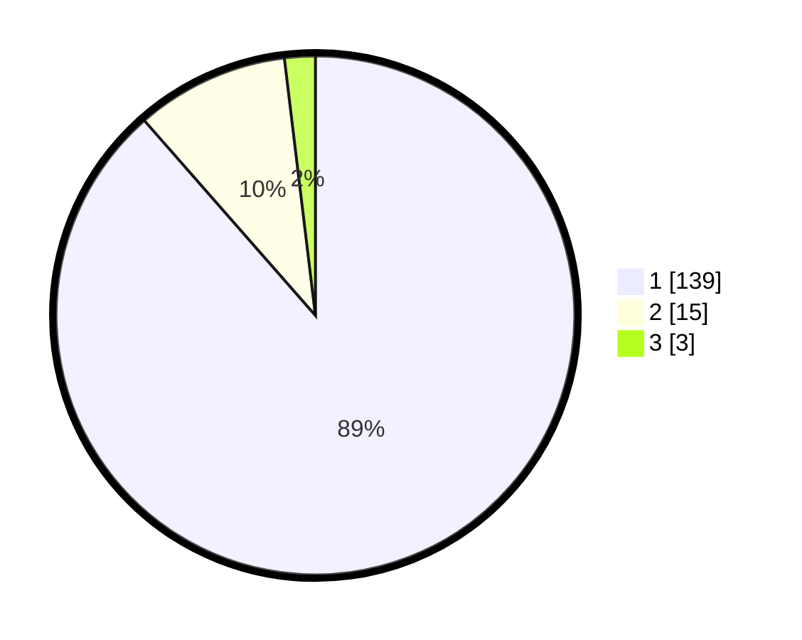

# Hasil

## Grafik

## Tabel

| No. | Nama Paslon    | Suara | Suara (raw) | Persentase |
|:--- |:-------------- | -----:| -----------:| ----------:|
| 1   | ANIES MUHAIMIN | 139   | [139][p-1]  | 88,54      |
| 2   | PRABOWO GIBRAN | 15    | [15][p-2]   | 9,55       |
| 3   | GANJAR MAHFUD  | 3     | [3][p-3]    | 1,91       |

[p-1]: https://github.com/gigit-pemilu/pemilu-2024-11-aceh/blob/main/pilpres/hitung-suara/sub/11-aceh/sub/01-aceh-selatan/sub/18-trumon-tengah/sub/2003-kampong-teungoh/sub/001-tps/sub/paslon-1.txt
[p-2]: https://github.com/gigit-pemilu/pemilu-2024-11-aceh/blob/main/pilpres/hitung-suara/sub/11-aceh/sub/01-aceh-selatan/sub/18-trumon-tengah/sub/2003-kampong-teungoh/sub/001-tps/sub/paslon-2.txt
[p-3]: https://github.com/gigit-pemilu/pemilu-2024-11-aceh/blob/main/pilpres/hitung-suara/sub/11-aceh/sub/01-aceh-selatan/sub/18-trumon-tengah/sub/2003-kampong-teungoh/sub/001-tps/sub/paslon-3.txt

## Foto C Plano

https://sirekap-obj-formc.kpu.go.id/5244/pemilu/ppwp/11/01/18/20/03/1101182003001-20240215-071453--532c1500-8421-4db7-a288-22d3691b7dae.jpg

https://sirekap-obj-formc.kpu.go.id/5244/pemilu/ppwp/11/01/18/20/03/1101182003001-20240215-072411--81a9f065-8ccb-431a-afe7-e5d448fd3518.jpg

https://sirekap-obj-formc.kpu.go.id/5244/pemilu/ppwp/11/01/18/20/03/1101182003001-20240215-072706--701b3c9c-2433-4e31-b872-9abf82bb8f2e.jpg

## Metadata

| Key        | Value               |
| ---------- | ------------------- |
| Time Stamp | 2024-02-16 21:01:00 |

## DATA PEMILIH TETAP

Jumlah pemilih dalam DPT: **161**.
 * L: **83**.
 * P: **78**.

## DATA PENGGUNA HAK PILIH

Jumlah pengguna hak pilih dalam DPT: **154**.
 * L: **76**.
 * P: **78**.

Jumlah pengguna hak pilih dalam DPTb: **4**.
 * L: **2**.
 * P: **2**.

Jumlah pengguna hak pilih dalam DPK: **0**.
 * L: **0**.
 * P: **0**.

Jumlah pengguna hak pilih: **158**.
 * L: **78**.
 * P: **80**.

## JUMLAH SUARA SAH DAN TIDAK SAH

JUMLAH SELURUH SUARA SAH: **157**.

JUMLAH SUARA TIDAK SAH: **1**.

JUMLAH SELURUH SUARA SAH DAN SUARA TIDAK SAH: **158**.

